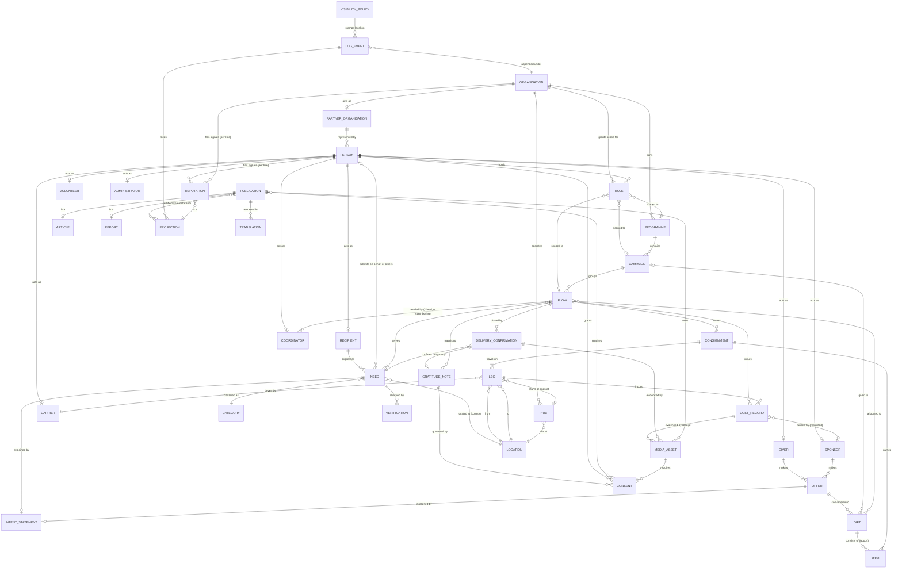

# Entity Relationship Map

*How the things in the river bed hold on to each other.* This is the index of section 03. The things themselves are described in [[Entities Index]]. This section covers how they connect, how they move through their lifecycles, and which [[Log Event]]s each movement leaves behind. Back to [[00 Home]].

> [!principle] The river remembers
> Every relationship on this page is created, changed or ended by a command that appends a [[Log Event]]. No link between two records is ever edited in place. A correction is a new event. See [[Guiding Principles#P7. The river remembers]] and [[ADR-001 Event-Sourced Append Log]].

## Notes in this section

| Note | Question it answers |
|---|---|
| [[Lifecycle of a Need]] | How a request moves from first words to closure without ever being "rejected" |
| [[Lifecycle of a Gift]] | How an offer becomes a gift, gets allocated, arrives and is acknowledged |
| [[The Delivery Chain]] | The full sequence from need to gratitude, with each event and decision point |
| [[Coordination Model]] | How several coordinators and partner organisations share one flow without collisions |
| [[Transport and Logistics Flow]] | How consignments, legs, hubs, carriers and handovers work, with costs for each leg |
| [[Money Flow and Cost Transparency]] | How money comes in and goes out, and how the [[Transparency Ledger]] is derived |
| [[Reputation Dynamics]] | How events become explainable reputation signals ("the current") |
| [[Gratitude Loop]] | How thanks is written, consented, moderated and carried back upstream |

## Full entity–relationship diagram

Cardinalities follow Mermaid crow's-foot notation: `||` exactly one, `o|` zero or one, `}o` zero or many, `}|` one or many. Role entities ([[Recipient]], [[Giver]], and so on) are **role-bearing views of a [[Person]] or [[Organisation]]**. They are not separate identities. See [[Role]].

## Relationship table

| From | Relationship | To | Cardinality | Created by event | Default visibility of the link |
|---|---|---|---|---|---|
| [[Person]] | holds | [[Role]] | 1 : 0..n | `role.Granted` | `team` |
| [[Role]] | scoped to | [[Organisation]] / [[Programme]] / [[Campaign]] / [[Flow]] | n : 1 | `role.Granted` | `team` |
| [[Recipient]] | expresses | [[Need]] | 1 : 0..n | `need.Submitted` | `private` |
| [[Person]] (proxy) | submits on behalf of | [[Need]] | 0..1 : 0..n | `need.Submitted` (payload `proxy: true`) | `private` |
| [[Need]] | explained by | [[Intent Statement]] | 1 : 0..1 | `need.Submitted` / `need.Clarified` | `private` |
| [[Need]] | checked by | [[Verification]] | 1 : 0..n | `verification.Requested` | `sealed` or `private` |
| [[Giver]] / [[Sponsor]] | makes | [[Offer]] | 1 : 0..n | `offer.Submitted` | `private` |
| [[Offer]] | converted into | [[Gift]] | 1 : 0..n | `offer.ConvertedToGift` + `gift.Pledged` | `private` |
| [[Gift]] | allocated to | [[Flow]] | n : n (with amount/quantity) | `gift.Allocated` | `team` (amounts), `participants` (fact) |
| [[Flow]] | serves | [[Need]] | n : n | `flow.NeedLinked` | `team` |
| [[Flow]] | tended by | [[Coordinator]] | 1 : 1..n (exactly one lead) | `flow.Formed` (lead), `flow.LeadHandedOver`, `flow.CoordinatorJoined` | `team` |
| [[Flow]] | moves | [[Consignment]] | 1 : 0..n | `consignment.PackingStarted` | `participants` |
| [[Consignment]] | carries | [[Item]] | 1 : 1..n | `consignment.ItemAdded` | `participants` (aggregated) |
| [[Consignment]] | travels in | [[Leg]] | 1 : 1..n (ordered) | `leg.Planned` | `participants` |
| [[Leg]] | driven by | [[Carrier]] | n : 1 | `leg.CarrierAssigned` (DP-05) | `participants` (pseudonymised) |
| [[Leg]] / [[Flow]] | incurs | [[Cost Record]] | 1 : 0..n | `costRecord.Submitted`, `costRecord.Approved` (DP-06) | `public` once approved (aggregated) |
| [[Cost Record]] | funded by | [[Sponsor]] restricted fund | n : 0..1 | `costRecord.FundingAssigned` | `participants` |
| [[Delivery Confirmation]] | confirms | [[Need]] within [[Flow]] | n : 1 | `deliveryConfirmation.Recorded`, reviewed at DP-08 | `private` |
| [[Gratitude Note]] | travels up | [[Flow]] participants | n : 1 | `gratitudeNote.Routed` | as consented |
| [[Person]] | grants | [[Consent]] | 1 : 0..n | `consent.Granted` / `consent.Withdrawn` | `private` |
| [[Log Event]] | feeds | [[Projection]] | n : n | projection trigger | per event `visibility` |
| [[Reputation]] | is a | [[Projection]] | per subject and role | derived, never written directly | `private` to subject + `team` |
| [[Publication]] | embeds | [[Projection]] | n : n | `publication.Published` (DP-10) | `public` after DP-09 / DP-10 |

> [!privacy] Links carry their own visibility
> A relationship can be more sensitive than either record it connects. A generator can be `public`, and so can a village. *"This generator went to this family"* is `private`. Projections redact the link separately from the records. See [[Visibility Levels]] and [[Visibility Policy]].

## Three structural rules

1. **The Flow is the hub of the graph.** [[Need]]s and [[Gift]]s never link to each other directly. They meet only through a [[Flow]]. This keeps the banks distinct (see [[The River Concept#What the metaphor commits us to]]) and gives every coordination act one place to live.
2. **Every cost has a home.** A [[Cost Record]] always belongs to a [[Leg]] or a [[Flow]], and through it to a [[Campaign]]. An orphan cost is impossible (it is rejected at command validation), so the [[Transparency Ledger]] always balances.
3. **Identity lives outside the log.** Events reference `personId` only. Names, phone numbers and addresses sit in the restricted person store and are protected by crypto-shredding. See [[Privacy Model]] and [[Firebase Data Model]].

## Aggregates and their event namespaces

| Aggregate (`aggregate.kind`) | Namespace | Status machine described in |
|---|---|---|
| `need` | `need.*` | [[Lifecycle of a Need]] |
| `offer`, `gift` | `offer.*`, `gift.*` | [[Lifecycle of a Gift]] |
| `flow` | `flow.*` | [[The Delivery Chain]], [[Coordination Model]] |
| `consignment`, `leg`, `hub` | `consignment.*`, `leg.*`, `hub.*` | [[Transport and Logistics Flow]] |
| `cost` | `cost.*` | [[Money Flow and Cost Transparency]] |
| `deliveryConfirmation` | `deliveryConfirmation.*` | [[The Delivery Chain]] |
| `gratitude` | `gratitude.*` | [[Gratitude Loop]] |
| `reputation` (contest records only) | `reputation.*` | [[Reputation Dynamics]] |

The authoritative list of event types, with payload schemas, is kept in [[Event Catalogue]]. The names used in this section follow that catalogue.
