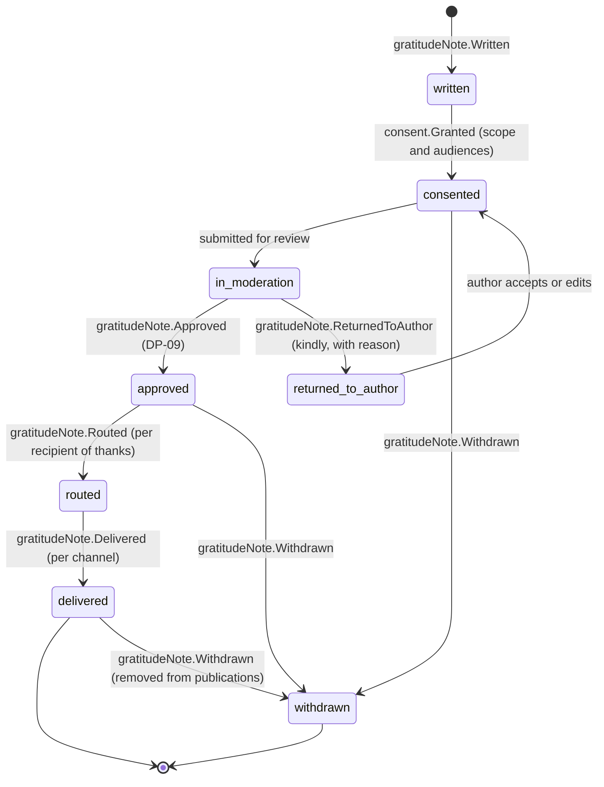
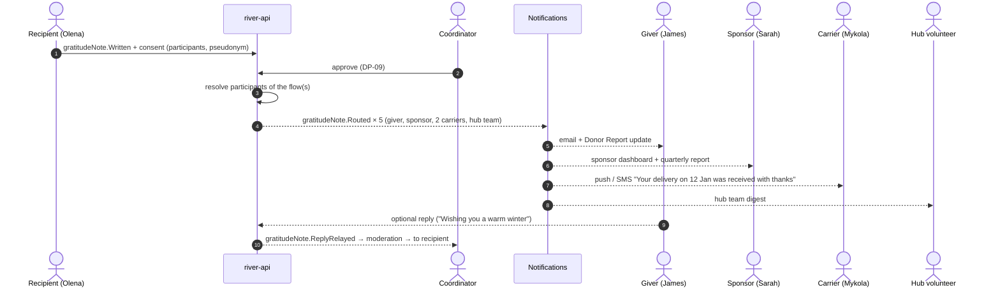

# Gratitude Loop

How thanks travels upstream. A [[Recipient]] may say thank you, and the thanks reaches **every hand that took part**: givers, sponsors, carriers, hub volunteers, coordinators and partner organisations. Each receives it in the form and with the level of identity that the recipient consented to. Back to [[Entity Relationship Map]].

> [!principle] Thanks travels upstream, and it is never owed
> Gratitude is invited, never required. No delivery, future help or reputation depends on a recipient saying thank you. See [[Guiding Principles#P9. Thanks travels upstream]].

## Gratitude Note lifecycle

## How thanks is written

| Channel | Who writes | Notes |
|---|---|---|
| Delivery confirmation screen ("Would you like to say something to the people who helped?") | Recipient or proxy | Optional, one free-text field, voice input, optional photo. uk / en-GB. |
| SMS reply to the tracking link | Recipient | Text only. A coordinator attaches it to the flow. |
| Spoken to a carrier or coordinator at handover | Carrier / coordinator, **on behalf of** the recipient | Recorded as `gratitudeNote.Written { transcribedBy }`. The recipient confirms the wording and consent by SMS or in person. |
| Institution letter (school, hospital) | Institution representative | Letter scan as a [[Media Asset]] |
| Coordinator's own thanks to carriers and volunteers | [[Coordinator]] / [[Administrator]] | The same pipeline with `author.role = coordinator`. Consent is not needed from a recipient, but moderation still applies. |

AI can **suggest a translation** (uk ↔ en-GB) for the giver. The original always travels with it, and a human reviews the translation. See [[Vertex AI Integration]] and [[Translation]]. #vertex

## Consent: scope and audiences

The recipient chooses, in simple words, who may read their thanks and how they are named:

| Choice | Options | Default |
|---|---|---|
| Who may read it | only the people who helped (`participants`) · also on the public [[Gratitude Wall]] and in stories (`public`) | `participants` |
| How I am named | "a family in Kharkiv oblast" · first name · first name + village · full name | pseudonym ("a family in Kharkiv oblast") |
| Photo | none · goods only · with people (faces blurred) · with people (faces visible) | none |
| Duration | until I withdraw · 12 months | until I withdraw |

Each choice is a [[Consent]] record (`consent.Granted`, purpose `gratitude`, scope). Withdrawal (`consent.Withdrawn` → `gratitudeNote.Withdrawn`) removes the note from every projection and publication within one projection cycle. See [[Consent Management]].

## Moderation (DP-09)

A coordinator (or an Editor) reviews every note before it leaves `private`. Moderation protects the **recipient** first:

- remove accidental identifiers: street, phone number, a child's full name, health details (Vertex may flag possible PII, and a human decides);
- check that photos have passed EXIF stripping and face blurring as consented;
- never "improve" the feeling or put words in the recipient's mouth. Edits are suggested back to the author (`gratitudeNote.ReturnedToAuthor`), not applied silently;
- decline to publish on the public wall if it would put the recipient at risk. The note still goes privately to participants.

Decision recorded at [[DP-09 Publication Consent]].

## Routing upstream

**Who counts as a participant** is resolved from the log for the flow (and, for split gifts, for each flow the gift touched):

| Participant | Derived from | What they receive |
|---|---|---|
| Givers of allocated gifts | `gift.Allocated` on the flow | The note, plus "your gift was part of this journey" |
| Sponsors whose funds paid costs | `costRecord.FundingAssigned` on the flow's legs | The note, plus the legs they funded |
| Carriers | `leg.HandedOver` on the flow's consignments | The note, plus the leg they drove |
| Hub volunteers and operators | `hub.ItemsReceived` / `hub.ItemsReleased`, packing events | Team digest |
| Coordinators and partners | Flow roles | In the [[Coordinator Workspace]] |

For large campaigns (hundreds of givers), notes are batched into a digest, and the [[Newsletter Digest]] may include a consented selection.

## Anonymity both ways

- **Recipient → giver:** the giver sees only the name form the recipient chose. The default is a pseudonym and a coarse region.
- **Giver → recipient:** the recipient sees "people in Leeds and a company in Manchester", or names only where the giver consented. Amounts are never shown to recipients.
- **Replies** from givers are moderated in the same way before reaching the recipient. No direct contact details are ever exchanged through the loop. See [[Privacy Model]].

## When no thanks is written

The loop still closes. After `flow.Confirmed`, every participant receives a **factual arrival notice** ("Delivered and confirmed on 14 January in Kharkiv oblast") and `gift.Acknowledged` is appended. The organisation's own thank-you, written by a coordinator or administrator, can travel the same route.

## What gratitude feeds

- The [[Gratitude Wall]], [[Journey Story]] and [[Donor Report]] (consented notes only)
- The "gratitude received" signal in [[Reputation Dynamics]] (counts only, never ranked)
- [[Impact Metrics]] (the number of flows with thanks, not the sentiment)

> [!question] Replies across the loop
> Should giver replies be allowed by default, or only when the recipient opts in to receiving replies? The current proposal is recipient opt-in, to avoid unwanted contact. #open-question
