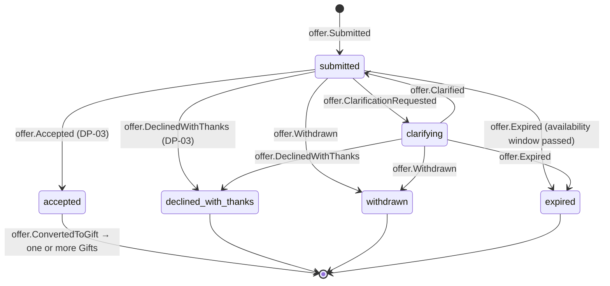
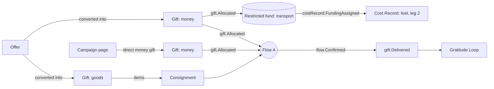

# Lifecycle of a Gift

The right bank has two lifecycles, one after the other. An [[Offer]] is *willingness* ("I can drive to Lviv in March", "I have 40 sleeping bags", "£50 a month"). A [[Gift]] is *what is actually given* once an offer is accepted. Money gifts can also arrive without an offer, straight from a [[Campaign]] page. Back to [[Entity Relationship Map]].

> [!principle] A gift is a gift
> A gift is never made conditional on publicity, priority or recognition, and it is never sold or exchanged. Declining an offer is always done *with thanks*. See [[Guiding Principles#P1. A gift is a gift]].

## Offer state machine

## Gift state machine

```mermaid
stateDiagram-v2
    [*] --> pledged: gift.Pledged
    pledged --> received: gift.Received (money in / goods in hand / service scheduled)
    pledged --> [*]: gift.PledgeLapsed (never arrived; no reproach)
    received --> allocated: gift.Allocated (to a Flow, DP-04)
    allocated --> allocated: gift.Reallocated (need withdrawn, flow changed)
    allocated --> delivered: gift.Delivered (derived from flow arrival)
    delivered --> acknowledged: gift.Acknowledged (gratitude or report delivered upstream)
    acknowledged --> [*]
```

A money gift may be **split**: £100 can be allocated as £60 to Flow A and £40 to a transport fund, each through its own `gift.Allocated` event with `amount` and `currency`. A goods gift is split by [[Item]] lines. Status is tracked per allocation, and the gift's own status is the *least advanced* of its allocations.

## What "received" means for each form of gift

| Form | `received` means | Evidence | Who records it | Event payload highlights |
|---|---|---|---|---|
| Money (card, via external checkout) | Provider webhook confirms settlement | Provider reference id | System (`via: api`) | `amount`, `currency`, `fxRateToBase`, `providerRef`, `restriction?` |
| Money (bank transfer, Monobank jar) | Finance Steward matches the statement line | Statement photo or CSV line | Finance Steward | same, plus `matchedBy` |
| Goods | Items counted in at a [[Hub]] or collected by a carrier | Intake photo, item list | [[Volunteer]] / Coordinator | `items[]`, `hubId`, `condition` |
| Service (skills, repair, translation) | Session scheduled with a date | Booking record | Coordinator | `scheduledFor`, `serviceKind` |
| Transport (a lift, a van, a slot in a lorry) | Capacity confirmed for a specific [[Leg]] | Leg assignment | Coordinator, [[DP-05 Routing and Carrier Assignment]] | `legId`, `capacity` |

Card data never touches the portal. See [[Money Flow and Cost Transparency]].

## Step table

| # | Step | Actor | Event | Visibility | DP |
|---|---|---|---|---|---|
| 1 | Giver describes what they can give, when and where, with an optional [[Intent Statement]] | [[Giver]] / [[Sponsor]] / [[Partner Organisation]] | `offer.Submitted` | `private` | — |
| 2 | Coordinator asks a clarifying question (size, condition, dates) | [[Coordinator]] | `offer.ClarificationRequested` / `offer.Clarified` | `private` | — |
| 3 | Acceptance or kind decline. Declines explain why and suggest alternatives (for example "money for local purchase travels further than used clothes"). | Coordinator | `offer.Accepted` / `offer.DeclinedWithThanks` | `private` | [[DP-03 Offer Acceptance]] |
| 4 | Conversion to one or more gifts | Coordinator / system | `offer.ConvertedToGift`, `gift.Pledged` | `private` | — |
| 5 | Money arrives or goods are counted in | System / Finance Steward / Volunteer | `gift.Received` | `team`; public ledger aggregate | — |
| 6 | Allocated to a [[Flow]] (or to a restricted fund held for a flow type) | Coordinator | `gift.Allocated` | `team`; giver sees "your gift is part of a journey" | [[DP-04 Matching]] |
| 7 | Flow arrives and its confirmation is accepted | derived | `gift.Delivered` | `participants` | [[DP-08 Delivery Confirmation Review]] |
| 8 | Thanks or a [[Donor Report]] reaches the giver | System | `gift.Acknowledged` | `private` to the giver | — |

## Relationships to the rest of the river

## Rules

- **Pledges that lapse are not failures.** `gift.PledgeLapsed` adds nothing negative to the giver's [[Reputation]]. Only accepted *commitments to carry or deliver* feed reliability. See [[Reputation Dynamics]].
- **Reallocation is visible to the giver.** When a need is withdrawn, the gift moves to a similar need in the same [[Campaign]], and the giver's journey view says so in plain words. Restricted money can only be reallocated within its restriction. Anything else needs the sponsor's recorded agreement (`gift.RestrictionVaried`).
- **Refunds are events, not deletions.** `gift.Refunded` appends a negative ledger line. The original `gift.Received` stays.
- **Amounts are private by default.** The giver chooses whether their name and amount appear anywhere (see [[Consent]] and [[Recognition Anti-Patterns]]).

> [!privacy] Giver anonymity
> A giver can be anonymous to the public and to the recipient. Whether they can also be anonymous to the coordinator (for anti-money-laundering reasons) is still open. See [[Open Questions]] and [[Privacy Model]].
