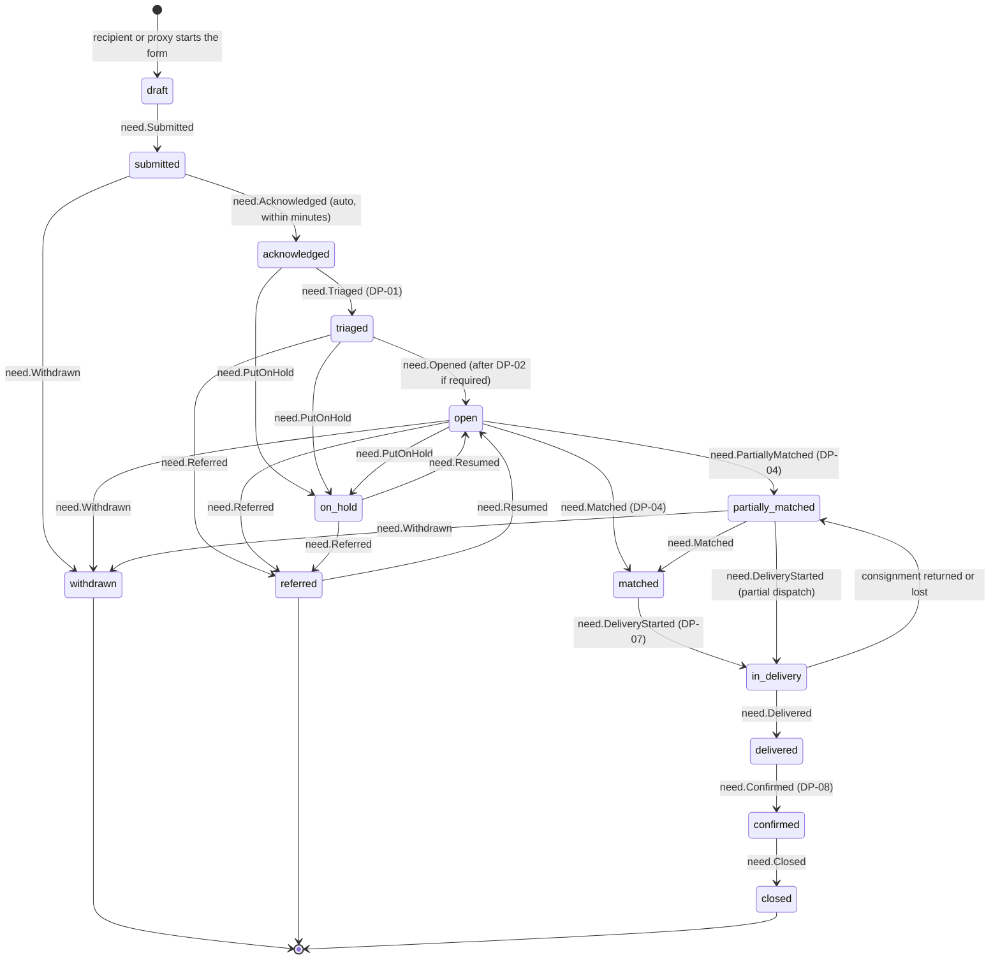

# Lifecycle of a Need

How a [[Need]] moves from the first words a [[Recipient]] types to its quiet closure. The note covers every status, the event that causes each move, who may cause it, and who can see it. Back to [[Entity Relationship Map]].

> [!principle] The left bank is always open
> There is **no `rejected` state**. When the organisation cannot help, the need is `referred` to someone who can, or put `on_hold` with a kind, plain explanation and a date for the next look. Reputation and verification change *how* a need is routed and checked. They never decide *whether* someone may ask. See [[Guiding Principles#P3. The left bank is always open]] and [[ADR-005 Open Access for Recipients]].

## State machine

## Status reference

Verification is **not** a Need status. [[DP-02 Need Verification]] runs as a parallel [[Verification]] record (`verification.*` events); while it runs the need stays `triaged`, and `need.Opened` follows once the chosen depth is satisfied or waived.

| Status | Meaning in plain words | Recipient sees ("Your request…") | Entered by | Event |
|---|---|---|---|---|
| `draft` | Being written. Saved only on the device or under the tracking link. | "Not sent yet" | Recipient / proxy | none, or `need.Drafted` if the recipient has an account |
| `submitted` | Received by the system | "Sent. Thank you." | Recipient / proxy | `need.Submitted` |
| `acknowledged` | A human-readable acknowledgement has been sent, with the expected time until someone looks at it | "We have it. A person will look at it by …" | System | `need.Acknowledged` |
| `triaged` | A [[Coordinator]] has read it, set its category, urgency and form, and chosen the depth of verification | "A coordinator is looking at it" | Coordinator, [[DP-01 Need Triage]] | `need.Triaged` |
| `open` | Visible to matching, in the coordinator queue and (redacted) to partners | "We are looking for help" | Coordinator, after [[DP-02 Need Verification]] where required | `need.Opened` |
| `partially_matched` | Some of what was asked for has a gift within a [[Flow]] | "Part of your request is on its way to being covered" | Coordinator, [[DP-04 Matching]] | `need.PartiallyMatched` |
| `matched` | All of it is covered by one or more flows | "Help has been found" | Coordinator, DP-04 | `need.Matched` |
| `in_delivery` | At least one [[Consignment]] or service is moving towards the recipient | "On its way" (with a coarse journey) | Coordinator, [[DP-07 Dispatch]] | `need.DeliveryStarted` |
| `delivered` | The carrier reports the handover at the destination | "Delivered. Did it arrive safely?" | Carrier / system | `need.Delivered` |
| `confirmed` | Receipt confirmed by the recipient, a proxy, or a carrier with evidence, and accepted at [[DP-08 Delivery Confirmation Review]] | "Thank you for confirming" | Recipient / proxy / coordinator | `need.Confirmed` |
| `closed` | Nothing more to do. Retention clock starts. | "Completed" | System or coordinator | `need.Closed` |
| `on_hold` | Paused, with a reason kind (`awaiting_stock`, `awaiting_clarification`, `seasonal`, `capacity`, `safety`) and a review date | Kind explanation + next review date | Coordinator | `need.PutOnHold` / `need.Resumed` |
| `withdrawn` | The recipient no longer needs it, or changed their mind. No questions asked. | "Withdrawn. You can ask again at any time." | Recipient / proxy only | `need.Withdrawn` |
| `referred` | Passed to a [[Partner Organisation]] or another service better able to help, with the recipient's agreement | "We have passed this to … who can help with …" | Coordinator | `need.Referred` |

## Step table

| # | Step | Actor | Event | Visibility | DP |
|---|---|---|---|---|---|
| 1 | Recipient (or neighbour, social worker, institution) submits without an account. Gets a one-time tracking link by SMS or email. | [[Recipient]] / proxy [[Person]] | `need.Submitted` | `private` | — |
| 2 | Automatic acknowledgement in the recipient's language | System | `need.Acknowledged` | `private` | — |
| 3 | Optional AI summary and clarity hints for the coordinator (never shown as a judgement) | Vertex, `via: vertex` | `ai.SuggestionMade` | `team` | — |
| 4 | Triage: category, urgency, form (cash, goods, service, lift), safeguarding flag | [[Coordinator]] | `need.Triaged` | `team`; safeguarding details `sealed` | [[DP-01 Need Triage]] |
| 5 | Proportionate verification (V0–V4, as a parallel [[Verification]] record — the need stays `triaged`) | Coordinator, Safeguarding Lead | `verification.Requested`, `verification.Completed` | `sealed` or `private` | [[DP-02 Need Verification]] |
| 6 | Clarification loop, if something is unclear | Coordinator ↔ Recipient | `need.ClarificationRequested`, `need.Clarified` | `private` | — |
| 7 | Opened for matching. The redacted card becomes visible to partners. | Coordinator | `need.Opened` | `team`; partner card `participants`-style redaction | — |
| 8 | Linked into one or more flows | Coordinator | `flow.NeedLinked`, `need.PartiallyMatched` / `need.Matched` | `team` | [[DP-04 Matching]] |
| 9 | Dispatch of the first consignment or service | Lead Coordinator | `need.DeliveryStarted` | `participants` (pseudonymised) | [[DP-07 Dispatch]] |
| 10 | Handover at destination | [[Carrier]] | `leg.HandedOver`, `need.Delivered` | `participants` | — |
| 11 | Confirmation, optional photo and thanks | Recipient / proxy / carrier | `deliveryConfirmation.Recorded`, `need.Confirmed` | `private` | [[DP-08 Delivery Confirmation Review]] |
| 12 | Closure. Retention policy is applied later. | System / coordinator | `need.Closed` | `team` | — |

## Rules that shape the lifecycle

- **One need, many flows.** A generator and winter medicine may travel in separate [[Flow]]s. The need's status is derived from its flows: it is `matched` only when every requested line is covered. See [[Entity Relationship Map#Three structural rules]].
- **Regression is honest.** If a [[Consignment]] is `returned` or `lost`, the need goes back to `partially_matched` and the recipient is told plainly. No silent re-routing. See [[Transport and Logistics Flow]].
- **On hold is a promise, not a parking lot.** Every `on_hold` carries a `reviewBy` date. When the date passes, the need appears in the queue of the triaging coordinator, and if nobody acts, the lead [[Coordinator]] of the programme is notified. See [[Escalation and Disputes]].
- **Referral needs agreement.** `need.Referred` requires a recorded [[Consent]] to share the need with the named partner. Only the fields the partner requires are shared (see [[Data Minimisation]]).
- **Withdrawal is instant and unquestioned.** Allocated gifts are released back to their flows through `gift.Reallocated`. See [[Lifecycle of a Gift]].
- **Re-asking is always allowed.** A closed, withdrawn or referred need never blocks a new submission from the same person. Duplicates are *linked* (`need.LinkedAsRelated`), never refused.

> [!privacy] What leaves the private zone
> Only the **need card** leaves `private`. It contains a category, a coarse [[Location]] (oblast or district), the form of help and the urgency band. The recipient's words, the household details and exact addresses never leave `private` or `sealed`. See [[Visibility Levels]] and [[Safeguarding]].

> [!decision] Automatic closure after silence
> When a recipient never confirms delivery and a confirmation based on carrier evidence is accepted at DP-08, the need stays `confirmed` for **30 days** ([[Canonical Parameters]]) and then closes automatically. The recipient can still add a confirmation or thanks during that time.
