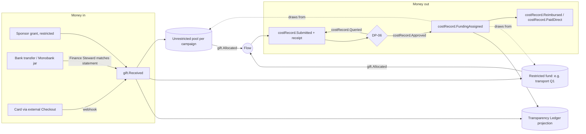
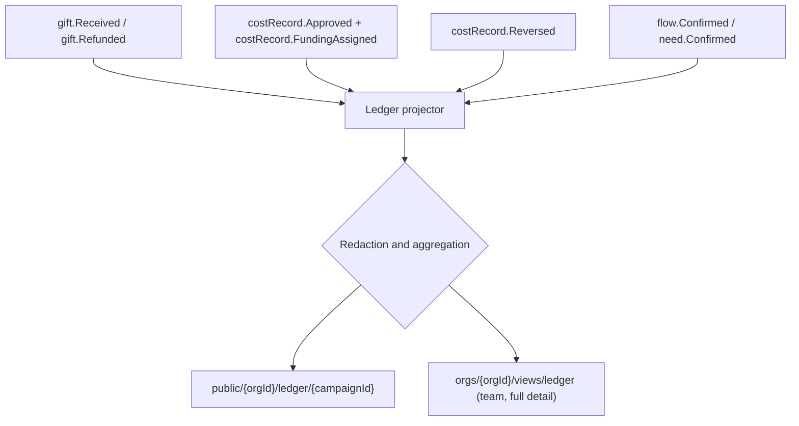

# Money Flow and Cost Transparency

How money enters the river, how it is kept to its purpose, how it leaves as real costs, and how the public [[Transparency Ledger]] is derived from the log, never typed by hand. Back to [[Entity Relationship Map]].

> [!principle] Honest numbers, beautifully shown
> Every public figure is a [[Projection]] of [[Log Event]]s. Transport and overhead are shown openly, not hidden to make impact look bigger. See [[Guiding Principles#P8. Honest numbers, beautifully shown]].

## The shape of the money

## Money in (Tier 1 baseline)

- The portal **never handles card data**. Givers are sent to external payment links (for example Stripe Checkout, a bank transfer reference, a Monobank jar). The portal records the **pledge** (`gift.Pledged`) and the **receipt evidence** (`gift.Received`).
- Provider webhooks reach `river-api`, are verified by signature, and append `gift.Received` with `via: api`, `providerRef`, `amount`, `currency` (ISO 4217) and `fxRateToBase` at the time of the event. Manual channels are matched by the Finance Steward from statement lines, with evidence attached.
- **Multi-currency:** every monetary field stores the original amount and currency. The base-currency value is computed with the FX rate recorded *at the event* and is never recalculated later. Rate source and timestamp are stored in the payload.
- Refunds and chargebacks append `gift.Refunded` as negative lines.

## Restricted funds

A restricted fund is money given **for a stated purpose**: "transport only", "Kharkiv oblast", "generators", "Q1 2027". Restrictions come from a [[Sponsor]]'s grant terms or from a [[Campaign]]'s declared purpose.

| Rule | Mechanism |
|---|---|
| Restricted money is spent only on matching costs | `costRecord.FundingAssigned` validates the cost's category, location and dates against the fund's restriction. A mismatch is rejected at command time. |
| Leftover restricted money is not silently absorbed | At fund end, `gift.RestrictedBalanceReported`. The sponsor chooses to extend, redirect (`gift.RestrictionVaried`, with a recorded agreement) or have it returned. |
| Overspend is visible | A cost larger than the fund's balance is split: part restricted, part unrestricted. Both parts are shown. |
| Sponsors see their fund's full trail | Sponsor view: income → each approved cost → leg or flow → deliveries enabled. See [[Donor Report]]. |

## Money out: cost records

Every outflow is a [[Cost Record]] attached to a [[Leg]] or a [[Flow]], or to an organisational overhead bucket. Categories: fuel, toll, ferry, postage, courier, customs, packaging, storage, vehicle hire, accommodation, local purchase (when a gift of money buys the item near the recipient), bank and payment fees, and overhead.

| Step | Actor | Event | Visibility | DP |
|---|---|---|---|---|
| Carrier or coordinator records the cost with a receipt photo | [[Carrier]] / [[Coordinator]] | `costRecord.Submitted` | `team` | — |
| Estimate before dispatch (for DP-07 budget check) | Lead Coordinator | `flow.BudgetEstimated` | `team` | [[DP-07 Dispatch]] |
| Approval or query. Nobody may approve their own claim. Above GBP 250 the Finance Steward approves; GBP 1,000 or more needs two approvers ([[Canonical Parameters]]). | Finance Steward / Lead Coordinator | `costRecord.Approved` / `costRecord.Queried` / `costRecord.Declined` | `team` | [[DP-06 Cost Approval]] |
| Funding source assigned (restricted or unrestricted) | Approver | `costRecord.FundingAssigned` | `participants` | DP-06 |
| Reimbursement or payment made (outside the portal) and recorded | Finance Steward | `costRecord.Reimbursed` / `costRecord.PaidDirect` | `team` | — |
| Correction (wrong amount or currency) | Finance Steward | `costRecord.Reversed` (references the original) | `team` | DP-06 |

## How the Transparency Ledger is derived

The ledger is a projection built by a Cloud Function on each relevant event. It is **rebuildable by replay** (see [[Event Log and Projections]]).

| Public ledger line | Source | Aggregation rule |
|---|---|---|
| Money received | `gift.Received − gift.Refunded` | Totals per campaign, per month, per currency plus base. **No individual amounts or names** unless the giver consented to named recognition. |
| Costs by category | Approved `cost.*` | Per category per campaign. Receipts can be shown with personal data redacted, if the [[Visibility Policy]] allows. |
| Restricted funds | `costRecord.FundingAssigned` | Per fund: in, spent, remaining |
| Deliveries enabled | `flow.Confirmed` | Count of confirmed flows and needs, coarse regions only |
| Pending | Recorded but not yet approved costs | Shown separately as "awaiting approval", never mixed with approved figures |

Small cells are suppressed (fewer than 5 people or households in a month and region, per [[Canonical Parameters]]) to prevent re-identification. See [[Data Minimisation]].

## Overhead honesty

- Overhead (platform hosting, payment fees, bank charges, accountant, coordinator stipends) is recorded as cost records in the `overhead` category, with an **allocation method** stated in writing (for example "pro rata by approved flow costs").
- The ledger shows three figures side by side: **delivered help**, **getting it there** (transport and logistics) and **keeping the lights on** (overhead). All three are plain numbers. The design does not hide or minimise any of them.
- Unpaid volunteer time is *not* converted into money on the ledger. It is recognised in [[Impact Metrics]] as hours, so it neither inflates impact nor suggests a hidden cost.

> [!decision] Approval separation
> The person who records a cost may not approve it. The Lead Coordinator approves up to the threshold, and above it the Finance Steward approves. Every decision is recorded at [[DP-06 Cost Approval]] and is visible to the Auditor role. See [[Accountability and Audit]].

> [!question] Direct payment integration at Tier 1
> Tier 1 records pledges and external receipts only. Should Tier 2+ integrate payment providers more deeply (for example recurring gifts, Gift Aid declarations for UK taxpayers)? Gift Aid in particular needs a declaration record and an HMRC-compatible export. #open-question
