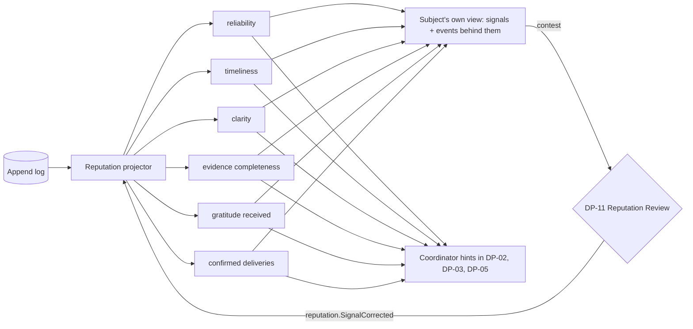
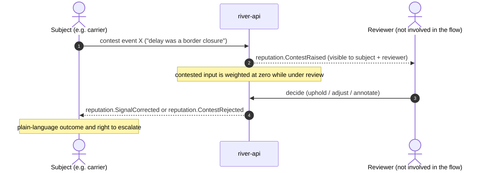

# Reputation Dynamics

How "the current" forms. [[Reputation]] is **not a score**. It is a set of explainable signals, each derived from specific [[Log Event]]s and each traceable back to them. This note covers how events feed signals for each role, how signals fade with time, how they are explained and contested, and the protections that keep them from ever closing the left bank. The signal definitions themselves live in [[Reputation Signals]]. Back to [[Entity Relationship Map]].

> [!principle] Reputation shapes routing, never access
> For a [[Recipient]], signals are **internal only**. They inform the *depth of verification* ([[DP-02 Need Verification]]) and *routing* ([[DP-05 Routing and Carrier Assignment]]). They never refuse, delay or deprioritise a request to ask. See [[ADR-005 Open Access for Recipients]].

## From events to signals

Reputation is a [[Projection]]. It is never written directly. The only reputation events in the log are the **contest and review records** (`reputation.ContestRaised`, `reputation.SignalAnnotated`, `reputation.SignalCorrected`, `reputation.ContestRejected`), which the projector reads like any other input.

## Signal inputs by role

| Role | Signal | Positive inputs | Negative or neutral inputs | Used at |
|---|---|---|---|---|
| [[Carrier]] | reliability | `leg.HandedOver` on an assigned leg | `leg.CarrierUnassigned` less than 24 h before departure without a reason; `consignment.Lost` *with fault recorded at DP-08* | [[DP-05 Routing and Carrier Assignment]] |
| Carrier | timeliness | Handover within the planned window | `leg.Delayed` with no external reason (customs and checkpoints are external and neutral) | DP-05 |
| Carrier | evidence completeness | Handover proof complete; receipts attached | `costRecord.Submitted` without a receipt (neutral if explained) | [[DP-06 Cost Approval]] depth |
| [[Giver]] / [[Sponsor]] | reliability | Commitments delivered (goods delivered to the hub on the agreed date, transport slot provided) | Accepted goods offer that never arrived. **Money pledges that lapse are neutral.** | [[DP-03 Offer Acceptance]] |
| Giver | clarity | `offer.Submitted` with no clarification needed | none. Clarification requests are neutral. | DP-03 |
| [[Coordinator]] | reliability, timeliness | Tasks completed before claim expiry; needs acknowledged and triaged within the service level | Repeated `flow.TaskClaimExpired`; `on_hold` review dates missed | Internal management only. See [[Coordination Model]]. |
| [[Partner Organisation]] | reliability, evidence | Hub counts that match; confirmed deliveries | `hub.DiscrepancyRecorded` unresolved | Cross-organisation routing |
| [[Recipient]] | confirmed deliveries, clarity | `need.Confirmed`, clear needs | **Nothing negative is ever derived automatically.** Only a Safeguarding Lead may add a `sealed` note, and it changes verification depth only. | DP-02 depth only |
| [[Volunteer]] | reliability | Shifts completed | Neutral when missed with notice | Task offers |

*Gratitude received* is counted for everyone in a flow when a [[Gratitude Note]] is routed to them. It is a warm signal, shown to its subject, and never used to rank anyone (see [[Gratitude Loop]]).

## Recency and decay

- Each input has a **half-life**. The default is 180 days for positive and 90 days for negative inputs, so old mistakes fade faster than good work.
- Signals are shown as **bands with evidence counts** ("reliable, 14 of 15 legs on time in the last 6 months"), never as bare numbers or percentages to two decimals.
- **Cold start is neutral.** A new carrier has "no history yet", which leads to a standard check, not a lower rank.
- Anything older than the retention period is not used at all (see [[Data Retention]]). Crypto-shredded persons disappear from projections on the next rebuild.

## Explainability

Every signal on every screen has a "why?" link that lists the contributing events in plain words, with their dates and weights:

| Shown to a carrier (Mykola) | Behind it |
|---|---|
| Reliable, 14 of 15 legs handed over as planned | 14 × `leg.HandedOver`, 1 × `leg.CarrierUnassigned` (18 Mar, "van broke down", neutral weight) |
| Evidence: complete | 22 receipts attached out of 22 costs |
| Thanks received: 9 | 9 × `gratitudeNote.Delivered` to you |

The subject can **always** see their own signals and the events behind them, except `sealed` safeguarding notes, whose existence is disclosed only where the law requires it (see [[Safeguarding]]).

## Contestation (DP-11)

- The reviewer must not have been involved in the contested flow ([[DP-11 Reputation Review]]).
- The original event is never changed. The adjustment is a new event that the projector applies. See [[Guiding Principles#P7. The river remembers]].
- Escalation follows [[Escalation and Disputes]].

## Protections

1. **No leaderboards of people.** No public ranking and no "top givers" by amount. Only participation-based [[Recognition]]. See [[Recognition Anti-Patterns]].
2. **No negative signal for recipients from automation.** Asking often, withdrawing or being referred elsewhere is never a negative input.
3. **No cross-organisation export of individual signals** without the subject's consent. Partners see "verified carrier with this organisation", not the underlying data.
4. **AI never computes reputation.** Vertex may *summarise* the events behind a signal for a reviewer, and that summary is logged with `via: vertex`. See [[Vertex AI Integration]].
5. **Humans decide.** Signals are hints on decision screens, next to the reasons. They never trigger an automatic action.

> [!question] Narrative or signals for the subject
> Should the subject's own view be a set of signals, a short narrative ("You have carried 15 loads with us since March…"), or both? The current proposal is both, with the narrative drafted by template, not AI. Already listed in [[Open Questions]]. #open-question
