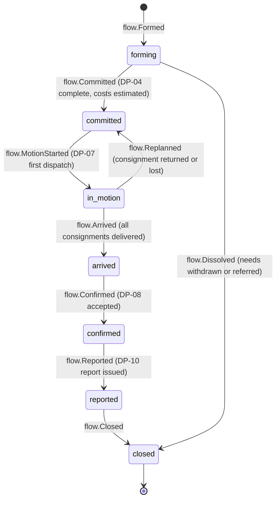
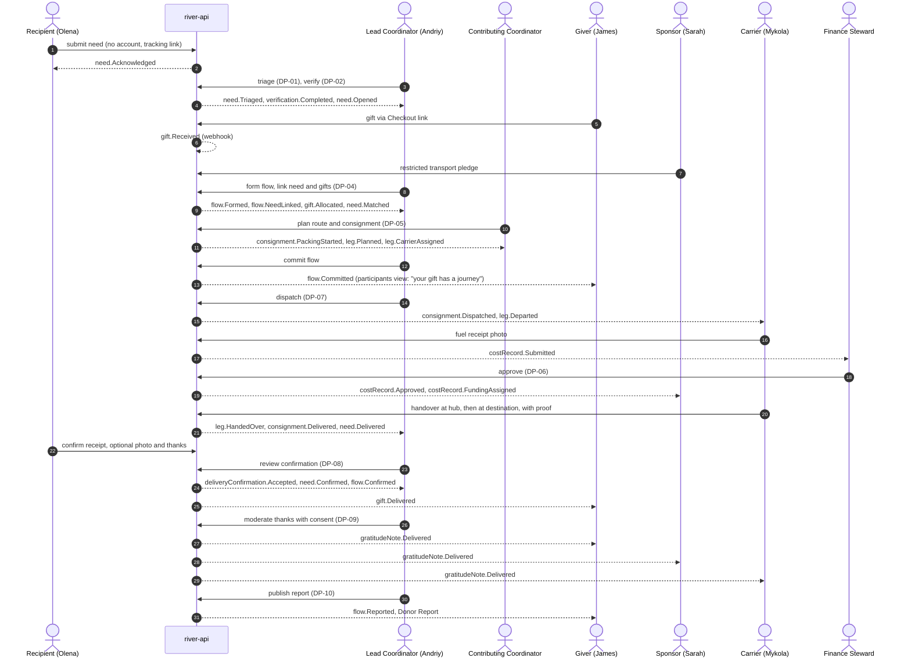
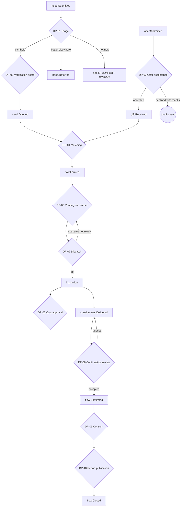

# The Delivery Chain

The whole river in one note. It follows a single [[Need]] from the moment it is expressed, through matching, packing, transport and confirmation, to the thanks that travels back upstream. Every step names its actor, the [[Log Event]] it appends, the visibility of that event, and the decision point that governs it. Back to [[Entity Relationship Map]].

Worked example: Olena's request for a generator and winter medicine (see [[Audiences and Personas]]), matched to James's money gift and a donated generator from a [[Partner Organisation]], carried by Mykola, with transport paid by Sarah's company. Demo data: [[Scenario B — Regional Aid Hub]].

## Flow state machine

The [[Flow]] is the unit that the chain moves forward.

## End-to-end sequence

## Step → actor → event → visibility → DP

| # | Step | Actor | Event(s) | Visibility | DP |
|---|---|---|---|---|---|
| 1 | Need expressed | [[Recipient]] or proxy | `need.Submitted`, `need.Acknowledged` | `private` | — |
| 2 | Triage | [[Coordinator]] | `need.Triaged` | `team` (safeguarding flag `sealed`) | [[DP-01 Need Triage]] |
| 3 | Proportionate verification | Coordinator / Safeguarding Lead | `verification.Requested`, `verification.Completed` | `sealed` / `private` | [[DP-02 Need Verification]] |
| 4 | Need opened | Coordinator | `need.Opened` | `team` | — |
| 5 | Offers accepted, gifts received | [[Giver]], [[Sponsor]], system | `offer.Accepted`, `gift.Pledged`, `gift.Received` | `private`; ledger aggregate `public` | [[DP-03 Offer Acceptance]] |
| 6 | Flow formed, need and gifts linked | Lead Coordinator | `flow.Formed` (names the Lead Coordinator), `flow.NeedLinked`, `gift.Allocated`, `need.Matched` | `team` | [[DP-04 Matching]] |
| 7 | Consignment packed at a [[Hub]] | [[Volunteer]] | `consignment.PackingStarted`, `consignment.ItemAdded`, `consignment.Ready` | `team` | — |
| 8 | Route planned, carriers assigned | Contributing Coordinator | `leg.Planned`, `leg.CarrierAssigned` | `participants` (pseudonymised) | [[DP-05 Routing and Carrier Assignment]] |
| 9 | Cost estimate and flow commitment | Lead Coordinator | `flow.BudgetEstimated`, `flow.Committed` | `participants` | — |
| 10 | Dispatch | Lead Coordinator | `consignment.Dispatched`, `leg.Departed`, `flow.MotionStarted`, `need.DeliveryStarted` | `participants` | [[DP-07 Dispatch]] |
| 11 | Costs recorded on the road | [[Carrier]] | `costRecord.Submitted` (with receipt [[Media Asset]]) | `team` | — |
| 12 | Costs approved | Finance Steward / Lead | `costRecord.Approved` or `costRecord.Queried` | `public` once approved (aggregated) | [[DP-06 Cost Approval]] |
| 13 | Handover at hub or to the next carrier | Carrier ↔ carrier / hub | `leg.HandedOver`, `hub.ItemsReceived`, `leg.Closed` | `participants` | — |
| 14 | Final handover | Carrier → recipient or proxy | `leg.HandedOver`, `consignment.Delivered`, `need.Delivered` | `participants` | — |
| 15 | Confirmation | Recipient / proxy / carrier with evidence | `deliveryConfirmation.Recorded` | `private` | — |
| 16 | Confirmation review | Coordinator | `deliveryConfirmation.Accepted`, `need.Confirmed`, `flow.Confirmed`, `gift.Delivered` | `participants` | [[DP-08 Delivery Confirmation Review]] |
| 17 | Thanks written, consented, moderated, routed | Recipient, Coordinator | `gratitudeNote.Written`, `gratitudeNote.Approved`, `gratitudeNote.Routed`, `gratitudeNote.Delivered` | as consented | [[DP-09 Publication Consent]] |
| 18 | Reporting | Lead / Editor | `flow.Reported`, `publication.Published` | `participants` / `public` | [[DP-10 Report Publication]] |
| 19 | Closure | System | `flow.Closed`, `need.Closed`, `gift.Acknowledged` | `team` | — |

Reputation signals are recomputed as a side effect of steps 8, 10, 12, 14 and 16 (see [[Reputation Dynamics]]). Visibility of any item can be changed later through [[DP-12 Visibility Change]].

## Decision points in the chain

## Correlation and causation

Every event in one chain shares a `correlationId` equal to the flow id, plus the need id for pre-flow events, which are back-linked by `flow.NeedLinked`. `causationId` points to the event or command that triggered it. This lets the [[Journey Story]] and the [[Flow Map]] rebuild the whole chain from the log, and lets [[Accountability and Audit]] answer "who decided this, and on what basis?" See [[Event Log and Projections]].

## Failure branches (never silent)

| Situation | Events | What participants are told |
|---|---|---|
| Consignment lost | `consignment.Lost`, `flow.Replanned`, `need.PartiallyMatched` | Recipient: "The delivery was lost on the way. We are arranging another." Givers: the same fact, pseudonymised. |
| Consignment returned (border refusal, recipient moved) | `consignment.Returned`, `hub.ItemsReceived` | As above, with the reason category |
| Recipient unreachable at handover | `leg.HandoverFailed`, retry or proxy delivery | Recipient: SMS with new options |
| Confirmation doubtful | `deliveryConfirmation.FollowUpRequested` (DP-08) | Private to coordinator and carrier. Never framed as an accusation. |
| Need withdrawn mid-flow | `need.Withdrawn`, `gift.Reallocated` | Givers: "Your gift is now helping a similar request nearby." |
