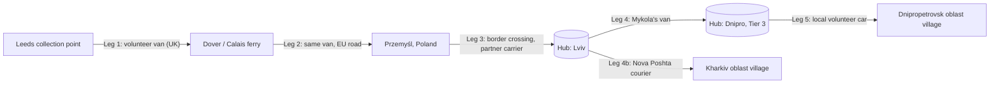
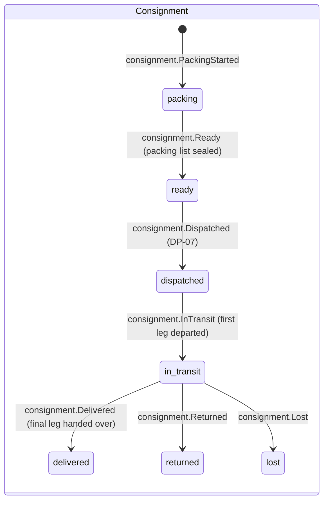
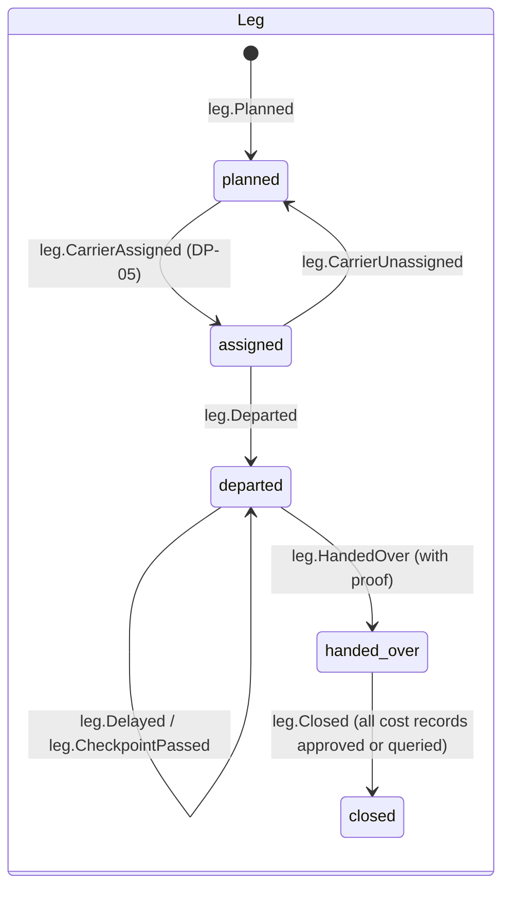
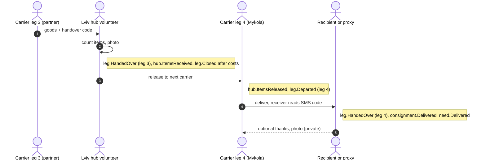

# Transport and Logistics Flow

How physical help moves. A [[Consignment]] (a "boat") of [[Item]]s travels along one or more [[Leg]]s ("reaches") between [[Location]]s and [[Hub]]s ("pools"). Each leg is driven by one [[Carrier]] ("boatman"), and each ends with a handover backed by proof. Every leg carries its own [[Cost Record]]s ("tolls"). Back to [[Entity Relationship Map]].

> [!principle] Honest about costs
> Transport is a real part of the gift, not an embarrassment to hide. Every leg's fuel, tolls, ferries, postage and customs fees are recorded against that leg and shown openly in aggregate. See [[Money Flow and Cost Transparency]] and [[Guiding Principles#P8. Honest numbers, beautifully shown]].

## Typical multi-leg route (Open River Aid)

A consignment may be **split** at a hub (`consignment.Split` creates child consignments) or **merged** with others heading the same way (`consignment.Merged`). Item-level traceability is preserved because each [[Item]] keeps its `giftId`.

## Consignment and leg state machines

A leg can only be `closed` after its cost records have passed [[DP-06 Cost Approval]] (approved, declined or explicitly marked "no costs"). This makes the cost of every reach complete before the flow is reported.

## Carrier types

| Carrier type | Example | How they access the portal | Tracking | Proof at handover | Typical costs |
|---|---|---|---|---|---|
| Volunteer driver | Mykola, Lviv ↔ Kharkiv | Leg-scoped magic link (no account needed) or Firebase account | Manual check-ins (`leg.CheckpointPassed`), works offline | Photo + receiver's name or code, geotag stripped | Fuel, tolls, ferry, meals (per policy) |
| Postal service | Royal Mail, Ukrposhta | Coordinator records it on their behalf | Tracking number in payload, optional polling | Provider's delivery scan | Postage |
| Courier / parcel network | Nova Poshta, DHL | Coordinator records; optional API import | Tracking number, webhook where available | Provider's proof of delivery (TTN) | Shipping fee, COD fees |
| Logistics company (paid) | Pallet haulier UK → PL | Coordinator records; company contact gets a leg link | Milestones | CMR note photo | Invoice |
| [[Partner Organisation]] fleet | Partner's lorry Przemyśl → Lviv | Partner co-coordinator | Partner check-ins | Hub intake count | Often donated. Recorded as an in-kind cost at zero with a note. |
| Recipient collection | Recipient collects from the hub | Tracking link | — | Hub release record + receiver code | none |

## Handover with proof

Every handover transfers **custody**. The system must always be able to say who holds a consignment.

| Proof element | Required? | Notes |
|---|---|---|
| Handover code | Yes for final delivery; optional between carriers | A short one-time code sent by SMS to the receiver and read out to the carrier. Works offline because it is validated when the carrier's device next syncs. |
| Photo of goods | Recommended | EXIF and GPS are stripped on upload. Faces are blurred by default. Visibility is `private` until DP-09 consent. See [[Media Asset]]. |
| Item count | Yes at hubs | Discrepancies create `hub.DiscrepancyRecorded` |
| Receiver identity | Name or role only ("hub volunteer", "neighbour") | Proxy receivers are allowed. See [[Delivery Confirmation]]. |
| Signature | Optional | Only where a customs or partner process requires it |

## Border and customs

| Step | Event | Evidence | Visibility |
|---|---|---|---|
| Humanitarian declaration prepared (packing list, consignee letter) | `consignment.CustomsDocumentsPrepared` | PDF [[Media Asset]] | `team` |
| Queue and crossing | `leg.CheckpointPassed` with `checkpointKind: border` | none | `participants` |
| Duty or fee paid | `costRecord.Submitted` with `category: customs` | Receipt | `team`, then aggregated `public` |
| Held or refused | `leg.Delayed` (reason `customs_hold`) or `consignment.Returned` | Officer's document photo | `team` |

Customs rules change often. The portal stores the documents and the facts. It does not give legal advice.

## Cost capture per leg

Carriers capture costs on their phones during the leg. Each capture becomes a `costRecord.Submitted` with `legId`, `category` (fuel, toll, ferry, postage, customs, packaging, accommodation, vehicle hire), `amount`, `currency` (ISO), `fxRateToBase` recorded at the time of the event, and a receipt photo. A missing receipt is allowed only with a written explanation and always goes to the Finance Steward.

## Sponsor-funded transport

A [[Sponsor]] (Sarah's company) funds "transport for Q1" as a **restricted fund**. When a transport cost is approved at DP-06, the approver assigns its funding source (`costRecord.FundingAssigned {fundId}`). The sponsor's view then shows every leg they paid for: kilometres, carriers (pseudonymised), costs and the deliveries those legs enabled. See [[Money Flow and Cost Transparency#Restricted funds]] and [[Donor Report]].

## Decision points

- [[DP-05 Routing and Carrier Assignment]]: choose route, hubs and carrier type. Carrier reliability signals inform the choice (see [[Reputation Dynamics]]).
- [[DP-07 Dispatch]]: go or no-go. Checks the packing list, documents, safety of the route and costs within estimate.
- [[DP-06 Cost Approval]]: every leg cost.

> [!privacy] Carriers see only what the leg needs
> A carrier's magic link shows the pickup and drop-off for that leg only. The final address and the receiver's phone number are revealed on the day of the final leg and hidden again after `leg.Closed`. See [[Visibility Levels]].

> [!question] Offline carriers and live tracking
> Should volunteer carriers be offered opt-in live location sharing during a leg? It is useful for safety and for givers' excitement, but it is sensitive in a conflict zone. The current proposal is no live location: coarse checkpoints only. #open-question
