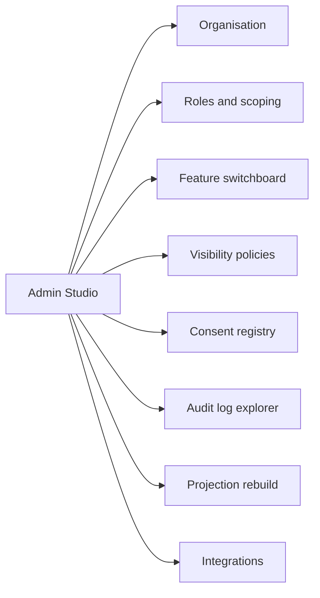

# Admin Studio

Where an organisation configures itself: who may do what, which features are on, how visible things are, and how every action can be checked. It lives under `studio /admin/*` behind IAP. Back to [[Portal Q&A]]. Routes: [[Site Map]].

Designed around **Iryna** (director and administrator): oversight without micromanagement, and audit-ready at any moment. See [[Audiences and Personas]].

> [!principle]
> Administration is also recorded. Every settings change is a command, appended as a [[Log Event]] with the administrator as actor. There are no silent switches. See [[Guiding Principles#P7. The river remembers]].

## Sections

## Organisation settings

- Legal name, charity number, registered country, default currency (e.g. `GBP`) and accepted currencies (`GBP`, `EUR`, `UAH`, `USD`).
- Locales enabled and default locale ([[Multilingual Experience]]), domains and brand tokens (logo, accent within the [[Design Language]] limits).
- Service promises shown to recipients (e.g. "reply within 2 days"), SMS sender and numbers.
- Programmes, campaigns and hubs (Tier 2+). See [[Programme]], [[Campaign]], [[Hub]].
- Cost-approval thresholds and giver-anonymity threshold (defaults GBP 250 / GBP 1,000 and GBP 5,000 in 12 months; see [[Canonical Parameters]]).

## Roles and scoping

Staff are Google Workspace / Cloud Identity accounts admitted by IAP. Admin Studio maps each identity to one or more [[Role]]s with a **scope**.

| Role / variant | Typical scope | Key powers |
|---|---|---|
| [[Coordinator]] | Programme or campaign | Triage, match, route, capture costs, review confirmations |
| Lead Coordinator | Per [[Flow]] (assigned in workspace) | Approve costs under threshold, hand over lead |
| Safeguarding Lead | Organisation | Sees `sealed` fields, runs [[Safeguarding]] reviews |
| Finance Steward | Organisation or programme | Approves costs above threshold ([[DP-06 Cost Approval]]), reconciles funds |
| Editor | Organisation | Content, review and publishing ([[Content Editor]]) |
| Auditor | Organisation, time-boxed | Read-only access to the log, ledger and reports |
| [[Administrator]] | Organisation | Everything in this note. By default *cannot* read `sealed` |

- Roles are granted with a start date, an optional end date and a reason. Grants are logged. Separation of duties is enforced: nobody approves their own cost, and Administrator plus Finance Steward in one person needs a second approver.
- Public participants (givers, carriers, volunteers) get roles through their Firebase identity. Staff roles are never granted to Firebase-only identities. See [[Identity and Access]].
- Partner organisations: their staff are admitted as external IAP principals scoped to the flows they co-coordinate ([[Partner Organisation]]).

## Feature switchboard

The [[Scaling Tiers]] table made operational. Each switch shows what it enables, its dependencies and its data impact.

| Switch | T1 | T2 | T3 | T4 | Depends on |
|---|:-:|:-:|:-:|:-:|---|
| Campaigns and money offers | ● | ● | ● | ● | payment integration |
| Cost records and ledger | ● | ● | ● | ● | – |
| Public need intake (`/ask`) | ○ | ● | ● | ● | SMS integration recommended |
| Goods, hubs, inventory | | ● | ● | ● | ≥ 1 hub |
| Multi-leg transport | | ○ | ● | ● | hubs |
| Partner organisations | | | ● | ● | external IAP principals |
| Programmes and grants | | | ○ | ● | restricted funds |
| Vertex AI assistance (per feature) | | ○ | ○ | ● | DPA accepted, region chosen |
| BigQuery export | | | ○ | ● | – |

Switching a feature off hides its UI and stops new commands. It **never** deletes data, and projections remain readable to Auditors.

## Visibility policies

- The organisation's [[Visibility Policy]] per entity and field (e.g. `Need.settlement`: participants → pseudonymised to oblast; `Gift.amount`: private).
- Defaults follow [[ADR-006 Private by Default Visibility]]. The editor lets policies be *tightened* freely. *Loosening* any person-related default requires a second approver and a reason ([[DP-12 Visibility Change]]).
- A **preview as audience** mode shows a sample record rendered for `public`, `participants`, `team`, `private` and `sealed`. See [[Visibility Levels]].
- Public map rounding and delay (oblast level; 7 days, or 14 days in high-risk oblasts) are set here, never looser than [[Canonical Parameters]]. See [[Flow Map]].

## Consent registry

- Consent templates (purposes) in every enabled locale: story publication, photo, named thanks, referral to partner, SMS updates. Each template is versioned.
- A registry of granted and withdrawn [[Consent]]s with purpose, scope, version and time. The registry shows no personal content, only references.
- **Withdrawal propagation monitor**: for each withdrawal, the projections it affected and confirmation that each has been rebuilt without the item. See [[Consent Management]].
- Erasure requests: a queue of right-to-erasure requests, legal-hold check, and **crypto-shred** action (destroys the person's KMS key) with double confirmation. See [[Privacy Model]] and [[Data Retention]].

## Audit log explorer

- Filter the append log by aggregate, event type, actor, role, channel (`web | studio | api | system | vertex`), time and correlation id.
- Follow causation chains: "this public counter changed because of `deliveryConfirmation.Accepted` ← `leg.HandedOver` ← …".
- Payloads are shown at the viewer's visibility. PII references resolve only for roles entitled to them. Auditors see crypto-shredded subjects as `[erased]`.
- Export as signed CSV or JSON for a period, for trustees, auditors or regulators. See [[Accountability and Audit]] and [[Event Catalogue]].

## Projection rebuild

- A list of projections with version, last event processed, lag and health. See [[Event Log and Projections]].
- *Rebuild* replays the log into a shadow collection, compares counts, then swaps. This is used after a projection code change, a consent withdrawal audit or a suspected drift.
- A rebuild is itself logged (`system.ProjectionRebuilt`) and does not change the log.

## Integrations

| Integration | Purpose | Secret storage |
|---|---|---|
| Payment providers (Stripe, bank feed, Monobank) | Money gifts, webhook → `gift.Received` | Secret Manager |
| SMS / email / push / Telegram / Viber | [[Notifications]] | Secret Manager |
| Vertex AI | Translation drafts, summaries, suggestions | service account, per-feature switch |
| BigQuery | Analytics export (Tier 3–4) | IAM |
| Partner webhooks | Referrals and shared offers | signed, per partner |

Each integration shows its status, last success and error rate, linking to [[Observability]].

> [!question]
> Should the Administrator role be able to see `sealed` data in an emergency ("break glass"), with a mandatory after-the-fact review by the Safeguarding Lead and trustees? The current default is no. See [[Safeguarding]].

## Built so far (engineering iteration 04, 2026-09-25)
- **Organisation settings** are the settings registry. It has about 35 typed settings in eight groups: organisation, contact, people asking for help, giving, money, publishing, home page and appearance. The form is generated from the registry. Each value shows whether it comes from the registry default, the profile or the organisation, and can be reset. Floors and the contrast of the accent colour are enforced. Every change is a `settings.*` event with the administrator as actor.
- **Profiles**: an administrator can apply one of three profiles (state programme, city foundation, small nationwide), optionally keeping their own values. See [[Scaling Tiers]].
- **Who may change what**: each setting names the roles that may change it. Wording and the home page are open to editors; money, contact and safety settings are for administrators; auditors see everything read-only.
- **Site texts** are edited in the studio's *Surface* stage, never on public pages.
- **Not built yet**:
  - role grants with scope and dates (staff roles still come from a configured list);
  - the feature switchboard;
  - visibility policies;
  - the consent registry;
  - the audit log explorer;
  - projection rebuild;
  - integrations.

The studio's stages are listed in [[Site Map]]. Engineering decision: `adr/records/ADR-0020 Settings Registry and Organisation Profiles.md`.

