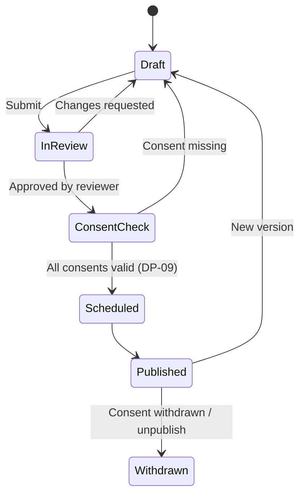

# Content Editor

The built-in editor for articles, campaign pages, journey stories, reports and the home page. It is simple enough for a volunteer and exact enough for a trustee report. It lives at `studio /content` behind IAP, for the Editor role variant and coordinators with editing rights. Back to [[Portal Q&A]]. Technical model: [[Content Management]].

> [!principle]
> Numbers are never typed. They are embedded as **live data blocks** bound to projections, so a published page cannot drift from the log. See [[Guiding Principles#P8. Honest numbers, beautifully shown]].

## Editor layout

```
┌──────────────────────────────────────────────────────────────────────────┐
│ Heaters for Izium · Journey story        Draft · uk ✓ reviewed · en ◐ AI │
├───────────────────────────────┬──────────────────────────────────────────┤
│ en-GB                         │ uk                                        │
│ ## Warm classrooms by Friday  │ ## Теплі класи до п'ятниці                │
│ [Journey timeline ▸ Flow #58] │ [Journey timeline ▸ Flow #58]  (shared)   │
│ Two generators left Leeds …   │ Два генератори вирушили з Лідса …         │
│ [Counter: litres carried]     │ [Counter: літрів перевезено]              │
├───────────────────────────────┴──────────────────────────────────────────┤
│ + Block   ✨ AI draft   👁 Preview as: Public ▾   ⧗ History   Submit ▸    │
└──────────────────────────────────────────────────────────────────────────┘
```

Built on TipTap. Content is stored as structured JSON blocks, with a per-locale [[Translation]] for each text-bearing block. Data blocks are shared across locales, and only their labels are translated.

## Blocks

| Block | Kind | Notes |
|---|---|---|
| Heading, paragraph, list, quote | text | Quote can be bound to a [[Gratitude Note]] (consented only) |
| Image, gallery | media | Only [[Media Asset]]s whose visibility ≥ page visibility, alt text required per locale |
| Callout | text | Info, thanks, cost note |
| Button / call to action | text | Links to `/give/...` or `/ask`. No urgency wording (linted) |
| Two-column, divider, spacer | layout | |
| **Counter** | live data | Binds to an [[Impact Metrics]] definition, with an optional filter (campaign, period) |
| **Campaign progress** | live data | Goal, raised, costs to date |
| **Ledger excerpt** | live data | Rows from the [[Transparency Ledger]] with receipt thumbnails |
| **Journey timeline** | live data | asked → gathered → carried → arrived → thanked for one [[Flow]] |
| **Flow map** | live data | Corridor map for a campaign or programme, rounded and delayed ([[Flow Map]]) |
| **Gratitude excerpt** | live data | Consented notes from the [[Gratitude Wall]] |
| **Supporters band** | live data | Sponsors and givers who opted in to be named, unordered by amount |
| Embed (video) | media | Allow-listed hosts, no autoplay |

Live data blocks store a **binding** (projection + filter + as-of mode), not values. As-of mode is either *live* or *frozen at publication*, and reports use frozen so that an audited figure never changes. The editor shows the current value and "last updated".

> [!privacy]
> A live data block renders only through the **public** projection when the page is `public`. The editor refuses to bind a block to a `team` or `private` view on a public page and says why.

## Bilingual side-by-side editing

- Two columns: the source locale on the left and the target on the right. The source can be swapped. Blocks are aligned row by row, so a missing translation is obvious.
- **Translation status per block and per page**: `missing` · `ai_draft` · `in_review` · `reviewed`. A page can be published in a locale only when every text block there is `reviewed`, unless the Editor explicitly publishes with a visible "Machine translated" label.
- If the source changes after review, the target block is marked `stale` with a diff.
- See [[Multilingual Experience]] and [[Internationalisation]].

## AI draft assist (`#vertex`)

| Action | Input | Output | Safeguard |
|---|---|---|---|
| Draft translation | Source block | Target block, status `ai_draft` | Must be human-reviewed before publication |
| Draft story from flow | Flow projection (pseudonymised) | Outline + paragraphs | Labelled, never auto-published |
| Tone check | Block text | Hints against [[Brand and Tone of Voice]] (pity, guilt, urgency, "beneficiaries") | Advisory |
| Plain-language check | Block text | Reading-age estimate and suggestions | Advisory |
| PII scan | Page | Highlights names, phones, addresses, faces in images | Blocks submission until each hit is resolved |

Every AI action is logged with `via: vertex`, the model and the prompt template version. See [[Vertex AI Integration]].

## Preview per audience

*Preview as* renders the page through the same projection pipeline as production for each audience: **Public**, **Participants** of a flow, **Team**, and a specific signed-in giver (for donor reports). It also offers device widths (360 / 768 / 1280), low-data mode, dark mode and each enabled locale. Redacted fields show as the audience would see them ("a family in Kharkiv oblast").

## Review and publish workflow



- The reviewer must be a different person from the last author.
- The **consent check** runs automatically. Every person-related block (quote, image, named supporter) must reference a valid [[Consent]] covering the page's visibility. See [[DP-09 Publication Consent]].
- Reports additionally pass [[DP-10 Report Publication]].
- When a consent is withdrawn, the affected block is removed from the published projection automatically and the page is flagged for the Editor. See [[Consent Management]].

## Versioning via the log

Every save is a `publication.DraftSaved` event with a block diff. Publication is `publication.Published` with the frozen bindings. *History* shows a timeline of versions with author, reviewer and AI involvement, and can restore any version as a new draft. Nothing is overwritten. See [[Publication Pipeline]] and [[Log Event]].
