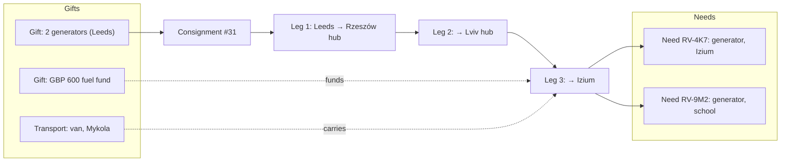

# Coordinator Workspace

The calm centre of the `studio` app, where coordinators turn needs and offers into flows that arrive. Back to [[Portal Q&A]]. Routes: [[Site Map]] (`studio /queue`, `/flows`, …). Access: [[IAP Staff Access]].

Designed around **Andriy** ([[Audiences and Personas]]): 40 open requests, three vans, and until now a WhatsApp group.

> [!principle]
> Humans decide. AI suggests, with reasons, and every suggestion can be dismissed without justification. Every action is a command appended to the log with the coordinator named as actor. See [[Responsibility Matrix]] and [[Accountability and Audit]].

## Layout

```
┌──────┬──────────────────────────────────────────────┬──────────────────┐
│ Nav  │  Main pane (queue / board / canvas / planner) │ Context panel    │
│ ▣ Q  │                                              │ selected item:    │
│ ▦ Tri│                                              │ details, history, │
│ ≋ Flo│                                              │ AI suggestions,   │
│ ⇄ Rou│                                              │ next action       │
│ £ Cos│                                              │                  │
│ ✓ Con│                                              │                  │
│ ♡ Gra│                                              │                  │
│ ▤ Rep│                                              │                  │
└──────┴──────────────────────────────────────────────┴──────────────────┘
```

Every item has a **next action** button (Acknowledge, Triage, Match, Plan route, Approve cost, Review confirmation, Send thanks, Draft report). A command palette (`⌘K`) reaches any need, offer, flow or person by code.

## Queue

The default landing page. It is a single list, prioritised by **time waiting × stated timing × vulnerability flags**, never by reputation.

| Lane | Contains | Decision point |
|---|---|---|
| New needs | `submitted` needs to acknowledge and triage | [[DP-01 Need Triage]] |
| Verification | Needs where proportionate checks are pending | [[DP-02 Need Verification]] |
| Offers | `submitted` / `clarifying` offers | [[DP-03 Offer Acceptance]] |
| Ready to match | `open` needs with candidate offers | [[DP-04 Matching]] |
| Legs today | Legs `assigned` and departing, or overdue `handed_over` | [[DP-05 Routing and Carrier Assignment]], [[DP-07 Dispatch]] |
| Costs | Cost records awaiting approval | [[DP-06 Cost Approval]] |
| Confirmations | Proxy or carrier confirmations to review | [[DP-08 Delivery Confirmation Review]] |
| Gratitude | Thanks to pass upstream | [[Gratitude Loop]] |

Service-level hints: "first human contact within 48 h" ([[Canonical Parameters]]) is shown as a soft timer that turns amber, never red. Needs on hold show their review date.

## Triage board

A Kanban board by need status (`submitted → acknowledged → triaged → open`), with side columns *On hold* and *Referred*.

- A card shows category pictograms, area (oblast), timing chip, "on behalf" marker and language. It **never** shows a reputation badge.
- **AI summary** (optional, `#vertex`): a two-line neutral summary of the free text plus a machine translation, both labelled "AI draft".
- **Duplicate hint**: "Similar request from the same village 3 days ago (partner: Kharkiv Aid Network)". The coordinator links, merges or ignores it. The hint never blocks.
- Moving a card to *On hold* or *Referred* requires choosing a reason and a plain-words message template for the recipient. Referral requires recipient consent to share.

> [!decision]
> Triage outcome and verification depth are recorded at [[DP-01 Need Triage]] and [[DP-02 Need Verification]]. Internal [[Reputation Signals]] may *raise* verification depth (e.g. a call-back), but may never close or delay the request.

## Flow canvas

A visual editor for one [[Flow]], laid out like the river.



- Gifts on the right, needs on the left, consignments and legs in between. Drag a gift onto a need to propose an allocation.
- The header shows flow status (`forming → committed → in_motion → arrived → confirmed → reported → closed`), the **Lead Coordinator** and Contributing Coordinators. *Hand over lead* is an explicit, logged action. See [[Coordination Model]].
- Funding is shown per leg: approved costs, pending costs, and funding source (general or a sponsor's restricted fund).

## Matching panel

The context panel on a need or flow.

| Element | Behaviour |
|---|---|
| Candidate offers/gifts | Ranked by fit to the need's *form*, place and timing |
| AI suggestion (`#vertex`) | "Suggested: Generator 3 kW from Leeds. Reasons: fits 2–5 kW spec; van already routed to Kharkiv oblast on 12 Oct; offer waiting 9 days." Labelled "Suggestion" |
| Accept / Dismiss | Accept issues `MatchOfferToNeed` with the human as actor. Dismiss records feedback with no reason required |
| Partial match | Allowed, and the need becomes `partially_matched` |

Suggestions are logged as events with `via: vertex`, and decisions are logged separately with a human actor. See [[DP-04 Matching]] and [[Vertex AI Integration]].

## Routing and legs planner

- A timeline and map view of [[Consignment]]s and [[Leg]]s across [[Hub]]s (Tier 3+: multi-leg).
- Corridor templates (UK → Rzeszów → Lviv → Kharkiv) with typical durations and costs taken from past legs.
- Assigning a [[Carrier]] sends a leg-scoped magic link. The carrier accepts in `/leg/{token}` on `web`.
- Leg states: `planned → assigned → departed → handed_over → closed`, each with a timestamp and optional handover photo.
- *Dispatch* ([[DP-07 Dispatch]]) is a checklist: packed, documents ready (customs and humanitarian declaration), recipient reachable, funding approved.

See [[Transport and Logistics Flow]].

## Cost capture

- From the phone: **Add cost** → photo of receipt → amount + currency (OCR prefill) → category (fuel, tolls, ferry, customs, packaging, postage) → leg or flow.
- The FX rate is recorded at the time of the event. The funding source is proposed automatically (restricted fund first if the purpose matches).
- Costs above an organisation threshold route to the Finance Steward. Below it, the Lead Coordinator approves. You cannot approve your own cost. See [[DP-06 Cost Approval]] and [[Cost Record]].

## Confirmation review

A queue of [[Delivery Confirmation]]s that did not come directly from the recipient's own token or SMS:

- **Proxy** (neighbour, institution): check the relationship and, where possible, call back the recipient.
- **Carrier with evidence**: handover photo (no faces by default), GPS-free timestamp, notes.
- Outcome: *accept*, *ask for more* or *flag an issue*. A flagged issue goes to [[Escalation and Disputes]], without blame by default.

## Gratitude delivery

- An outbox of incoming [[Gratitude Note]]s. The coordinator checks visibility and consent, runs PII redaction (AI-assisted, human-confirmed), approves translation drafts, then *Send upstream* to all participants of the flow.
- Media go through the [[Media Asset]] pipeline (EXIF strip, face-blur option). Anything marked `public` goes on to [[DP-09 Publication Consent]].

## Report generation

- *Draft report* on a flow or campaign creates a [[Report]] from projections: journey timeline, costs with receipts, confirmations and consented thanks.
- **AI draft narrative** (optional) is labelled and editable in the [[Content Editor]].
- Publication goes through [[DP-10 Report Publication]], with private [[Donor Report]]s generated for each giver.

## Mobile use

| Task | Mobile | Desktop |
|---|:-:|:-:|
| Queue, acknowledge, message recipient | ● | ● |
| Triage board | ○ (list view) | ● |
| Add cost with receipt photo | ● | ● |
| Review confirmation, send gratitude | ● | ● |
| Leg status, call carrier | ● | ● |
| Flow canvas, routing planner | ○ (read-only) | ● |
| Report drafting | ○ | ● |

● full · ○ limited. The studio app is a responsive PWA behind IAP. On the road, coordinators use their Google Workspace account on the phone. Poor connectivity is handled with optimistic UI and a command retry queue, and commands are idempotent via client-generated ULIDs. See [[Frontend Application]].
