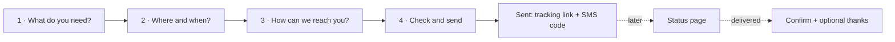
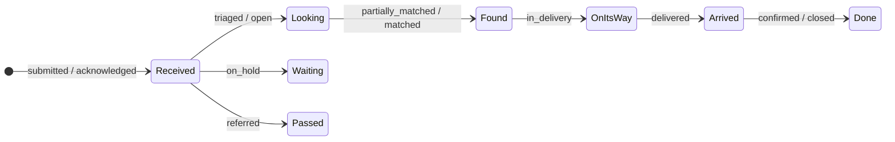
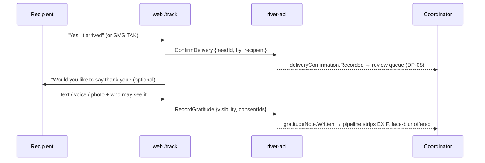

# Help Seeker Section

The simplest part of the portal and the most important one: how a person in need, or someone helping them, asks for help, follows it and confirms it arrived. Back to [[Portal Q&A]]. Routes: [[Site Map]] (`/ask`, `/track/{token}`).

Designed around **Olena** ([[Audiences and Personas]]): 63, an old Android phone, patchy signal, Ukrainian, does not want her face online.

> [!principle]
> The left bank is always open ([[ADR-005 Open Access for Recipients]]). No account, no proof and no minimum history is needed to ask. Nothing on these screens mentions reputation, verification scores or eligibility.

## Design rules

1. **At most 4 screens** from "Ask for help" to "Sent".
2. **One question per screen region**, large touch targets (≥ 48 px) and a reading age of about 9 ([[Accessibility]]).
3. **Voice everywhere.** Every free-text field has a microphone button. Speech is transcribed on the device where supported, otherwise server-side, and the audio is discarded after transcription unless the person chooses to keep it.
4. **Only two required fields**: a way to reach you and roughly where you are (settlement or oblast). Everything else is optional. See [[Data Minimisation]].
5. **No river metaphors** in the UI: "Your request", "On its way", "Arrived".
6. **Works without JavaScript** (plain HTML form posts to a server action) and **under 150 KB** on first load.
7. **Quick exit** button on every screen.

## The flow



### Step 1: What do you need?

```
┌─────────────────────────────────────┐
│  Who is this for?                   │
│  ( ● ) Me / my family               │
│  (   ) Someone else  → relationship │
│                                     │
│  What do you need?                  │
│  [🔥 Heating] [💊 Medicine] [🍞 Food]│
│  [⚡ Power]   [🧥 Clothes]  [🏠 Repair]│
│  [🚐 Transport] [… Something else]  │
│                                     │
│  Tell us in your own words  🎤      │
│  ┌───────────────────────────────┐  │
│  │ Генератор для хати, у нас ... │  │
│  └───────────────────────────────┘  │
│  ⓘ Clearer is quicker, but any      │
│    words are fine.                  │
│                     [ Next → ]      │
└─────────────────────────────────────┘
```

- Pictogram tiles come from [[Category]]. Several can be chosen.
- The free text is the person's own [[Intent Statement]] in any language. An optional, clearly labelled "Help me say it clearly" button uses Vertex AI to suggest a clearer version, which the person may accept, edit or ignore. The original is always kept. See [[Vertex AI Integration]].
- **On behalf of**: choosing "Someone else" adds *Your relationship* (neighbour, relative, social worker, school, other) and *Do they know you are asking?* (yes / not yet / they cannot). Children are always represented by a guardian or an institution. See [[Safeguarding]].

### Step 2: Where and when?

- Settlement autocomplete ([[Location]]). The precise address is **optional** and asked for later by the coordinator only when a delivery is planned.
- "How soon?" as three chips: *This week* · *This month* · *When possible*. There is no "EMERGENCY" button. Genuine emergencies get a clear signpost to emergency services and hotlines.
- "How many people?" is an optional stepper.

### Step 3: How can we reach you?

- Phone (SMS by default), email, or "through someone else". Optional Telegram or Viber.
- Preferred language for replies, pre-set from the page locale.
- A plain consent line: "We will use this only to help you with this request." Separate, unticked options follow for anything else (e.g. "You may share my story without my name"). See [[Consent]].

### Step 4: Check and send

A summary in the person's own words, with an *Edit* link on each part. Sending issues a `SubmitNeed` command to `river-api`, which appends `need.Submitted` ([[Event Catalogue]]). The contact details go to the person's private store, never into the event payload ([[Privacy Model]]).

### Sent

```
┌─────────────────────────────────────┐
│  ✓ Your request is with us.         │
│  A coordinator will reply within    │
│  2 days (usually sooner).           │
│                                     │
│  Your code:  RV-4K7-PQ              │
│  We sent a link to +380 •• ••• 21   │
│  [ Open my request ]                │
│  Save or screenshot this page.      │
└─────────────────────────────────────┘
```

The tracking link is a signed, single-need token. The short code plus the phone number can recover it by SMS. See [[Identity and Access]].

## SMS channel

| Inbound SMS | Effect |
|---|---|
| Free text to the org number | Creates a draft need that a coordinator completes by phone |
| `STATUS RV-4K7-PQ` | Replies with status in plain words |
| `TAK` / `YES` after a delivery message | Records a recipient delivery confirmation |
| `STOP` | Stops messages, while the request stays open |

Outbound SMS are ≤ 160 characters, in the person's language and contain no sensitive detail. See [[Notifications]].

## Status page in plain words



| Internal status ([[Lifecycle of a Need]]) | What the person sees (en-GB / uk) |
|---|---|
| submitted, acknowledged | "We have your request." / «Ми отримали ваш запит.» |
| triaged, open | "We are looking for help for you." / «Шукаємо допомогу для вас.» |
| partially_matched, matched | "We have found someone to help." / «Знайшли, хто допоможе.» |
| in_delivery | "It is on its way." (with a rough day, never live location) / «Вже в дорозі.» |
| delivered | "It should have arrived. Please tell us." / «Має бути у вас. Підтвердіть, будь ласка.» |
| confirmed, closed | "Thank you for letting us know." / «Дякуємо, що повідомили.» |
| on_hold | "We cannot help yet. We will look again on {date}. Here is why: …" |
| referred | "{Partner} can help with this. They will contact you." |
| withdrawn | "You closed this request. You can ask again at any time." |

The page shows the next step, the coordinator's first name (if they agree) and a *Message us* box. It **never** shows givers' names, amounts or other recipients.

## Delivery confirmation and thanks



- **Something wrong?** Choices: "Only part arrived", "Something is damaged", "It did not arrive". These open a gentle follow-up, never an accusation. See [[Escalation and Disputes]].
- **Thanks screen**: a text box with a mic, an optional photo ("of the thing, not of you, unless you want"), then a visibility choice in plain words:
  - *Only the people who helped* (`participants`, pseudonymised)
  - *Also on the website, without my name* (`public`, pseudonymised)
  - *On the website with my first name* (`public` + named consent)
  - Default: *Only the people who helped*.
- Recipients who cannot confirm are covered by proxy or carrier confirmation. See [[Delivery Confirmation]] and [[Portal Q&A]] A9.

> [!privacy]
> Photos uploaded here are held back from every projection until the [[Media Asset]] pipeline has stripped EXIF/GPS, and until the coordinator has confirmed at [[DP-09 Publication Consent]] that consent covers the chosen visibility.

## Low bandwidth and offline

- The form saves itself to local storage after each step, so a dropped connection loses nothing.
- If a send fails, the page offers "Send by SMS instead" with the text prefilled.
- Images are optional and compressed on the device to ≤ 300 KB before upload.

> [!question]
> How far do we go with offline support? The options are a service-worker PWA with background sync for `/ask` and `/track`, or only local draft saving plus the SMS fallback. See [[Open Questions]].
