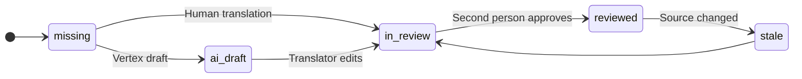

# Multilingual Experience

How the portal speaks each visitor's language, how translations are made and trusted, and how people can write in any language at all. Back to [[Portal Q&A]]. Technical implementation: [[Internationalisation]] (next-intl, locale routing in [[Site Map]]).

> [!principle]
> Bilingual parity ([[Brand and Tone of Voice]]). Ukrainian is a first-class language, written natively. It is not a translation left unchecked. A recipient must never meet an English-only screen.

## Locales

| Locale | Status | Where | Notes |
|---|---|---|---|
| `en-GB` | Launch | `web`, `studio`, all content | British spelling and currency formatting |
| `uk` | Launch | `web`, `studio`, all content | UI keys sourced from the [[Glossary]] Ukrainian column |
| `pl` | Candidate (Tier 3) | `web` | Polish hub partners and carriers on the Rzeszów corridor |
| `de` | Candidate (Tier 4) | `web` | Givers and funders in Germany |
| `ru` | **Sensitive: not planned by default** | `/ask` intake only, if enabled | See below |
| others | Extensible | | Adding a locale = config + UI strings + reviewed core pages |

### A note on Russian

- **No Russian UI and no Russian public content.**
- **Recipients may always write in Russian** (or any language) in free-text fields and by SMS, and are answered in Ukrainian or English plainly and respectfully. Nobody is corrected, judged or deprioritised for the language they write in.

## Language switcher

- Always in the header and repeated in the footer. It shows each language by its **own name** ("English", "Українська"), never with flags.
- Switching keeps you on the equivalent page (via the content projection's alternate-slug map). If the page does not exist in the target locale, the switcher shows "Not yet available in Українська. Show in English?" and does not silently redirect.
- The preference is stored in a cookie and, for signed-in users, in their profile. SMS and email are sent in the person's *preferred reply language*, which may differ from the page they used.

## Translation status per content item

Every text-bearing block of every [[Publication]] carries a [[Translation]] status per locale.

- Public pages publish in a locale only when all its blocks are `reviewed` (see [[Content Editor]]). The exception is an explicit "machine-translated" publication with a visible label.
- The studio dashboard shows coverage per locale ("uk: 100 % reviewed · pl: 62 %, 4 stale").
- UI strings follow the same states in the message catalogue, and CI fails if a launch locale has missing keys.

## Machine-draft labelling

Machine translation is useful and fast. It must never be passed off as a human voice.

| Where | Label (en-GB / uk) |
|---|---|
| Gratitude note shown to givers | "Translated automatically from Ukrainian · Show original" / «Перекладено автоматично · Показати оригінал» |
| Need text shown to coordinators | "AI draft translation. Check with the person if in doubt" |
| Published page with unreviewed blocks | Banner: "Parts of this page were translated by machine" |
| Donor report | Original quote always shown next to translation |

All machine translations are made through [[Vertex AI Integration]], logged with `via: vertex`, and the original text is always kept and reachable.

## Recipients and others writing in any language

- Free-text fields accept any script. Language is detected, stored with the text and shown to coordinators as a chip (`uk`, `ru`, `pl`, `crh`…).
- Voice input transcribes in the device's language where supported.
- Coordinators reply in the recipient's preferred language, with templates in `en-GB` and `uk`, and AI-assisted drafts for other languages that a coordinator must review.
- Gratitude notes keep their **original language** as the primary text. Translations are secondary and toggleable, because the recipient's own words matter.
- Crimean Tatar and other minority languages in Ukraine are accepted in free text, and UI support can be added as a locale.

## Formatting

- Dates: `24 September 2026` (en-GB), `24 вересня 2026 р.` (uk). ISO in data.
- Numbers and currency via `Intl`: `£1,240.50` / `1 240,50 £`. The ISO code is always available on hover and in the ledger ([[Money Flow and Cost Transparency]]).
- Place names use the official Ukrainian transliteration in English (Kharkiv, Dnipro, Izium). Legacy Russian-derived spellings are never used.
- Plurals use ICU MessageFormat (Ukrainian has one/few/many/other).

## Staff and partners

Studio is fully bilingual. Glossary terms are fixed across both languages, so coordinators in Lviv and trustees in the UK talk about the same things. Partner organisations may use either locale. See [[Coordination Model]].
