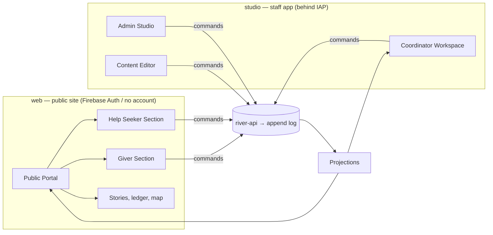

# Portal Q&A

*The form of the system, told as the questions real people ask a very good charitable portal and the answers River Portal gives them.* Back to [[00 Home]].

This note is the index of section 04 and its main reference. Each answer is short and states what we have committed to. The links lead to the note where that commitment is specified. If a screen, rule or feature contradicts an answer here, one of them is wrong and must be fixed.

## Section 04 map

| Note | What it shapes |
|---|---|
| [[Site Map]] | Every route on the public site (`web`) and the staff app (`studio`), per locale, audience and projection |
| [[Public Portal]] | Home page, navigation, live counters, stories, motion |
| [[Help Seeker Section]] | The simplest possible way to ask for help and follow it |
| [[Giver Section]] | Ways to give, the offer form, "My giving", reports and thanks |
| [[Coordinator Workspace]] | Queue, triage, flow canvas, matching, routing, costs, confirmations |
| [[Admin Studio]] | Organisation settings, roles, tiers, visibility, consent, audit |
| [[Content Editor]] | Block editor with live data blocks, bilingual editing, review |
| [[Design Language]] | Palette, type, motion, illustration, tokens |
| [[Accessibility]] | WCAG 2.2 AA, plain language, low bandwidth, older users |
| [[Multilingual Experience]] | en-GB and uk at launch, translation status, AI drafts |

---

## A. People seeking help

**A1. Who can ask for help?**
Anyone, at any time, whatever their history. The "left bank" is never closed. Reputation and verification change *how* a request is checked and routed, never *whether* it can be made. → [[ADR-005 Open Access for Recipients]], [[Guiding Principles#P3. The left bank is always open]]

**A2. Do I need an account?**
No. You give one way to reach you (phone or email) and receive a private tracking link by SMS or email. You can create an account later to see all your requests in one place. → [[Help Seeker Section]], [[Identity and Access]]

**A3. How long is the form?**
Three short steps and a check screen: *What do you need* → *Where and when* → *How can we reach you* → *Check and send*. Each step can be answered by voice. Nothing is compulsory except a way to reach you and roughly where you are. → [[Help Seeker Section]]

**A4. Can I ask on behalf of someone else, such as a neighbour, my mother or a village school?**
Yes. Choose "For someone else" and say how you know them. Where possible, the coordinator will confirm with that person or institution before sharing their details any further. Children are always represented by a guardian or an institution. → [[Recipient]], [[Safeguarding]]

**A5. Do I have to prove that I deserve help?**
No. Your request is taken at face value first. Checks are proportionate. A blanket request may need nothing more, while a generator worth GBP 900 may need a phone call or a note from the village council. Nobody is asked to describe suffering. → [[DP-02 Need Verification]], [[Verification]]

**A6. Can someone be refused help?**
There is no "rejected" status. If the organisation cannot help, the request is *referred* to a partner or another service, or put *on hold* with a plain explanation and an expected review date. You are told which, and why, in words you can understand. → [[DP-01 Need Triage]], [[Lifecycle of a Need]]

**A7. What will you ask for and who will see it?**
Only what is needed to deliver: what, where and how to reach you. Your contact details and address stay `private` (you and your coordinator). Safeguarding matters are `sealed`. Nothing about you is public unless you agree to it item by item. → [[Data Minimisation]], [[Visibility Levels]]

**A8. How do I know what is happening?**
Your tracking page shows the status in plain words ("We have found a giver", "It is on its way") and sends an SMS when something changes. It never shows other people's names. → [[Help Seeker Section#Status page in plain words]], [[Notifications]]

**A9. What if I can't confirm delivery, for example because I have no smartphone, no signal or I'm unwell?**
Confirmation can come by SMS reply ("TAK"/"YES"), by phone to the coordinator, from a proxy (a neighbour, social worker or institution), or from the carrier with a handover photo that does not show your face. The coordinator reviews every non-recipient confirmation. You are never chased or blamed. → [[Delivery Confirmation]], [[DP-08 Delivery Confirmation Review]]

**A10. Do I have to say thank you, or send a photo?**
No. Thanks are welcome but never required, and help is never made conditional on them. If you want to, you can write or record a short message, and choose who may see it and whether a photo may be shown. → [[Gratitude Note]], [[Gratitude Loop]]

**A11. Can I change my mind or withdraw my request?**
Yes, at any time, from your tracking page or by SMS. The request becomes *withdrawn*. That is recorded, but it counts against nobody. → [[Need]]

**A12. I don't read well or I don't write Ukrainian or English. Can I still ask?**
Yes. Voice input, pictograms for common needs, a reading age of about 9, and any language. Coordinators see the original plus a machine draft translation labelled as such. → [[Accessibility]], [[Multilingual Experience]]

## B. Givers

**B1. What can I give?**
Money, goods, a service (for example a repair or legal advice), transport, or time. The "Give" page shows current needs grouped by form, so you can see what is actually useful. → [[Giver Section]], [[Offer]]

**B2. Why might my offer of goods be declined?**
Because the river has no use for it right now. Examples: used mattresses that cannot be cleaned, perishable food with no route, or items that would cost more to transport than to buy locally. It is then *declined with thanks*, with a suggestion of what would help. → [[DP-03 Offer Acceptance]]

**B3. Do you handle my card details?**
No. Money is given through an external payment page (for example Stripe Checkout, a bank transfer or a Monobank jar). The portal records your pledge and the provider's confirmation, never your card. → [[Money Flow and Cost Transparency]], [[Gift]]

**B4. Can I give anonymously?**
Yes, to the public. Your name never appears unless you choose it. Being anonymous to the organisation itself is limited: small gifts may be anonymous, but larger money gifts need an identity for anti-money-laundering and Gift Aid reasons. The default threshold is GBP 5,000 in 12 months (or equivalent), and any gift with Gift Aid needs an identity ([[Canonical Parameters]]). → [[Privacy Model]], [[Giver Section#Visibility choices]] #open-question

**B5. Will I know where my gift went?**
Yes. "My giving" shows each gift's journey: allocated to a flow, carried over which legs, delivered and confirmed. Money gifts are traced to the costs and purchases they funded, pro rata where they were pooled. → [[Donor Report]], [[Journey Story]]

**B6. Can I get my money back?**
Within the payment provider's refund window, and before your gift has been allocated to a flow, the organisation will refund it on request. After allocation, the money has already become fuel or goods. We then offer a full account of what it became instead. Refunds are recorded as new log events and never as edits. → [[Money Flow and Cost Transparency]], [[Log Event]] #open-question

**B7. Why don't you show a donor leaderboard?**
Because a gift is not a competition and no one buys status. Leaderboards reward size of wallet, pressure others and turn help into display. We celebrate *what happened together* (litres of fuel, families warmed, legs driven), never a ranking of people. → [[Recognition Anti-Patterns]], [[Guiding Principles#P1. A gift is a gift]]

**B8. How much of my money goes on costs?**
All of it goes to the purpose you chose, and costs *are* part of that purpose. Transport, fuel and packaging are shown line by line with receipts on the [[Transparency Ledger]]. Overheads are shown separately, never hidden. → [[Cost Record]], [[Guiding Principles#P8. Honest numbers, beautifully shown]]

**B9. Will I be thanked?**
If the recipient chooses to send thanks, it travels back to everyone in the chain, including you. The organisation also sends a factual acknowledgement once your gift is received. We never write thanks in a recipient's name. → [[Gratitude Loop]]

## C. Sponsors

**C1. Can we fund just transport or just one route?**
Yes. Sponsorship creates a *restricted fund* tied to a purpose (for example "diesel for Lviv → Kharkiv, Q4"). Cost records draw on it only when they match that purpose. → [[Sponsor]], [[Money Flow and Cost Transparency]]

**C2. Do we get a report for our board and another for the public?**
Yes. The same data is published at two visibility levels: a full `private` report for you and a `public` version you approve. → [[Donor Report]], [[DP-10 Report Publication]]

**C3. Can we have our logo on the site?**
Yes, if you wish, as acknowledgement of your support. It sits on the campaign page and in reports, in a supporter band of equal-sized logos. It is never placed on recipients' photos or stories and never ranked by amount. → [[Recognition]], [[Recognition Anti-Patterns]]

**C4. What if a sponsored purpose is under-spent?**
The balance stays restricted. The coordinator proposes a close-out (roll over to the next quarter, or return), and the sponsor agrees it in writing. Both steps are logged. → [[Cost Record]]

## D. Carriers and volunteers

**D1. Do I need an account to drive a leg?**
No. You can receive a magic link scoped to that leg only. It shows the pickup, drop-off, contact at handover, checklist and cost capture, and expires when the leg closes. → [[Carrier]], [[Leg]], [[Identity and Access]]

**D2. How are transport costs covered?**
Each leg has an agreed budget. You photograph receipts for fuel, tolls or ferry and submit them from your phone. The Finance Steward or Lead Coordinator approves them, and reimbursement comes from the campaign or a sponsor's restricted fund. You can also choose to waive a cost as a gift, which is recorded as such. → [[Cost Record]], [[DP-06 Cost Approval]], [[Transport and Logistics Flow]]

**D3. What if I have no signal on the road?**
The leg page works offline. Checklist ticks, photos and receipts queue on the device and sync when you are back in coverage. Each is recorded with the time it happened on the device. → [[Leg]], [[Frontend Application]] #open-question

**D4. What if goods are lost, damaged or confiscated?**
Mark the consignment *lost* or *returned* and add a note. The coordinator reviews it without blame and tells givers honestly. → [[Consignment]], [[Escalation and Disputes]]

**D5. How do volunteers find tasks?**
A short list of open tasks (packing at the Lviv hub, translation review, calling recipients) that you can claim. Your contribution is recorded and thanked, never ranked. → [[Volunteer]], [[Recognition]]

## E. Partner organisations

**E1. Can another charity send us needs or take ours?**
Yes (Tier 3+). A need can be *referred* to a partner with the recipient's consent. Partners can also act as giver, carrier, hub operator or co-coordinator on a flow. → [[Partner Organisation]], [[Coordination Model]]

**E2. What do partners see?**
Only what the flow requires, at `team` level for their own people. Recipient contact details are shared only for a referral or delivery the partner is actually doing. → [[Visibility Policy]], [[Visibility Levels]]

**E3. Can we avoid duplicating help to the same family?**
Coordinators see a de-duplication hint when a similar need appears across partners. It is a hint for a person to check, never an automatic block, because the left bank stays open. → [[DP-01 Need Triage]]

## F. Coordinators

**F1. Where do I start my day?**
In the queue. New and changed needs, offers waiting for a decision, legs departing today, and confirmations to review, each with the next action. → [[Coordinator Workspace]]

**F2. Does the AI decide matches?**
No. Vertex AI suggests matches with reasons ("same oblast, generator 3 kW fits, carrier already on this route"), and a coordinator accepts or dismisses them. Every suggestion and decision is logged with `via: vertex` for the suggestion and a named human for the decision. → [[DP-04 Matching]], [[Vertex AI Integration]]

**F3. Can several coordinators work on one flow?**
Yes. There is one Lead Coordinator and any number of Contributing Coordinators. Hand-offs are explicit and logged, so it is always clear who is responsible now. → [[Coordination Model]], [[Responsibility Matrix]]

**F4. Can I fix a mistake I entered?**
Yes, by recording a correction. The original stays in the log, the correction supersedes it in every projection, and both are visible in the audit trail. → [[Log Event]], [[Accountability and Audit]]

**F5. Can I work from my phone?**
Yes. The queue, cost capture, confirmation review and leg status are designed mobile-first. The flow canvas and routing planner are best on a larger screen. → [[Coordinator Workspace#Mobile use]]

## G. Administrators

**G1. How do we start small and grow?**
Choose a tier in the feature switchboard. Moving up adds features and keeps all data. Nothing is migrated. → [[Admin Studio#Feature switchboard]], [[Scaling Tiers]]

**G2. How do staff sign in?**
With their Google Workspace or Cloud Identity account, through Identity-Aware Proxy. Staff roles are assigned in Admin Studio and scoped to organisation, programme, campaign or flow. → [[IAP Staff Access]], [[Role]]

**G3. Can we see who did what?**
Yes. The audit log explorer shows every event with actor, role, channel and time, and can be filtered and exported for auditors. → [[Admin Studio#Audit log explorer]], [[Accountability and Audit]]

**G4. A dashboard looks wrong. What do we do?**
Projections can be rebuilt from the log. The log is the truth and the dashboard is a view of it. → [[Admin Studio#Projection rebuild]], [[Event Log and Projections]]

## H. Public and press

**H1. Are the numbers on the home page real?**
Every counter is computed from the append log by a public projection and links to its definition. Nothing is typed in by hand. → [[Public Portal#Live counters]], [[Impact Metrics]]

**H2. Can I interview a recipient?**
Only through the organisation, and only with that person's specific, fresh consent. We never pass on contact details. Published stories are consented, pseudonymised by default and reviewed. → [[DP-09 Publication Consent]], [[Consent Management]]

**H3. Why is the map not precise?**
Public locations are rounded to oblast or city level, and recent deliveries are delayed before they appear, so that nobody can be located or targeted. → [[Flow Map]], [[Safeguarding]]

**H4. Can I see the accounts?**
The [[Transparency Ledger]] shows income, costs by category and deliveries per campaign, with receipt thumbnails where they are safe to show. Formal annual accounts are linked from it. → [[Impact Report]]

## I. Privacy and ethics

**I1. What happens to my data if I withdraw consent?**
Anything published on the basis of that consent is taken down from every live page within 15 minutes, including stories, photos and your name on a gratitude wall. Data needed to complete a delivery in progress or meet a legal duty is kept, with access narrowed. → [[Consent]], [[Consent Management]]

**I2. And if I ask to be forgotten entirely?**
Your personal data is encrypted with a key that belongs only to you. We destroy that key ("crypto-shredding"). The log keeps its shape ("a need was delivered in Kharkiv oblast"), but nothing in it can identify you any more. → [[Privacy Model]], [[Data Retention]]

**I3. Why do you keep a permanent log at all?**
So that numbers are honest, mistakes are corrected openly and auditors can check our work. It records actions, not personal details. → [[ADR-001 Event-Sourced Append Log]], [[Guiding Principles#P7. The river remembers]]

**I4. Do you rate people?**
There is no public score and no ranking. Everyone can see their own "current", meaning the signals behind it and the events that produced it, and can contest them. For recipients these signals are internal only and never limit asking. → [[Reputation]], [[Reputation Signals]], [[DP-11 Reputation Review]]

**I5. Do you use sad photos to raise money?**
No. No pity imagery, no faces without consent, no children as fundraising props. We show agency, the people who carry help, the goods and the places. → [[Ethics Charter]], [[Design Language#Illustration and photography]]

**I6. What offers are declined on principle?**
Offers conditional on religious or political messaging, data harvesting, or publicity that recipients must perform. → [[Intent Statement]], [[DP-03 Offer Acceptance]]

## J. Technology

**J1. Where does it run?**
On Google Cloud. The public site (`web`) and the staff app (`studio`) are Next.js on Cloud Run. The command API is Node.js/Fastify. Firestore holds the append log and projections. Public users sign in with Firebase Authentication and staff through IAP. → [[Architecture Overview]], [[Technology Stack]]

**J2. Can a page be tampered with to change figures?**
Clients never write domain data. Every change is a command, validated by `river-api` and appended as an event. Security rules forbid updates and deletes on the log. → [[Security Rules]], [[Event Log and Projections]]

**J3. Does it work on a slow connection?**
The help-seeker flow is server-rendered, under 150 KB on first load, works without JavaScript for submission, and has an SMS fallback. → [[Accessibility#Low bandwidth]], [[Help Seeker Section]]

**J4. What does AI see?**
Only what the task needs. PII is redacted before summarisation where possible, and nothing AI produces is published without a human. → [[Vertex AI Integration]], [[Data Minimisation]]

**J5. Which languages?**
English (en-GB) and Ukrainian at launch. Adding a locale is configuration plus translation. → [[Multilingual Experience]], [[Internationalisation]]

---

## Open questions raised here
- B4: resolved — GBP 5,000 in 12 months and no Gift Aid ([[Canonical Parameters]]); organisations may set a stricter value per jurisdiction. See also [[Open Questions]].
- B6: the refund policy after partial allocation of a pooled gift, and who approves it (Finance Steward?).
- D3: the depth of offline support for the carrier leg page (a PWA with background sync vs a simple queued form).
