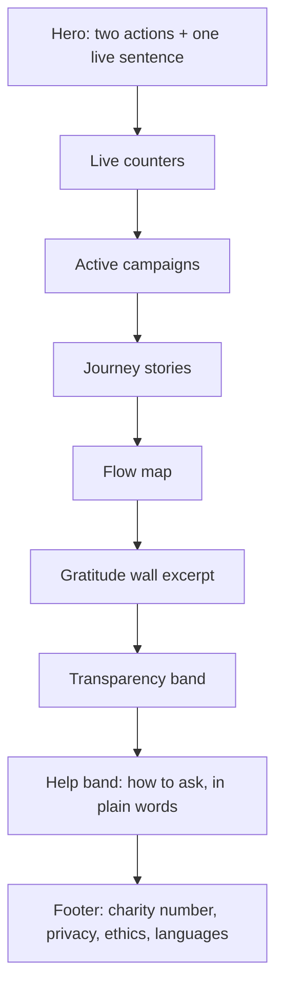

# Public Portal

The front door of the `web` app: what a first-time visitor sees and how they find their way. Back to [[Portal Q&A]]. Routes: [[Site Map]]. Visual system: [[Design Language]].

The home page has three jobs, in this order:
1. Let someone in need **ask for help within one tap**.
2. Let someone who wants to help **give within two taps**.
3. Show, **honestly and joyfully**, that help really travels.

> [!principle]
> Dignity in every pixel ([[Guiding Principles#P10. Dignity in every pixel]]). No crisis red, no countdown clocks, no pity photos. The page feels like a sunny morning at a busy river crossing.

## Navigation

```
┌────────────────────────────────────────────────────────────────────────┐
│ ◠ Open River Aid     Stories  Campaigns  Transparency  About   EN | УК │
│                                          [ Ask for help ] [ Give ●  ]  │
└────────────────────────────────────────────────────────────────────────┘
```

- **Two primary actions are always visible**: *Ask for help* (outlined, calm) and *Give* (filled, sunrise accent). On mobile they sit in a sticky bottom bar and never hide behind a hamburger menu.
- The secondary menu has Stories, Campaigns, Map, Transparency, Thanks and About.
- The language switcher shows each language by its own name (English · Українська) and never with a flag. See [[Multilingual Experience]].
- "My account" appears only after sign-in. A recipient with a tracking link sees "Your request" instead.
- A "Quick exit" link on `/ask` pages and the help band clears the page and goes to a neutral site, for people in unsafe situations. See [[Safeguarding]].

## Home page composition



| Block | Content | Source projection | Visibility |
|---|---|---|---|
| **Hero** | A headline in plain words ("Help that travels, from people who care to people who need it"), the two actions, and one *live sentence* ("This week, 14 families near Kharkiv received winter heaters") | `public/{orgId}/home.liveSentence` | public, aggregated |
| **Live counters** | 3–4 counters | `public/{orgId}/counters` | public, aggregated |
| **Active campaigns** | 1–3 cards: goal, progress, costs so far, days active (never "days left") | `public/{orgId}/campaigns?active` | public |
| **Journey stories** | 3 consented stories as horizontal "river" timelines | `public/{orgId}/publications?kind=journey` | public, consented ([[DP-09 Publication Consent]]) |
| **Flow map** | Animated corridors UK → Poland → Lviv → Kharkiv/Dnipro, with pulses for recent legs | `public/{orgId}/flowMap` | public, rounded and delayed |
| **Gratitude wall** | 4–6 consented thank-you notes, text first, in the original language with a translation toggle | `public/{orgId}/gratitudeWall` | public, consented |
| **Transparency band** | "Where the money went" as a stacked bar: goods / transport / fees / overheads, linking to the ledger | `public/{orgId}/ledger.summary` | public |
| **Help band** | Three plain steps for asking, an SMS number and a phone line | content | public |

Composition is set per organisation in the [[Content Editor]] (the home page is a block document with live data blocks). A Tier 1 organisation typically shows only hero, one campaign, counters and ledger. See [[Scaling Tiers]].

### Live counters

- They count **what happened together**: *deliveries confirmed*, *kilometres carried*, *people who took part*, *thank-you notes sent back*. Money raised is shown on campaign cards together with costs, never on its own.
- Each counter is a projection of the append log ([[Event Log and Projections]]). It carries an ⓘ link to its definition in [[Impact Metrics]] ("confirmed deliveries = `deliveryConfirmation.Accepted` events after DP-08 review").
- Counters update through a Firestore listener on the public projection, which only includes events older than the 72-hour safety delay ([[Canonical Parameters]]). They tick up with a soft roll animation (see Motion below).
- A counter never shows a person, an amount per person or a ranking. See [[Recognition Anti-Patterns]].

### Journey story cards

A card shows the river journey as five dots: *asked → gathered → carried → arrived → thanked*. Each dot lights up in turn on hover or scroll. The card text is pseudonymised ("A grandmother in Kharkiv oblast") unless consent allows more. Photos come from [[Media Asset]]s that have passed EXIF stripping, optional face-blur and consent. See [[Journey Story]].

## Dynamic positive motion

Motion shows **movement of help**, never urgency.

| Motion | Where | Rule |
|---|---|---|
| Flow pulse | Flow map corridors | A small light travels along a corridor when a leg is `handed_over`. At most one pulse per corridor per 3 s |
| Counter roll | Live counters | 600 ms ease-out, starting on first scroll into view. No looping |
| Ripple of thanks | Gratitude wall | A new note fades in with a gentle ripple from its edge |
| Journey dots | Story cards | Sequential fill, 120 ms stagger |
| Progress fill | Campaign cards | Fills to the current value once. No "almost there!" pulsing |

All motion uses Framer Motion, follows the tokens in [[Design Language#Motion principles]] and is turned off or reduced to fades under `prefers-reduced-motion` and in low-data mode. See [[Accessibility]].

## Performance and rendering

- Home is a React Server Component page, statically regenerated every 60 s from public projections. Live counters then hydrate as a small client island.
- The Largest Contentful Paint target is under 2.0 s on a mid-range Android over 3G. The hero image is optional. By default the hero is an SVG illustration under 20 KB.
- No third-party trackers. Analytics are privacy-preserving and cookieless (server-side aggregates). The consent banner is therefore minimal or absent. See [[Privacy Model]].

## Other public pages (summary)

| Page | Purpose | Spec |
|---|---|---|
| Campaign page | Goal, progress, costs with receipts, journey updates, supporters band | [[Campaign Page]] |
| Stories | Journey stories and articles, filterable by programme and region | [[Journey Story]], [[Article]] |
| Map | Full [[Flow Map]] with time slider | [[Flow Map]] |
| Transparency | [[Transparency Ledger]] by campaign and period | [[Money Flow and Cost Transparency]] |
| Thanks | Full [[Gratitude Wall]] | [[Gratitude Loop]] |
| About | Organisation, team (consented), ethics, privacy, accounts | [[Ethics Charter]] |
