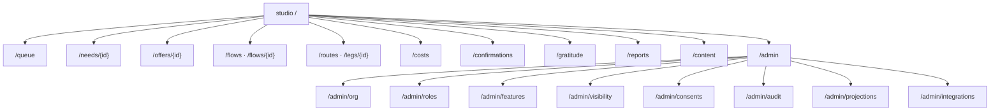

# Site Map

Every route of the two applications, and for each one: who it is for, how access is checked, and which [[Projection]] it reads. Back to [[Portal Q&A]].

- **`web`**: the public site at `riverportal.org` (per-organisation domain, e.g. `openriveraid.org`). Next.js App Router on Cloud Run behind Firebase Hosting / Cloud CDN. See [[Frontend Application]].
- **`studio`**: the staff app at `studio.<domain>`. It is a separate Next.js app behind an external HTTPS Load Balancer with Identity-Aware Proxy. See [[IAP Staff Access]].

> [!principle]
> Routes use plain words, never river metaphors: `/ask`, not `/left-bank`. See [[Brand and Tone of Voice]].

## Locale prefixes

- Every `web` route is prefixed with a locale: `/en-gb/...` and `/uk/...` at launch. Further locales are added by configuration (see [[Multilingual Experience]]).
- `/` negotiates from the saved preference cookie, then from `Accept-Language`, then falls back to the organisation's default locale, and redirects with 307.
- Slugs are localised for content (`/uk/istorii/...`), while functional routes keep English slugs in all locales (`/uk/ask`) so that SMS links stay short and stable.
- `studio` uses the staff member's profile language (en-GB or uk) and has no locale prefix.
- `hreflang` alternates and a per-locale `sitemap.xml` are generated from the content projection. Pages without a reviewed translation are not listed for that locale.

## Auth modes

| Code | Meaning |
|---|---|
| `open` | No sign-in. Server-rendered from public projections only |
| `token` | One-time tracking or magic link (signed, scoped to one aggregate, expiring). See [[Identity and Access]] |
| `fb` | Firebase Authentication (email link, phone OTP, Google/Apple) |
| `iap` | Identity-Aware Proxy JWT verified server-side, then mapped to a [[Role]] and its scope |
| `iap+role` | As `iap`, restricted to a named role variant (Safeguarding Lead, Finance Steward, Editor, Auditor, Administrator) |

## `web`: public site

```mermaid
flowchart TD
    L["/{locale}"] --> ASK["/ask"]
    L --> TRACK["/track/{token}"]
    L --> GIVE["/give"]
    L --> CAMP["/campaigns"]
    L --> STORIES["/stories"]
    L --> MAP["/map"]
    L --> LEDGER["/transparency"]
    L --> THANKS["/thanks"]
    L --> ABOUT["/about"]
    L --> ME["/me"]
    L --> LEG["/leg/{token}"]
    ASK --> ASK1["/ask/for-someone-else"]
    ASK --> ASKSENT["/ask/sent"]
    TRACK --> CONF["/track/{token}/confirm"]
    TRACK --> GRAT["/track/{token}/thanks"]
    GIVE --> GM["/give/money"]
    GIVE --> GG["/give/goods"]
    GIVE --> GT["/give/transport"]
    GIVE --> GS["/give/service"]
    GIVE --> GTM["/give/time"]
    CAMP --> CS["/campaigns/{slug}"]
    STORIES --> SS["/stories/{slug}"]
    ME --> MR["/me/requests"]
    ME --> MG["/me/giving"]
    ME --> MRP["/me/reports/{id}"]
    ME --> MP["/me/privacy"]
    ME --> MC["/me/current"]
```

| Route | Audience | Auth | Projection read | Notes |
|---|---|---|---|---|
| `/{locale}` | Everyone | open | `public/{orgId}/home` (counters, active campaigns, featured stories, gratitude excerpt) | [[Public Portal]] |
| `/ask` | People seeking help, helpers on behalf | open | `public/{orgId}/needForms` (categories, areas served) | [[Help Seeker Section]]. Works without JS |
| `/ask/for-someone-else` | Proxies, institutions | open | same | Adds relationship step |
| `/ask/sent` | Submitter | open | none | Shows tracking link and SMS code |
| `/track/{token}` | Recipient or proxy | token | `views/needStatus/{needId}` redacted to `private` for the subject | Plain-words status |
| `/track/{token}/confirm` | Recipient or proxy | token | `views/deliveryPending/{needId}` | [[Delivery Confirmation]] |
| `/track/{token}/thanks` | Recipient | token | same | [[Gratitude Note]] upload with visibility choice |
| `/give` | Givers, sponsors | open | `public/{orgId}/needsByForm` (aggregated open needs, no persons) | [[Giver Section]] |
| `/give/money` | Givers | open → external checkout | `public/{orgId}/campaigns` | Redirects to payment provider |
| `/give/goods`, `/give/service`, `/give/time` | Givers, volunteers | open (fb to follow up) | `public/{orgId}/needsByForm` | [[Offer]] form |
| `/give/transport` | Carriers, partners | open (fb to follow up) | `public/{orgId}/routes` (corridors only) | [[Carrier]] |
| `/campaigns`, `/campaigns/{slug}` | Everyone | open | `public/{orgId}/campaigns/{id}` | [[Campaign Page]] |
| `/stories`, `/stories/{slug}` | Everyone | open | `public/{orgId}/publications/{id}` | [[Journey Story]], [[Article]] |
| `/map` | Everyone | open | `public/{orgId}/flowMap` (rounded, delayed) | [[Flow Map]] |
| `/transparency` | Everyone, press, auditors | open | `public/{orgId}/ledger` | [[Transparency Ledger]] |
| `/reports/{slug}` | Everyone | open | `public/{orgId}/reports/{id}` | [[Impact Report]], public [[Donor Report]]s |
| `/thanks` | Everyone | open | `public/{orgId}/gratitudeWall` | [[Gratitude Wall]] |
| `/about`, `/about/privacy`, `/about/ethics`, `/about/accessibility` | Everyone | open | content projection | [[Ethics Charter]] |
| `/me` | Signed-in public user | fb | `views/people/{personId}/summary` | Single hub for all roles |
| `/me/requests` | Recipient | fb | `views/needStatus` filtered to subject | Merges earlier token submissions after verification of contact |
| `/me/giving` | Giver, sponsor | fb | `views/giverLedger/{personId}` | "My giving" |
| `/me/reports/{id}` | Giver, sponsor | fb | `views/donorReports/{id}` | Private [[Donor Report]] |
| `/me/current` | Any participant | fb | `views/reputation/{personId}` | Own [[Reputation Signals]] with events, contest link ([[DP-11 Reputation Review]]) |
| `/me/privacy` | Any participant | fb | `views/consents/{personId}` | Consents, visibility, export, erasure |
| `/leg/{token}` | Carrier | token | `views/legs/{legId}` redacted to what the carrier needs | Offline-capable checklist |
| `/volunteer` | Volunteers | fb | `views/tasks/open` | [[Volunteer]] tasks |

## `studio`: staff app (IAP)

| Route | Audience | Auth | Projection read | Note |
|---|---|---|---|---|
| `/queue` | Coordinators | iap | `views/queue/{personId}` | [[Coordinator Workspace]] |
| `/triage` | Coordinators | iap | `views/triageBoard` | [[DP-01 Need Triage]] |
| `/needs/{id}` | Assigned coordinators; Safeguarding Lead for `sealed` fields | iap | `views/needs/{id}` field-redacted by role | |
| `/offers/{id}` | Coordinators | iap | `views/offers/{id}` | [[DP-03 Offer Acceptance]] |
| `/flows`, `/flows/{id}` | Coordinators, partner co-coordinators | iap | `views/flows/{id}` | Flow canvas, matching panel |
| `/routes`, `/legs/{id}` | Coordinators | iap | `views/routes`, `views/legs/{id}` | [[DP-05 Routing and Carrier Assignment]] |
| `/costs` | Coordinators, Finance Steward | iap / iap+role | `views/costs/pending` | [[DP-06 Cost Approval]] |
| `/confirmations` | Coordinators | iap | `views/confirmations/review` | [[DP-08 Delivery Confirmation Review]] |
| `/gratitude` | Coordinators | iap | `views/gratitude/outbox` | [[Gratitude Loop]] |
| `/reports` | Coordinators, Editors | iap | `views/reportDrafts` | [[DP-10 Report Publication]] |
| `/safeguarding` | Safeguarding Lead | iap+role | `views/sealed/*` | [[Safeguarding]] |
| `/content`, `/content/{id}` | Editors | iap+role | `views/content/{id}` | [[Content Editor]] |
| `/admin/*` | Administrators; Auditors read-only on `/admin/audit` | iap+role | `views/admin/*` | [[Admin Studio]] |

> [!privacy]
> `studio` pages never read `public/` projections for decisions. They read `views/` projections, which are redacted server-side per role and scope. An IAP identity without a mapped role sees only a "request access" page. See [[Security Rules]].

## Errors and edge routes

- An expired `token` route shows a friendly page: "This link has expired. We have sent a new one to the phone or email you gave us", with a button to resend. It never reveals whether a need exists.
- `/ask` is never behind a maintenance wall. If `river-api` is down, submissions are queued via Pub/Sub, or the page falls back to SMS instructions. See [[Observability]].
