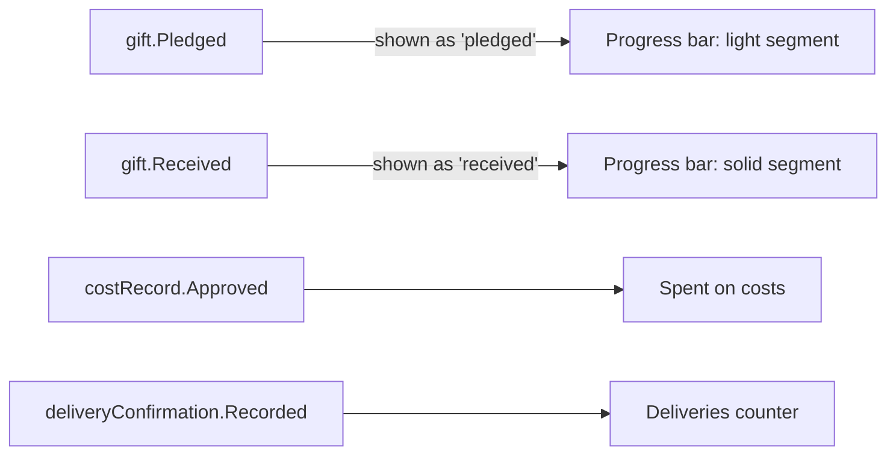

# Campaign Page

The public home of a [[Campaign]]: purpose, goal, live progress, an honest cost breakdown and updates as the work moves. The first publication a [[Scaling Tiers#Tier 1 — Spring]] organisation needs. Back to [[Publications Overview]].

> [!principle] Never guilt
> No countdown timers, no "only 3 hours left to save…", no per-donor amount feed. Progress is shown as a shared achievement. See [[Brand and Tone of Voice]] and [[Recognition Anti-Patterns]].

## Layout

| Section | Content | Source | Editable by |
|---|---|---|---|
| Hero | Title, purpose in one sentence, one consented image or illustration | Editor | Editor |
| Progress | Raised vs goal, number of givers (count only), currency | `campaignProgress` live block | — (live) |
| What the money is for | Planned budget lines: fuel, ferry, tolls, generators… | Campaign budget (set at `campaign.Launched`) | Lead Coordinator |
| Where it went so far | Actual approved costs by kind vs budget | `ledgerTotals` scope = campaign | — (live) |
| Deliveries | Confirmed deliveries, % confirmed by recipient | `impactMetrics` scope = campaign | — (live) |
| Updates | Dated posts: "Van loaded in Leeds", "Crossed into Poland" | Editor / Coordinator | Editor |
| Journey | Embedded [[Flow Map]] (fuzzed) and [[Journey Story]] links | projections | — |
| Thanks | Gratitude strip from [[Gratitude Wall]] | consented notes | Moderator |
| Give | Payment link buttons (Stripe Checkout, bank details, Monobank jar) | Campaign config | Administrator |
| Ledger | "See every entry" link to the campaign view of the [[Transparency Ledger]] | — | — |

## Progress model

- The bar distinguishes **received** (solid) from **pledged** (light). Only received money counts toward "goal reached".
- Multi-currency: totals are shown in the campaign's base currency, converted at the FX rate recorded on each `gift.Received`; a tooltip lists totals per original currency.
- Goal reached is a [[Milestones]] moment: gentle celebration animation, update prompt for the Editor, no pressure to "stretch goal" unless the coordinator adds a new budget line with a reason.
- Over-funding: surplus is shown openly with its planned use (next campaign, general fund), decided by the Lead Coordinator and logged.

## Cost breakdown

The breakdown compares **planned** vs **actual** per kind, with receipts count:

| Kind | Planned (GBP) | Actual (GBP) | Receipts |
|---|---:|---:|---:|
| Fuel | 900 | 846.20 | 11 |
| Ferry Dover–Calais | 240 | 238.00 | 2 |
| Tolls (PL) | 80 | 64.10 | 5 |

Illustrative. Actuals come only from approved costs ([[DP-06 Cost Approval]]). Receipt images stay `team`; the public sees counts and the verifiable ledger reference.

## Updates

- Written in the [[Content Editor]]; may embed live data blocks.
- Updates with photos or recipient details pass the [[Publication Pipeline]] ([[DP-09 Publication Consent]]).
- Coordinators can post a short field update from mobile; it lands as a draft for the Editor.
- Location in updates follows [[Flow Map]] fuzzing and delay rules; "Crossed into Poland" is fine, live position of a van is not.

## Lifecycle

`draft → live → goal_reached → delivering → closed → reported`. On close, an [[Impact Report]] (campaign close-out) is drafted automatically, and every giver receives their [[Donor Report]].

## Related

[[Public Portal]] · [[Giver Section]] · [[Money Flow and Cost Transparency]] · [[Scenario A — Transport Fundraiser]] · [[Design Language]]
