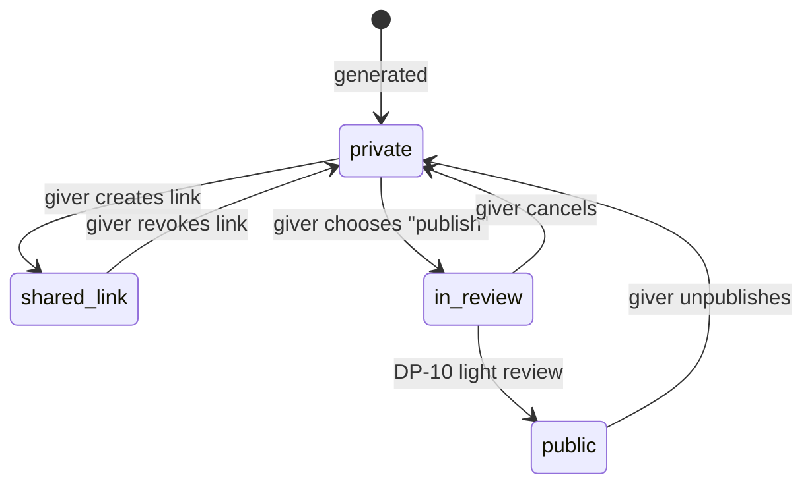

# Donor Report

A beautiful, personal report for one [[Giver]] or [[Sponsor]]: **what your gift became**. Private by default, publishable by choice, shareable by link, exportable to PDF. Back to [[Publications Overview]].

> [!principle] A gift is a gift
> The report thanks the giver for taking part. It never ranks them, never compares them with other givers, and never offers status in exchange for amount. See [[Guiding Principles#P1. A gift is a gift]] and [[Recognition Anti-Patterns]].

## Who gets one

| Persona | Report kind | Trigger |
|---|---|---|
| James, monthly giver | Per-gift card + annual roll-up | Per gift on `gift.Acknowledged`; yearly in January |
| Sarah, sponsor lead | Sponsorship report per funded purpose (e.g. transport for Q3), with a board edition and a public edition | Period end of the sponsorship + on-demand |
| One-off giver without an account | Per-gift report via a signed link sent by email | `gift.Acknowledged` |
| Goods giver | "Your 12 boxes" — items traced through hub to deliveries | `consignment.Delivered` for allocated items |

## What the report shows

1. **Your gift** — amount (only to the giver), currency, date, channel; goods as item categories and counts.
2. **What it became** — allocations from `giftAllocation`: "£40 → fuel for the Lviv–Kharkiv leg (62%), generator purchase (38%)".
3. **Your share of the costs** — the honest part: how much of the gift paid for transport, packaging, customs, fees, calculated pro rata from approved [[Cost Record]]s of the flows it joined. Displayed next to what was delivered, never hidden. See [[Money Flow and Cost Transparency]].
4. **The journey** — embedded [[Journey Story]] timeline(s) at `participants` level.
5. **The mouth** — confirmations: "3 families in Kharkiv oblast confirmed receipt".
6. **The returning tide** — [[Gratitude Note]]s the recipients chose to send upstream.
7. **Together** — "You were one of 214 people who made this happen" (a count, never a rank).

### Cost share calculation

```
costShare(gift) = Σ over flows f the gift joined:
    allocatedAmount(gift, f) / totalFunding(f) × approvedCosts(f)
```

For restricted sponsor funds earmarked for costs (e.g. Sarah's transport sponsorship), the share is shown as **100% by purpose**, and the report lists the legs and kilometres funded.

## Visibility and sharing



- **Private**: visible to the giver (signed in, or via signed email link) and to the assigned coordinators.
- **Shareable link**: an unguessable, revocable URL; the shared view hides the amount unless the giver ticks "show amount". Link views are counted, viewers are not tracked.
- **Public**: the giver chooses to publish (e.g. Sarah for her company's social value statement). The public version passes [[DP-09 Publication Consent]] for any recipient-related content and a light [[DP-10 Report Publication]] review. Recipient details are always pseudonymised unless the recipient consented for this purpose.

> [!privacy] What never appears
> Recipient names, addresses, contact details; other givers' names or amounts; `sealed` safeguarding information. The giver's own amount is shown only to them unless they choose otherwise.

## PDF export

Server-rendered PDF (A4, print stylesheet), in the giver's locale, with the organisation's charity number, report `asOf` time and a verification link to the [[Transparency Ledger]] entries it draws on. Suitable for Gift Aid records and corporate social value statements. Gift Aid itself is out of scope here. #open-question

## Design

A card-based, scrolling "river" layout with gentle motion; warm colours; a large, simple headline ("Your £40 became warmth for three families"). Mobile-first; emailable summary card. See [[Design Language]].

## Related

[[Giver Section]] · [[Gift]] · [[Lifecycle of a Gift]] · [[Gratitude Loop]] · [[Recognition]] · [[Scenario A — Transport Fundraiser]]
