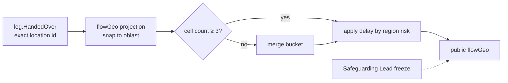

# Flow Map

An animated map of help moving: from sources, through hubs, to regions where it arrived. It shows the river as a living thing while protecting everyone on it. Back to [[Publications Overview]].

> [!privacy] Safety first
> In an active conflict setting a precise map of aid movement is a targeting aid. The public map is **coarse in space and late in time** by design. See [[Safeguarding]] and [[Data Minimisation]].

## Views

| View | Audience | Spatial precision | Time | Content |
|---|---|---|---|---|
| Public map | `public` | Delivery: **oblast** (region) polygon/centroid; hubs: city if the hub is publicly listed; sources: country | Delay ≥ 7 days, or 14 days in high-risk oblasts (stricter per region allowed); animation aggregated by week | Flow lines as particles; counts of deliveries per oblast; categories |
| Participant map | `participants` of a flow | Same as public for the recipient end; full route of hubs for their flow | Delay ≥ 24 h ([[Canonical Parameters]]) | Their flow's legs animated, with carrier aliases |
| Operational map | `team` (studio) | Exact locations as needed for routing | Live | Not a publication; part of [[Coordinator Workspace]] |

## Fuzzing rules

1. **Snap to oblast.** The projection `flowGeo` never stores coordinates below oblast for delivery points; the snap happens *in the projection function*, not the browser, so precise data never reaches `public/{orgId}/...`.
2. **k-anonymity per cell.** An oblast/week cell describing fewer than 5 people or households ([[Canonical Parameters]]) is merged into a two-week or multi-oblast bucket.
3. **Jitter of display position** within the oblast polygon, re-randomised per render, so centroids do not become de facto locations.
4. **No live positions.** Carriers' GPS is never published; legs are drawn hub-to-hub as smooth arcs, not as tracked routes.
5. **Freeze switch.** The Safeguarding Lead can freeze a region (hide or stop updating) instantly; the freeze is a Log Event and its reason is `sealed`.
6. **Frontline buffer.** Oblasts designated high-risk get a longer delay (default 14 days) and show counts only, no lines.

## Animation

Built with a vector map (e.g. MapLibre GL with self-hosted tiles, no third-party tracking) and Framer Motion overlays. Particles flow along arcs weighted by volume; a timeline scrubber lets viewers replay months. Respects `prefers-reduced-motion`: static choropleth plus table. The table view is the accessible equivalent. See [[Accessibility]] and [[Design Language]].

## What the map never shows

- Individual recipients, addresses, villages (unless a consented [[Journey Story]] names the village — and even then not on the map).
- Carrier identities or vehicle details.
- Money amounts per location.
- Hubs that are not publicly listed by the organisation.

Map tile provider choice and whether oblast boundaries should reflect administrative changes are open. #open-question

## Related

[[Location]] · [[Hub]] · [[Leg]] · [[Transport and Logistics Flow]] · [[Campaign Page]] · [[Impact Report]] · [[Scenario B — Regional Aid Hub]]
