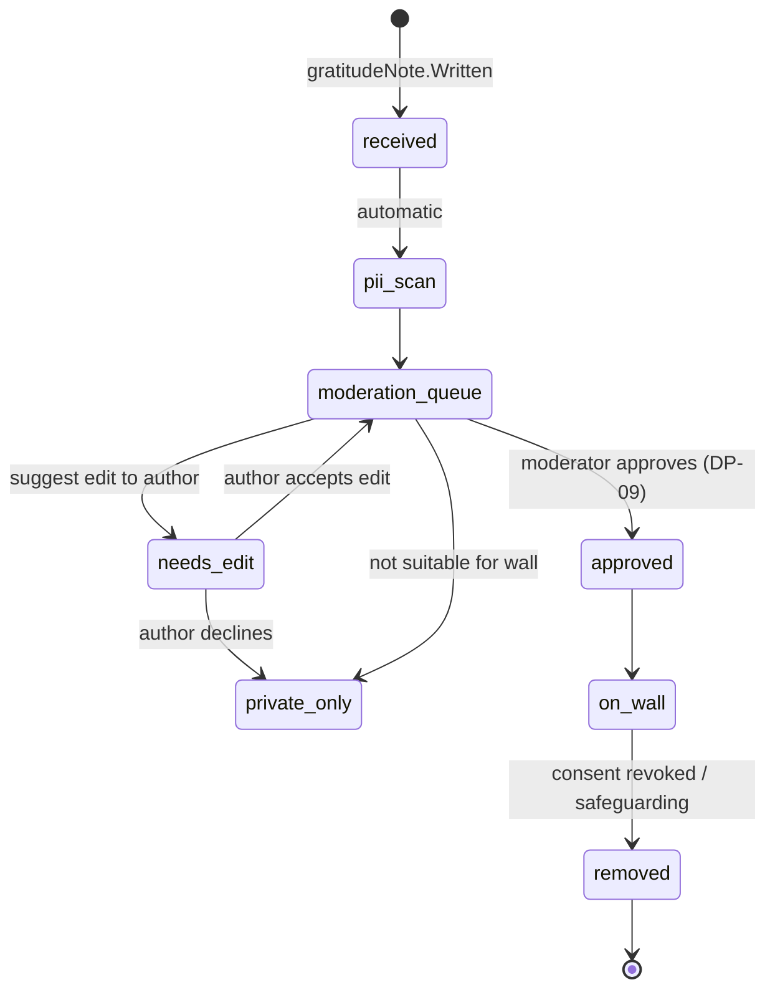

# Gratitude Wall

A place where **consented** thanks from recipients become visible to the people who took part, and, if the recipient wishes, to the public. It is the visible end of the returning tide. Back to [[Publications Overview]].

> [!principle] Thanks travels upstream — by the recipient's choice
> A recipient is never asked to thank as a condition of help, and never pressed to make thanks public. The wall shows only what they chose to share. See [[Guiding Principles#P9. Thanks travels upstream]] and [[Gratitude Loop]].

## Where thanks can go

A [[Gratitude Note]] has a **sharing scope** chosen by its author (the recipient or their proxy):

| Scope | Who sees it | Appears on the wall? |
|---|---|---|
| `private_to_team` | Coordinators only | No |
| `participants` (default suggestion) | Everyone who took part in the Flow, pseudonymised | Participants' view of the wall and their [[Donor Report]] |
| `public_anonymous` | Anyone; signed as "a family in Kharkiv oblast" | Yes |
| `public_named` | Anyone; signed with the name form the author chose (first name, institution name) | Yes |

Photos attached to a note carry their own [[Media Asset]] consent; a public text consent does not publish the photo.

## Moderation

Moderators (Editor role, or Coordinator in Tier 1) check:

1. **Identifiability** — no street names, phone numbers, military unit names, recognisable faces without consent. AI PII detection assists ([[Vertex AI Integration]]), a human decides.
2. **Safety** — nothing that reveals the recipient's location pattern or vulnerability beyond what they intended. Safeguarding Lead can remove immediately.
3. **Dignity** — the note is shown as written. Moderators never "improve" the emotion, never add pity framing, and **never edit meaning**; any edit is proposed to the author, who can accept or decline.
4. **Not advertising** — thanks naming a commercial sponsor are fine; promotional content is not.

Moderators do **not** filter out short, plain or critical notes. "Thanks, it arrived late but it works" is a real thank-you and stays.

## Translation

Notes are shown in the original language, with a toggle to a translation. Machine drafts are labelled "Automatic translation" until reviewed. See [[Multilingual Experience]].

## Display

- Cards in a gentle flowing grid; newest first within a campaign or programme; no "most liked" sort, no likes, no view counts.
- Each card links to the [[Journey Story]] of the flow (at the viewer's visibility).
- Embeddable as a strip in [[Campaign Page]]s and in the [[Newsletter Digest]].
- Wall-level counters ("412 thank-you notes returned this year") come from [[Impact Metrics]].

> [!privacy] Revocation
> A recipient can withdraw any note from the wall at any time, via the tracking link or SMS keyword. Removal propagates per [[Publication Pipeline#Withdrawal on consent revocation]].

## Related

[[Gratitude Note]] · [[Recognition]] · [[Consent Management]] · [[Safeguarding]] · [[Demo Stories and Gratitude]]
