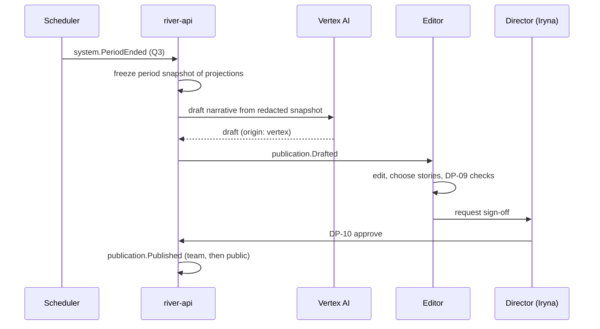

# Impact Report

A periodic report for an [[Organisation]], [[Programme]] or [[Campaign]]: what was needed, what was given, what it cost to move, what arrived, and what came back as thanks. Written for trustees, sponsors, partners and the public. Back to [[Publications Overview]].

> [!principle] Reports produced from records
> The Impact Report is assembled from projections, not written from memory after the fact. The narrative explains the numbers; it never replaces them. See [[Business Overview#Business outcomes the portal must deliver]].

## Scope and cadence

| Scope | Default cadence | Typical audience | Tier |
|---|---|---|---|
| Campaign close-out | On `campaign.Closed` | Givers of the campaign, public | [[Scaling Tiers#Tier 1 — Spring]] (as a simple [[Report]]) |
| Organisation quarterly | Quarterly (scheduled) | Trustees (`team`), public version | Tier 2+ |
| Programme report | Quarterly / grant-period | Funders, [[Partner Organisation]]s, auditors | Tier 3–4 |
| Annual report | Yearly | Public, regulators | All |

Each scope produces two editions from the same data: a **team edition** (full operational detail, `team` visibility) and a **public edition** (aggregated, consented). The public edition is never more detailed than the team edition.

## Structure

1. **Summary in numbers** — headline [[Impact Metrics]] as live data blocks: needs met, confirmed deliveries, % confirmed by recipient, median time to help.
2. **Money in, money used** — excerpt of the [[Transparency Ledger]] for the period: income by channel, costs by kind, share of costs vs gifts, restricted funds and their use.
3. **Where help went** — [[Flow Map]] snapshot at oblast level; counts by [[Category]].
4. **Stories** — 2–4 consented [[Journey Story]] excerpts, chosen for representativeness, not for emotional effect.
5. **The returning tide** — count of [[Gratitude Note]]s and a consented selection.
6. **Milestones reached** — from [[Milestones]].
7. **What we could not do** — needs `referred` or `on_hold`, with reasons by category (never individual cases). Honesty about limits builds trust.
8. **Corrections** — ledger corrections made in the period, with their reasons.
9. **Method** — how figures are counted, data freshness, reviewer names and roles.

## Production flow

### Period snapshot
Live data blocks in a published report are **pinned** to a snapshot (`asOf` timestamp and last event id), so a report for Q3 does not drift when late events arrive. Late events or corrections that affect a closed period appear in the next report's *Corrections* section and as a banner on the old report: "2 corrections since publication — see the ledger". See [[Transparency Ledger#Corrections]].

## Export

- Web page (primary), with per-locale versions (en-GB, uk). See [[Multilingual Experience]].
- PDF export (print stylesheet, accessible tagged PDF).
- CSV of the figures with metric definitions for auditors. See [[Accountability and Audit]].

> [!privacy] Small numbers
> Any public breakdown cell with fewer than **5** people (e.g. "deliveries to Kupiansk district: 2") is merged up to the oblast or suppressed, to prevent re-identification. See [[Data Minimisation]].

> [!decision] Sign-off
> Publication of any Impact Report is [[DP-10 Report Publication]]. For organisation and programme reports the approver is the Director / [[Administrator]]; the Finance Steward confirms the money section.

## Related

[[Report]] · [[Money Flow and Cost Transparency]] · [[Achievements Overview]] · [[Demo Articles and Reports]] · [[Scenario C — Humanitarian Programme]]
