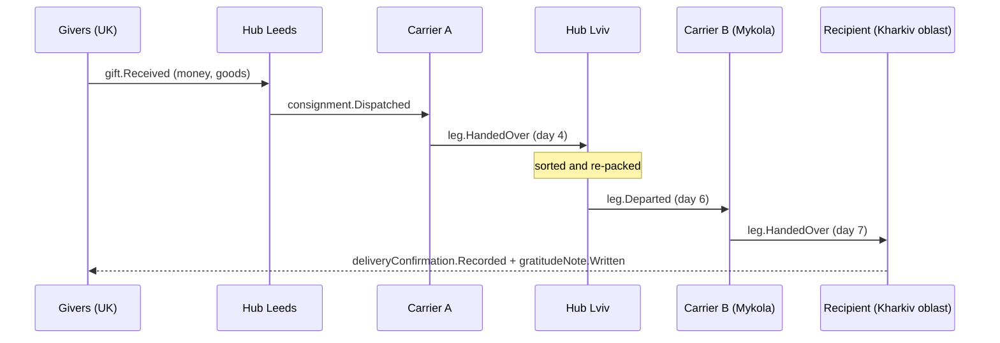

# Journey Story

A trace of a [[Gift]] **from source to mouth**: where it came from, which hands carried it, where it rested, what it cost to move, how it was received and what thanks came back. Built from the log of one [[Flow]]. Back to [[Publications Overview]].

> [!principle] We, together
> A Journey Story credits the chain of people, never a single hero, and never shows the recipient as a spectacle. See [[Brand and Tone of Voice]] and [[Guiding Principles#P10. Dignity in every pixel]].

## Anatomy

| Block | Source | Default rendering |
|---|---|---|
| Header | `flowSummaries` | "A generator for a family in Kharkiv oblast" — the *what* and the oblast, never the village |
| The source | `gift.Received`, `offer.Accepted` | "Gifts from 37 people in the UK and Poland" (pseudonymised, counted) |
| Timeline of legs | `legTimeline` | One row per [[Leg]]: from → to (city or oblast), carrier alias, departed / handed over, days |
| Rest points | `hub.ItemsReceived` | "Rested 2 days at the Lviv hub, re-packed by 3 volunteers" |
| The tolls | `costRecord.Approved` (flow scope) | Transport costs by kind (fuel, ferry, customs) with currency and share of the flow total |
| The mouth | `deliveryConfirmation.Recorded` | "Received and confirmed by the recipient on 12 November" or "confirmed by a neighbour" |
| Returning tide | `gratitudeNote.Written` | The thank-you text, only if the recipient consented to share it with this audience |
| Photos | [[Media Asset]] | EXIF stripped; faces blurred unless consented; `participants` by default |

## Timeline of legs

In the rendered page this becomes an animated horizontal river with a "boat" moving along reaches (Framer Motion, reduced-motion fallback: a static list). See [[Design Language]] and [[Accessibility]].

## Pseudonymisation rules

| Subject | Default in `participants` | Default in `public` | With consent |
|---|---|---|---|
| Recipient | "a family in Kharkiv oblast" | same, or omitted | First name, village, photo — each a separate consent scope |
| Institution recipient (school, hospital) | Institution type + oblast | Institution type + oblast | Institution name (consent by the institution's representative) |
| Giver | "37 givers" | "37 givers" | Name in a list of supporters; **never** with amount unless the giver chose it ([[Recognition Anti-Patterns]]) |
| Carrier | "a volunteer driver" | "a volunteer driver" | First name and organisation |
| Coordinator | "the Open River Aid team" | same | First name |
| Location | City for hubs; oblast for delivery | Oblast; date shifted to week | Village name only with recipient consent **and** Safeguarding Lead approval in active-conflict regions |

> [!privacy] Location safety
> Exact addresses and GPS are never part of the story. Delivery location is coarsened to oblast level and times to the day (public: week) to avoid revealing patterns. Same rules as [[Flow Map]]. The `public` version of a story about a delivery in a conflict zone is published no earlier than 14 days after the delivery ([[Canonical Parameters]]). See [[Safeguarding]].

## Generation

1. `flow.Confirmed` triggers an automatic `participants` draft consisting only of data blocks (no narrative). Because it contains nothing beyond pseudonymised, already-`participants` fields, it can be released to participants after a light DP-10 check by the Lead Coordinator.
2. A narrative version (optionally drafted by [[Vertex AI Integration]]) is proposed for `public`. It goes through the full [[Publication Pipeline]]: [[DP-09 Publication Consent]] then [[DP-10 Report Publication]].
3. Each giver's [[Donor Report]] embeds the Journey Stories their gifts took part in, at `participants` level.

## Multi-gift, multi-need flows

A Flow may join many gifts to many needs. The story is told **per Flow**, with a "your part" highlight when a signed-in giver views it: their gift is traced through allocation to the specific Consignment(s). Money gifts are shown as "became fuel for leg 2 and part of the generator" via allocation records, not by pretending a specific banknote travelled. See [[Money Flow and Cost Transparency]].

## States

`drafted → consent_pending → in_review → published(participants) → published(public) → redacted | withdrawn`. Withdrawal follows [[Publication Pipeline#Withdrawal on consent revocation]].

## Related

[[The Delivery Chain]] · [[Transport and Logistics Flow]] · [[Gratitude Loop]] · [[Consignment]] · [[Delivery Confirmation]] · [[Demo Stories and Gratitude]]
