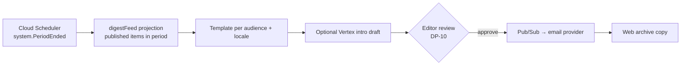

# Newsletter Digest

A periodic email (and web) digest per audience, composed from items already published elsewhere. It adds no new facts; it gathers the surface of the river for people who do not visit every week. Back to [[Publications Overview]].

> [!principle] Never guilt, never noise
> Digests are calm and infrequent. No urgency subject lines, no "you haven't given in 60 days", no streaks. See [[Brand and Tone of Voice]] and [[Recognition Anti-Patterns]].

## Audiences and content

| Audience | Default cadence | Contents | Personal part |
|---|---|---|---|
| Givers | Monthly | Campaign progress, 1–2 [[Journey Story]] excerpts, thanks from the [[Gratitude Wall]], [[Milestones]] reached, ledger totals | "Your gifts this month" summary linking to the [[Donor Report]] (amount visible only in their copy) |
| Sponsors | Monthly / per sponsorship period | Purpose-funded work: legs, kilometres, costs covered | Link to their sponsorship report |
| Carriers and volunteers | Monthly | Routes completed (collective), upcoming needs for transport, thanks returned to carriers | Their own legs and kilometres ([[Recognition]]) |
| Partner organisations | Monthly | Open needs by category and region (aggregated), shared flows | — |
| Public subscribers | Monthly / quarterly | Highlights, [[Impact Report]] link, [[Campaign Page]]s | — |
| Recipients | Not sent by default | — | Only transactional updates about their own [[Need]] via [[Notifications]] |

Recipients are not marketed to. They receive a digest only if they explicitly subscribe as a member of the public.

## Composition

- Only items with `publication.Published` status and visibility ≥ the audience's level are eligible. A digest item is **never** more visible than its source.
- Personal parts are merged per recipient at send time from `private` projections; they are never in the web archive.
- Every issue is reviewed by an Editor before sending: once sent, email cannot be recalled.
- Locale follows the subscriber's preference (en-GB, uk). See [[Internationalisation]].

> [!privacy] Consent and revocation
> Subscription is a specific [[Consent]] (purpose: newsletter, audience, channel), one-click unsubscribe in every email, no third-party tracking pixels; opens are not tracked by default. If a story's consent is revoked after sending, the web archive is redacted per [[Publication Pipeline#Withdrawal on consent revocation]]; the consent screen explains that sent emails cannot be recalled. See [[Consent Management]].

## Measures

Only aggregate deliverability and unsubscribe rates are measured. No per-person engagement scoring feeds [[Reputation]] or segmentation by generosity.

## Related

[[Notifications]] · [[Content Management]] · [[Multilingual Experience]] · [[Giver Section]]
