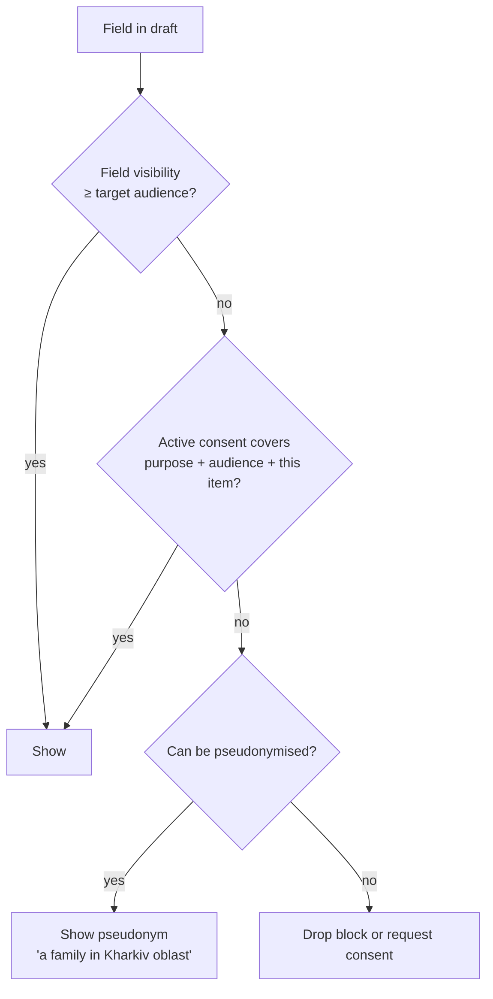

# Publication Pipeline

The single path every [[Publication]] takes, from something happening in a [[Flow]] to something visible on the [[Public Portal]] — and back out again if [[Consent]] is withdrawn. Back to [[Publications Overview]].

> [!principle] Nothing is auto-published
> AI may draft, projections may assemble, schedules may prompt. **A human always decides** before narrative content leaves `team` visibility. See [[Guiding Principles#P5. Consent is specific and revocable]] and [[Vertex AI Integration]].

## Stages

```mermaid
flowchart LR
    EV[Log Event<br/>e.g. flow.Confirmed] --> PR[Projection<br/>read model refreshed]
    PR --> DR[Draft assembled<br/>data blocks + optional AI text]
    DR --> CC{DP-09<br/>Consent check}
    CC -- missing consent --> RQ[Consent request<br/>to subject]
    RQ --> CC
    CC -- redact instead --> RD[Pseudonymise / drop field]
    RD --> HR
    CC -- all fields covered --> HR{DP-10<br/>Human review}
    HR -- changes --> DR
    HR -- approve --> PB[Published<br/>publication.Published]
    PB --> LV[Live data blocks<br/>keep updating]
    PB -. consent.Withdrawn .-> WD[Withdrawn or re-redacted<br/>publication.Withdrawn]
    WD --> DR
```

| # | Stage | What happens | Actor | Event(s) appended |
|---|---|---|---|---|
| 1 | Event | Something real happens: gift received, leg handed over, delivery confirmed | Any participant, system, webhook | domain events, see [[Event Catalogue]] |
| 2 | Projection | Cloud Function updates read models (`orgs/{orgId}/views/...`, `public/{orgId}/...`) | system | none (projections are derived, rebuildable by replay) |
| 3 | Draft | A publication draft is created from a template: structured JSON blocks, live data blocks referencing projections, empty or AI-drafted narrative blocks | system, Coordinator, Editor, `vertex` | `publication.Drafted` |
| 4 | Consent check | Every field is compared against its field-level visibility and the subject's active consents for this purpose and audience | system, then Coordinator at [[DP-09 Publication Consent]] | `publication.ConsentChecked`, `consent.Requested` |
| 5 | Human review | Editor or Lead Coordinator reads the rendered preview **as the target audience would see it**, in every locale | Editor / Lead Coordinator at [[DP-10 Report Publication]] | `publication.Approved` |
| 6 | Publish | Content is frozen as a version; public projection is written; CDN cache invalidated. Safety delays apply: 72 hours for aggregates, 14 days for a public [[Journey Story]] after a delivery in a conflict zone ([[Canonical Parameters]]) | Editor | `publication.Published` |
| 7 | Withdrawal | On consent revocation, safeguarding concern or error, the item is withdrawn or re-redacted | system (automatic on revocation), Safeguarding Lead, Editor | `publication.Withdrawn`, `publication.Redacted` |

Event names are indicative; the canonical list lives in [[Event Catalogue]].

## Draft assembly

- Templates per publication type define block order, required data blocks and which fields are *candidates* for display. See [[Template — Publication]] and [[Content Management]].
- **Live data blocks** (counter, ledger excerpt, journey timeline, map) reference a projection query, not a copied number. The rendered value is resolved at request time from `public/{orgId}/...`, so it can never show data the public projection does not hold.
- Narrative blocks are empty or AI-drafted. Each block carries `origin: human | vertex` and a `reviewedBy` marker.

### AI drafting via Vertex #vertex

| Use | Input | Guard-rails |
|---|---|---|
| Story and report drafting | Projection data already redacted to the draft's target visibility | Model never sees `private` / `sealed` fields it could leak; prompt includes [[Brand and Tone of Voice]] rules (agency, no pity, no single hero) |
| Translation drafts (en-GB ↔ uk) | Approved source-locale text | Every [[Translation]] is marked `machine_draft` until a fluent reviewer approves; see [[Multilingual Experience]] |
| PII detection | Narrative text and image captions | Flags names, addresses, phone numbers, faces; reviewer must resolve every flag |

Every Vertex call appends a Log Event with `actor.via: vertex` and the model version. A draft with unresolved AI flags cannot pass stage 5.

## Consent check (DP-09)



- Consent is **specific**: "story about my generator, first name only, no photo, public, 12 months" is one consent record. A consent for the [[Gratitude Wall]] does not cover a [[Journey Story]].
- `sealed` fields ([[Safeguarding]]) are never candidates, whatever the consent.
- Recipients can grant consent via SMS reply or a one-time link, without an account. See [[Consent Management]].

## Human review (DP-10)

The reviewer sees a **preview per audience** (`participants`, `public`) and per locale, with redactions highlighted. Checklist:

1. Every figure is a live data block or traceable to one.
2. No identifying detail beyond consent (including background details in photos, street names, vehicle plates).
3. Tone matches [[Brand and Tone of Voice]]: agency, chain of people, honest costs.
4. Costs shown alongside outcomes where money is discussed ([[Money Flow and Cost Transparency]]).
5. Both locales reviewed by a fluent human.

Tier 1 organisations with a single coordinator may act as both drafter and reviewer, but the log records it and the [[Impact Report]] discloses it. #open-question

## Withdrawal on consent revocation

When `consent.Withdrawn` is appended:

1. A function finds every published version referencing the consent (index `publicationConsents`).
2. Affected blocks are re-rendered with the fallback (pseudonym or removal) **within 15 minutes**, without human action; the item is marked `publication.Redacted`.
3. If redaction would leave the item meaningless, it is `publication.Withdrawn` and the page shows a neutral "This story is no longer available" note.
4. CDN caches are purged; social share images are regenerated.
5. The Editor is notified to review; digests already sent cannot be recalled, which is disclosed at consent time. See [[Newsletter Digest]].

> [!privacy] Published versions and erasure
> Published versions are content snapshots, not log events. Personal fields inside them are references to encrypted person data, so crypto-shredding of the person key also blanks old versions. See [[Data Retention]] and [[Privacy Model]].

## Related

[[Publication]] · [[Consent]] · [[Visibility Policy]] · [[DP-12 Visibility Change]] · [[Content Editor]] · [[Event Log and Projections]] · [[Accountability and Audit]]
