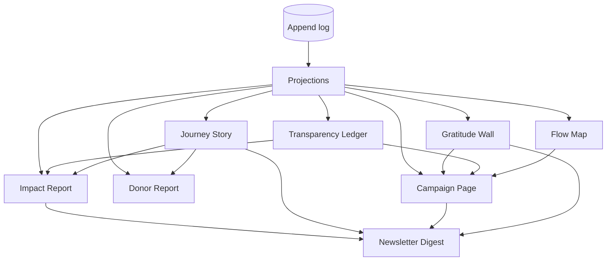

# Publications Overview

*What the system forms and publishes from its own data flows and business interactions.* Back to [[00 Home]].

In the river metaphor, publications are **the surface**: what can be seen of the depths. Every publication is built from [[Projection]]s of the append-only [[Log Event]] stream, never from hand-typed figures. Words may be written (or drafted by AI and reviewed by a human), but **numbers, dates, routes and confirmations come from the log**. See [[The River Concept]] and [[Guiding Principles#P8. Honest numbers, beautifully shown]].

> [!principle] Honest numbers, beautifully shown
> A figure that cannot be traced back to Log Events does not appear in a publication. Every live number carries a "How is this counted?" link to its definition in [[Impact Metrics]].

> [!privacy] Private by default
> Anything touching a person starts at `private`. A publication may only raise the visibility of a field to the level allowed by a specific, current [[Consent]] and the [[Visibility Policy]]. See [[Visibility Levels]] and [[ADR-006 Private by Default Visibility]].

## Publication types

| Publication | Main source projections / events | Audience | Default visibility | Consent needed | Trigger | Editor involvement |
|---|---|---|---|---|---|---|
| [[Journey Story]] | `flowTimeline`, `legTimeline`; `gift.Received`, `consignment.Dispatched`, `leg.HandedOver`, `deliveryConfirmation.Recorded`, `gratitudeNote.Written` | Participants of the Flow; optionally public | `participants` | Recipient consent for any story detail beyond pseudonymised facts; carrier consent to be named | Automatic draft on `flow.Confirmed`; published on review | Required ([[DP-10 Report Publication]]) before `public`; `participants` version may auto-assemble without narrative |
| [[Impact Report]] | `impactMetrics`, `ledgerTotals`, `milestones`, `flowSummaries` | Trustees, sponsors, public | `team` until approved | Only for embedded stories, photos or quotes | Scheduled (quarterly, annual) or on-demand | Required; Director / Editor sign-off at DP-10 |
| [[Donor Report]] | `giverContributions`, `giftAllocation`, `flowTimeline`, `costShare`, `gratitudeForGiver` | The individual Giver or Sponsor | `private` | The giver's own choice to publish; recipient consent for any recipient detail | Automatic on `gift.Acknowledged`, periodic roll-up, on-demand | None for the private version; DP-10 light review if the giver publishes |
| [[Campaign Page]] | `campaignProgress`, `ledgerTotals` (campaign scope), `campaignUpdates` | Public | `public` (aggregates only) | For updates containing stories, photos or names | Continuous live data; updates on-demand | Editor writes the story and updates; figures are live data blocks |
| [[Transparency Ledger]] | `ledgerEntries`, `ledgerTotals`; `gift.Received`, `costRecord.Approved`, `deliveryConfirmation.Recorded`, `gift.ReceiptCorrected`, `costRecord.Reversed` | Public, auditors | `public` (aggregated) | Only if a giver chooses to be named in a line | Automatic, near real-time with a safety delay | None for entries; Finance Steward owns corrections |
| [[Gratitude Wall]] | `gratitudeNotes` where consent scope includes `wall` | Public or participants | `participants` | Recipient consent per note (wording, name form, photo) | On-demand after consent | Moderation queue required |
| [[Flow Map]] | `flowGeo` (oblast-level), `legTimeline` | Public (fuzzed), participants (route per own flow) | `public` at oblast level with delay | None for fuzzed aggregates; carrier consent for named routes | Automatic with time delay | Safeguarding Lead may freeze a region |
| [[Newsletter Digest]] | `digestFeed` per audience; published items from all types above | Subscribers by audience | Per item (never higher than the source item) | Subscription consent; item-level consents inherited | Scheduled (monthly by default) | Editor reviews every issue before send |

## How the types relate

Smaller publications are **composed** into larger ones: a Campaign Page embeds a ledger excerpt, a gratitude strip and a map; an Impact Report embeds selected Journey Stories. Composition never raises visibility: a composed item shows the **lowest** visibility of its parts for any given audience.

## Trigger kinds

- **Automatic**: a projection change creates or refreshes a draft or a live data block. Live figures on already-published pages update without review, because the *shape* of what is shown was approved once.
- **On-demand**: a Coordinator, Editor or the Giver asks for a publication.
- **Scheduled**: Cloud Scheduler creates a draft on a calendar (digest, quarterly report).

No trigger ever publishes narrative content directly. See [[Publication Pipeline]].

## Section notes

- [[Publication Pipeline]]: the one path every publication takes
- [[Journey Story]] · [[Impact Report]] · [[Donor Report]] · [[Campaign Page]]
- [[Transparency Ledger]] · [[Gratitude Wall]] · [[Flow Map]] · [[Newsletter Digest]]

## Related

- Entities: [[Publication]], [[Article]], [[Report]], [[Media Asset]], [[Translation]]
- Form: [[Public Portal]], [[Content Editor]], [[Design Language]], [[Multilingual Experience]]
- Decisions: [[DP-09 Publication Consent]], [[DP-10 Report Publication]], [[DP-12 Visibility Change]]
- Architecture: [[Event Log and Projections]], [[Content Management]], [[Vertex AI Integration]]
- Achievements that feed publications: [[Achievements Overview]]
- Template: [[Template — Publication]]
