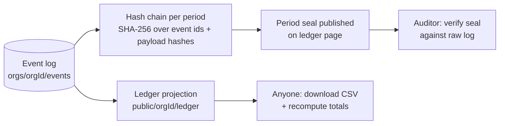

# Transparency Ledger

The public, aggregated, verifiable record of **income, costs and deliveries**. It is the honest surface of the money river. Back to [[Publications Overview]].

> [!principle] The river remembers
> The ledger is a projection of the append-only log. Nothing is edited: mistakes are corrected by **compensating entries** that are visible to everyone. See [[Guiding Principles#P7. The river remembers]] and [[ADR-001 Event-Sourced Append Log]].

## Entry types

| Entry | From event | Public fields | Hidden fields |
|---|---|---|---|
| Income | `gift.Received` | Date (day), amount, currency, FX rate, channel (card, bank, jar), campaign, restricted/unrestricted | Giver identity (shown as "a giver" unless they opted to be named), payment reference |
| Goods received | `gift.Received` (goods) | Date, category, quantity, estimated value if recorded | Giver identity |
| Cost | `costRecord.Approved` | Date, kind, amount, currency, flow/leg reference, receipt present ✓, approver role | Receipt image, supplier personal details |
| Delivery | `deliveryConfirmation.Recorded` | Date (week), category, oblast, confirmation kind (recipient / proxy / carrier evidence) | Recipient, address |
| Allocation | `gift.Allocated` | From fund/campaign to flow, amount | — |
| Correction | `gift.ReceiptCorrected` / `costRecord.Reversed` | Reference to corrected entry, delta, reason category, who approved (role) | — |

## Aggregation levels

- **Line level** (per entry, pseudonymised) for campaigns and organisations below a volume threshold, e.g. Tier 1 van fundraiser: every line shown.
- **Daily / weekly totals** above the threshold, with drill-down to line level for auditors (`team` / Auditor role).
- **Totals**: income, costs by kind, share of costs vs gifts, restricted funds balance, deliveries.

## Verifiability

- Every public ledger line has a stable id (the source event ULID) and a permalink.
- Each closed period (month) publishes a **seal**: a hash over the ordered event ids and payload hashes contributing to the ledger. An [[Accountability and Audit]] Auditor can re-derive it from the log. Personal data is not in payloads, so sealing does not conflict with crypto-shredding. See [[Privacy Model]].
- CSV and JSON export of the public projection, with a metric dictionary.
- Donor Reports and Impact Reports link to the ledger lines they draw on.

## Corrections

A correction never rewrites history:

| # | Date | Entry | Amount |
|---|---|---|---:|
| L-0412 | 2026-09-03 | Cost — fuel, leg Lviv→Kharkiv | 142.00 GBP |
| L-0431 | 2026-09-09 | Correction of L-0412 — duplicate receipt | −142.00 GBP |

- Recorded by the Finance Steward with a reason category (duplicate, wrong amount, wrong currency, reclassification, refund) and free-text note (`team`).
- The original line stays, struck through visually, with a link to its correction.
- Corrections to closed periods show a banner on affected [[Impact Report]]s.
- Refunds to givers appear as negative income lines.

> [!privacy] Safety delay
> Ledger lines — delivery, income and cost — are published after a 72-hour delay ([[Canonical Parameters]]) and at oblast level. The [[Flow Map]] waits longer (7 days, or 14 days in high-risk oblasts). Safeguarding Lead may extend the delay per region.

> [!decision] Costs enter the ledger only after approval
> Unapproved costs never appear publicly. Approval is [[DP-06 Cost Approval]].

## Related

[[Cost Record]] · [[Gift]] · [[Campaign Page]] · [[Impact Metrics]] · [[Event Log and Projections]] · [[Scenario A — Transport Fundraiser]]
