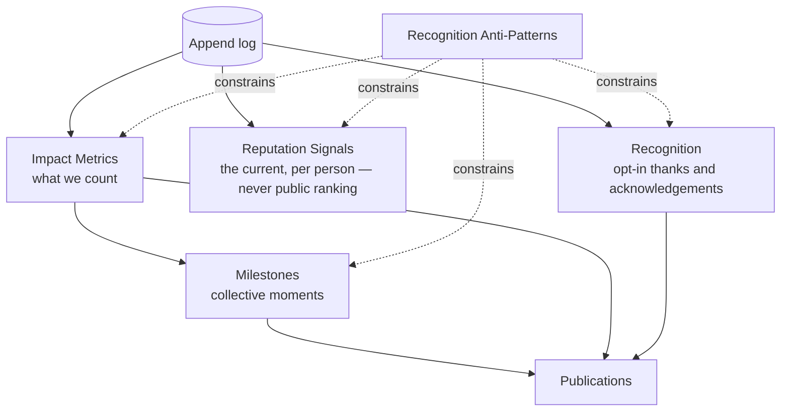

# Achievements Overview

*What the system counts and shows as achievements.* Back to [[00 Home]].

## Philosophy: celebrate the flow, not the amount

In a river no single drop claims the sea. River Portal celebrates **what people did together** — needs met, deliveries confirmed, thanks returned — and recognises **taking part**, never the size of a gift. Achievements are counted from the [[Log Event]] stream like everything else, so they are honest, explainable and reproducible.

> [!principle] A gift is a gift
> No recognition, status or visibility is bought with money. Amounts are private unless the giver chooses otherwise, and even then they are never ranked. See [[Guiding Principles#P1. A gift is a gift]].

> [!principle] The left bank is always open
> Nothing counted here ever affects whether a [[Recipient]] may ask for help. Recipients are never scored publicly. See [[Guiding Principles#P3. The left bank is always open]] and [[ADR-005 Open Access for Recipients]].

## Four layers

| Layer | Question | Subject | Default visibility | Note |
|---|---|---|---|---|
| Impact metrics | What happened, in numbers? | Organisation, programme, campaign, flow | `public` aggregates; `team` operational metrics | [[Impact Metrics]] |
| Milestones | What did we reach together? | Collective (campaign, programme, organisation) | `public` | [[Milestones]] |
| Recognition | How do we thank the people who took part? | Individuals and partner organisations, opt-in | `private` → `participants` / `public` by choice | [[Recognition]] |
| Reputation signals | How reliable, timely and clear has someone's participation been? | Individuals and organisations | `private` (self) and `team` (coordinators) | [[Reputation Signals]] |
| Anti-patterns | What will we never build? | — | — | [[Recognition Anti-Patterns]] |

## Rules that apply to every layer

1. **Derived, not declared.** Every count comes from events via a [[Projection]]; each displayed figure links to its definition. See [[Event Log and Projections]].
2. **Collective by default.** Public achievements are about the whole flow: "we", not "top donor".
3. **Opt-in for individuals.** Any individual recognition beyond a private thank-you needs the person's choice ([[Consent]]).
4. **Explainable.** A person can see every signal about themselves and the events behind it, and contest it via [[DP-11 Reputation Review]].
5. **Costs are part of the achievement.** Moving goods costs money; showing cost per kg or share of costs honestly is itself celebrated ([[Guiding Principles#P8. Honest numbers, beautifully shown]]).
6. **No manipulation.** No streaks, no loss aversion, no pity virality. See [[Recognition Anti-Patterns]].

## Section notes

- [[Impact Metrics]] — metric catalogue with formulas from events
- [[Milestones]] — collective milestones and celebration moments
- [[Recognition]] — thanks, acknowledgements, anniversaries, carrier kilometres
- [[Reputation Signals]] — how the current is displayed per audience
- [[Recognition Anti-Patterns]] — what we deliberately do not do

## Related

[[Reputation]] · [[Reputation Dynamics]] · [[Gratitude Loop]] · [[Publications Overview]] · [[Value for Each Party]] · [[Ethics Charter]]
