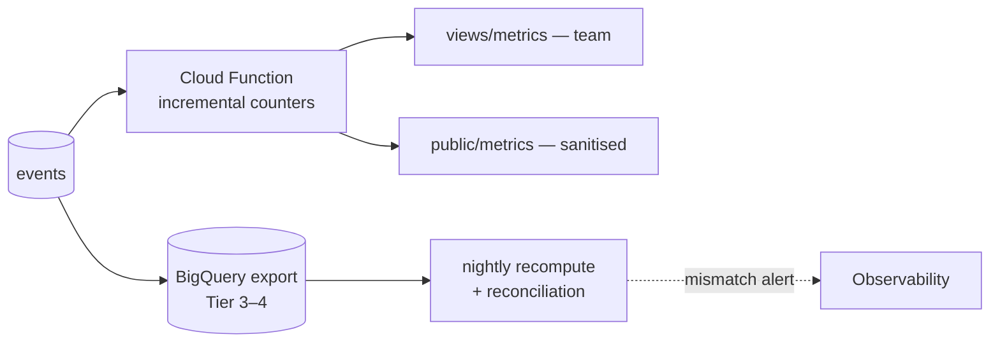

# Impact Metrics

The catalogue of what River Portal counts. Each metric has a precise definition, a formula over [[Log Event]]s, an audience and a visibility level. Every public figure links to its entry here ("How is this counted?"). Back to [[Achievements Overview]].

> [!principle] Honest numbers
> A metric that cannot be computed from events is not a metric; it is a claim. Costs are counted with the same care as outcomes. See [[Guiding Principles#P8. Honest numbers, beautifully shown]].

## Conventions

- Scope: every metric can be computed per `org`, `programme`, `campaign`, `flow`, and period.
- Time: by `occurredAt`, bucketed in the organisation's time zone.
- Money: converted to the scope's base currency at the FX rate recorded on each event; original currency totals kept.
- Small-number suppression: public breakdown cells with n < 5 are merged or hidden ([[Data Minimisation]]).
- Event names are indicative; canonical names in [[Event Catalogue]].

## Catalogue

### Outcomes

| Metric | Definition | Formula (events) | Audience | Visibility |
|---|---|---|---|---|
| Needs met | Needs that reached `confirmed` or `closed` after delivery | count distinct `need.id` with `need.Confirmed` in period | All | `public` |
| Needs referred | Needs passed to a partner or other service | count `need.Referred` | Team, public (aggregate) | `public` aggregate, reasons by category only |
| Median time to help | Median time from submission to first confirmed delivery | median(`deliveryConfirmation.Recorded.occurredAt` − `need.Submitted.occurredAt`) per need | All | `public` |
| Time to acknowledge | Median time from submission to acknowledgement | median(`need.Acknowledged` − `need.Submitted`) | Team | `team` (target: see [[Canonical Parameters]], automatic < 1 h, human < 48 h) |
| Deliveries confirmed | Delivery Confirmations accepted at DP-08 | count `deliveryConfirmation.Accepted` | All | `public` |
| % confirmed by recipient | Share of confirmed deliveries confirmed by the recipient themselves, rather than proxy or carrier evidence | count(kind = recipient) / count(all accepted) | All | `public` |
| People reached | Estimated people in households/institutions helped | Σ `need.Submitted.payload.householdSize` for met needs (self-declared, optional) | All | `public`, labelled "estimated" |

### Money and costs

| Metric | Definition | Formula | Audience | Visibility |
|---|---|---|---|---|
| Money received | Received money gifts | Σ `gift.Received.amount` (money) − refunds | All | `public` |
| Costs approved | Approved costs by kind | Σ `costRecord.Approved.amount` + corrections | All | `public` |
| Share of costs vs gifts | Proportion of money received that paid for moving help (transport, packing, fees) | costs approved ÷ money received (+ goods value where recorded) | All | `public` |
| Cost per km | Transport cost per vehicle-kilometre | Σ transport costs of legs ÷ Σ `leg.Closed.payload.distanceKm` | Team, sponsors, public | `public` at campaign level |
| Cost per kg delivered | Total costs per kg of goods delivered | Σ costs of flows ÷ Σ delivered `consignment.weightKg` | Team, sponsors, public | `public` |
| Restricted funds balance | Unspent restricted funds per purpose | Σ restricted received − Σ restricted allocated | Team, sponsors | `team`; sponsor sees own |
| Receipt completeness | Share of approved costs with receipt evidence | count(receipt ✓) / count(approved) | Team, auditors | `team`, public summary |

### Participation and gratitude

| Metric | Definition | Formula | Audience | Visibility |
|---|---|---|---|---|
| Gratitude notes returned | Thank-you notes sent upstream | count of distinct notes with `gratitudeNote.Delivered` | All | `public` |
| Givers taking part | Distinct givers with a received gift in period | count distinct giver ids | All | `public` (count only) |
| Active carriers | Carriers who closed at least one leg in period | count distinct `leg.Closed.carrierId` | All | `public` (count) |
| Kilometres carried | Total distance of closed legs | Σ `distanceKm` | All | `public` |
| Volunteer hours | Logged volunteer time | Σ `role.TimeLogged.hours` | All | `public` |
| Languages served | Distinct locales used by recipients in submitted needs | count distinct `need.Submitted.payload.locale` | All | `public` |
| Partner organisations active | Partners in at least one flow | count distinct partner ids | All | `public` |

### Operational health (team only)

| Metric | Definition | Visibility |
|---|---|---|
| Open needs by age band | Needs in `open`/`partially_matched` by days since submitted | `team` |
| Offers awaiting clarification | Offers in `clarifying` > 7 days | `team` |
| Legs overdue | Legs `departed` beyond planned arrival + tolerance | `team` |
| Consent pending | Publications blocked at [[DP-09 Publication Consent]] | `team` |
| Coordinator load | Open flows per coordinator (for balancing, not appraisal) | `team` |

## Computation

Incremental counters give live figures; a nightly full recompute (from replay or BigQuery) reconciles them. Mismatches raise an alert in [[Observability]]. Published reports pin a snapshot ([[Impact Report#Period snapshot]]).

> [!question] Goods valuation
> Should in-kind goods carry an estimated monetary value (needed for "share of costs vs gifts" when gifts are mostly goods)? Valuation invites "price tags on people" framing. #open-question

## Related

[[Milestones]] · [[Transparency Ledger]] · [[Campaign Page]] · [[Money Flow and Cost Transparency]] · [[Business Overview#Business outcomes the portal must deliver]]
