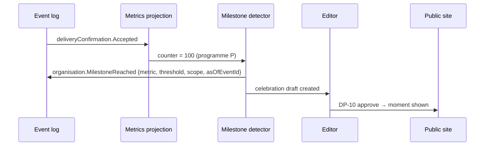

# Milestones

Collective moments worth celebrating: thresholds reached **together** by a [[Campaign]], [[Programme]] or the [[Organisation]]. A milestone is always about the flow, never about one person's contribution. Back to [[Achievements Overview]].

> [!principle] We, together
> "The 100th confirmed delivery" belongs to everyone in the chain: givers, carriers, volunteers, coordinators and the recipients who confirmed. See [[Brand and Tone of Voice]].

## Milestone catalogue

| Milestone | Scope | Defined over metric | Default thresholds | Celebration |
|---|---|---|---|---|
| Goal reached | Campaign | Money received ≥ goal | 100% (also 25/50/75% as quiet progress marks) | Banner + gentle animation on [[Campaign Page]]; update draft for Editor |
| First delivery | Campaign, programme | Deliveries confirmed | 1 | "The first boat has reached the mouth" story prompt |
| Nth confirmed delivery | Programme, org | Deliveries confirmed | 10, 50, 100, 250, 500, 1000… | Home-page moment; [[Newsletter Digest]] item |
| Thanks returned | Programme, org | Gratitude notes returned | 50, 100, 500… | [[Gratitude Wall]] highlight |
| Kilometres carried | Programme, org | Kilometres carried | 1 000, 10 000, 40 075 ("once around the Earth") | [[Flow Map]] replay moment |
| Every leg receipted | Campaign | Receipt completeness | 100% at close | Transparency badge on the campaign's ledger |
| All confirmed by recipients | Campaign | % confirmed by recipient | 100% at close | Mentioned in close-out [[Impact Report]] |
| Languages | Org | Languages served | each new locale | "We now help in Crimean Tatar" style announcement |
| Anniversary | Programme, org | First event date | yearly | Year-in-review [[Impact Report]] |
| Faster help | Programme | Median time to help | improvement ≥ 20% vs previous quarter | Team-internal celebration first, then public if sustained |

Thresholds are configurable per organisation in [[Admin Studio]]; a Tier 1 van fundraiser may only use *goal reached*, *first delivery* and *every leg receipted*.

## Detection

- `organisation.MilestoneReached` is appended **once** per (scope, metric, threshold). If a later correction drops the metric below the threshold, the milestone is not revoked silently: a `organisation.MilestoneCorrected` event is appended and the celebration shows a note. See [[Transparency Ledger#Corrections]].
- The event records the triggering event id, so anyone can check which delivery was "the 100th" — but that delivery's recipient is **never** featured unless they consent through [[DP-09 Publication Consent]].
- Detection is automatic; public celebration content passes the [[Publication Pipeline]]. The live counter itself may update immediately.

## Celebration moments on site

- **Subtle and warm**: a ripple animation across the counter, a short line of copy, a thank-you to "everyone in the chain". No confetti storms, no sound, respects reduced motion. See [[Design Language]] and [[Accessibility]].
- **Time-boxed**: a moment is prominent for 7 days, then lives in the programme timeline.
- **Thanks to all**: participants of the scope receive a notification ("You were part of this"), without amounts. See [[Recognition]].
- **Never urgency**: a milestone is never used as a fundraising countdown ("only £200 to go before midnight!"). See [[Recognition Anti-Patterns]].

## Related

[[Impact Metrics]] · [[Campaign Page]] · [[Impact Report]] · [[Newsletter Digest]] · [[Demo Articles and Reports]]
