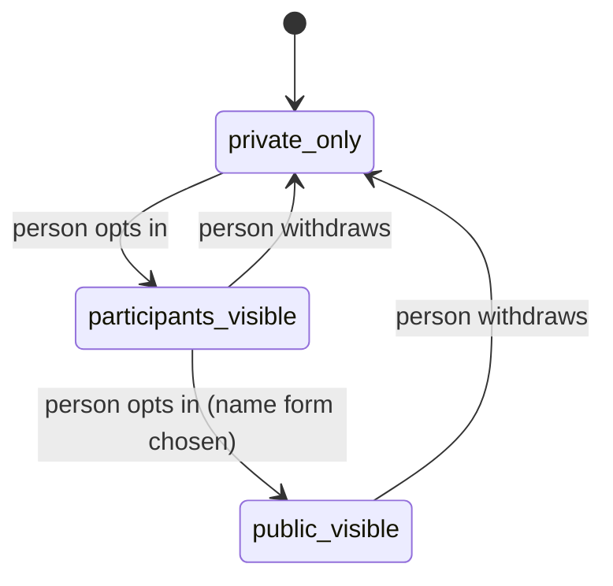

# Recognition

How River Portal thanks and acknowledges the people and organisations who take part. Recognition is for **taking part**, it is **always opt-in beyond a private thank-you**, and it is **never ranked by money**. Back to [[Achievements Overview]].

> [!principle] A gift is a gift
> Recognition is not a reward that can be bought. The same warmth goes to someone who gave £5, drove 800 km, or sorted boxes for an afternoon. See [[Guiding Principles#P1. A gift is a gift]].

## Forms of recognition

| Form | For | Content | Default visibility | Opt-in? |
|---|---|---|---|---|
| Personal thank-you | Every participant | Message from the organisation after their part (gift received, leg closed, shift logged) | `private` | No (transactional); can mute |
| Returning thanks | Every participant in a flow | The recipient's [[Gratitude Note]], if they chose to send it upstream | `participants` | Recipient decides; participant can mute |
| Participation acknowledgement | Givers, carriers, volunteers | "You took part in the Kharkiv winter flow" — a card in their space and [[Donor Report]] | `private` | Can share or publish by choice |
| Anniversary | Anyone with ≥ 1 year of participation | "A year ago you first gave / drove / packed" with the collective story since | `private` | Can turn off |
| Carrier kilometres | Carriers | Their total kilometres and legs, routes at hub level | `private`; `public` by choice | Yes, for any public display |
| Volunteer hours | Volunteers | Hours and tasks (packing, translation) | `private`; `public` by choice | Yes |
| Supporters list | Givers, sponsors, partners | Names in an alphabetical list on a [[Campaign Page]] or [[Impact Report]] — **no amounts, no tiers** | `public` | Yes, explicit consent with chosen name form |
| Sponsor acknowledgement | [[Sponsor]]s | "Transport for Q3 made possible by Northfield Ltd" with the purpose funded | `public` | Yes; purpose-based, not amount-based |
| Partner acknowledgement | [[Partner Organisation]]s | Named in flows they co-ran | `participants` / `public` | Yes (organisational consent) |
| Recipient's own acknowledgement | [[Recipient]]s who confirmed and shared | They are thanked for confirming and for their feedback; never publicly scored | `private` | — |

## Opt-in model

- Opt-in is recorded as a [[Consent]] with scope (which recognition, which audience, which name form: full name, first name, initials, organisation) and is revocable at any time. See [[Consent Management]].
- The UI asks at a natural moment (after the first thank-you), once, and never nags.
- Withdrawal propagates through [[Publication Pipeline#Withdrawal on consent revocation]].

## Carrier kilometres, in detail

Carriers such as Mykola (see [[Audiences and Personas]]) value seeing the distance they covered and knowing it mattered. The carrier's space shows:

- total km and legs, per year and all-time;
- a private map of their own hub-to-hub legs;
- thanks returned from flows they carried;
- fuel and toll costs they logged and their reimbursement status.

Publicly, if Mykola opts in: "Mykola, volunteer driver, Lviv — 18 400 km with Open River Aid since 2025". Never compared with other carriers.

## Tone

Recognition copy follows [[Brand and Tone of Voice]]: specific, warm, collective. "Your gift became part of fuel for a 1 040 km journey to Kharkiv oblast" beats "Thank you for your generous donation!".

## Related

[[Gratitude Loop]] · [[Reputation Signals]] · [[Milestones]] · [[Giver Section]] · [[Carrier]] · [[Volunteer]] · [[Value for Each Party]]
