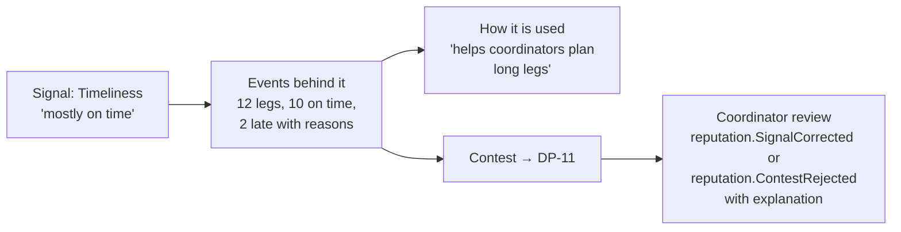

# Reputation Signals

How **the current** — [[Reputation]] — is shown to each audience. Reputation is not a score. It is a set of explainable signals derived from the log, visible to the person themselves and to the coordinators who need it, and **never shown as a public leaderboard**. The model behind the signals is in [[Reputation Dynamics]]. Back to [[Achievements Overview]].

> [!principle] The left bank is always open
> For [[Recipient]]s, signals are internal only and used to choose verification depth and routing. They never refuse or delay the ability to ask for help. See [[ADR-005 Open Access for Recipients]] and [[Guiding Principles#P3. The left bank is always open]].

## The signals

| Signal | Meaning | Derived from (examples) | Applies to |
|---|---|---|---|
| Reliability | Did what was promised | offers fulfilled vs accepted; legs closed vs assigned; `gift.Pledged` → `gift.Received` | Givers, carriers, partners, coordinators |
| Timeliness | Did it when agreed | leg departure/arrival vs plan; acknowledgement times | Carriers, coordinators, partners |
| Clarity | Requests / offers were clear and complete | clarification rounds at [[DP-03 Offer Acceptance]] / [[DP-01 Need Triage]] | Givers, partners; recipients (internal only) |
| Evidence completeness | Receipts, handover photos, confirmations provided | cost records with receipts; `leg.HandedOver` with evidence | Carriers, coordinators |
| Gratitude received | Thanks returned from flows they took part in | `gratitudeNote.Delivered` linked to their flows | Everyone except recipients |
| Confirmed deliveries | Flows they took part in that reached a confirmed mouth | `deliveryConfirmation.Accepted` | Everyone except recipients |

Each signal is shown as a **qualitative band** ("consistently on time", "building", "not enough history yet") with the underlying counts, never as a single number or percentile against others.

## Display per audience

| Audience | What they see | Where |
|---|---|---|
| The subject (self-view) | All their signals, the events behind each, how each is used, and a "Contest this" action | Their space on the [[Public Portal]] (givers, carriers) or [[Coordinator Workspace]] (staff) |
| Assigned coordinator | Signals of participants in their flows, as context for decisions ([[DP-04 Matching]], [[DP-05 Routing and Carrier Assignment]], [[DP-02 Need Verification]]) | [[Coordinator Workspace]] side panel |
| Safeguarding Lead | Plus any `sealed` safeguarding flags | Safeguarding view |
| Other participants in a flow | Nothing about individuals' signals; only that the carrier is "a verified volunteer driver" if verified | [[Journey Story]] |
| Public | **Nothing individual.** At most, a Partner Organisation's verification status and public track record by consent (e.g. "42 confirmed flows") | Partner profile |

## Self-view

- Late legs with a recorded reason (border queue, curfew, breakdown) are **context-weighted**: they are shown with the reason and carry little or no weight. See [[Reputation Dynamics]].
- Signals decay: older events weigh less, so people can grow.
- The subject can add a short statement to any event, visible to coordinators.

## Coordinator view

Coordinators see signals **as context, not verdicts**:

- displayed next to the decision, not in a ranked list;
- sort by signal is not offered for people lists; filtering by "not enough history" is (to offer support, not exclusion);
- for recipients, the panel shows only the *suggested verification depth* and why (e.g. "first request; standard check"), never a trust label;
- any use of a signal in a decision is logged with the decision event, so [[Accountability and Audit]] can review it.

> [!privacy] Visibility
> Signals are `private` to the subject plus `team` for assigned coordinators. Raising any signal's visibility is [[DP-12 Visibility Change]] and requires the subject's consent. See [[Visibility Levels]].

> [!question] Narrative or signals?
> Should the self-view also include a short, human-written or AI-drafted narrative summary alongside the signals? Relates to the open question in [[Open Questions]] on how reputation is shown to its subject. #open-question

## Related

[[Reputation]] · [[Reputation Dynamics]] · [[DP-11 Reputation Review]] · [[Verification]] · [[Recognition Anti-Patterns]] · [[Escalation and Disputes]]
