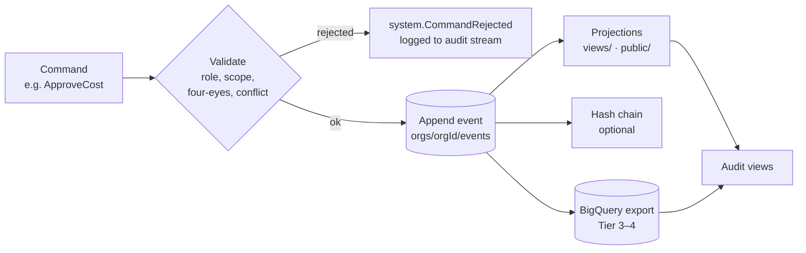

# Accountability and Audit

How the River Portal makes every decision traceable to a person, a role, a moment and a reason, and how auditors, trustees and regulators can check this without seeing more personal data than they need. Back to [[Decision Points Overview]] · [[00 Home]].

> [!principle] The river remembers
> [[Guiding Principles#P7. The river remembers|P7]]: every action is appended, never overwritten. Corrections are new entries. Accountability is therefore a *property of the data model*, not a report assembled afterwards ([[ADR-001 Event-Sourced Append Log]]).

## How the append log provides accountability

Every write passes through the command API (`river-api`) and becomes a [[Log Event]] in `orgs/{orgId}/events/{eventId}`. [[Security Rules]] forbid update and delete, and only the server may create.

| Event field | Accountability question answered |
|---|---|
| `actor.personId`, `actor.role` | Who decided, and in what capacity (e.g. Finance Steward, not just "staff") |
| `actor.via` (`web`, `studio`, `api`, `system`, `vertex`) | Was it a human, an automation or an AI suggestion? |
| `occurredAt` / `recordedAt` | When it happened versus when it was recorded (late entries are visible) |
| `correlationId` | Which Need or Flow journey it belongs to |
| `causationId` | Which earlier event caused it (e.g. `costRecord.Approved` ← `costRecord.Submitted`) |
| `payload.reasonCode` + `payload.note` | Why, from the DP's controlled list |
| `payload.delegationRef` | Under whose delegation a Contributing Coordinator acted |
| `schemaVersion`, `payload.rubricVersion` | Which rules applied at the time |

Because personal data lives outside the payload (in `people/{personId}/private`, encrypted with per-person keys), the log can be retained and audited for years while [[Data Retention]] and erasure are honoured by **crypto-shredding**. After shredding, the audit trail still shows *that* a decision was made and by which role. The subject's identity becomes unreadable.

Rejected commands (four-eyes violations, conflicts of interest, AI attempting a decision) are also logged to a separate audit stream. Attempted breaches are therefore visible, not just successful actions.

## Auditor access via IAP

- Auditors are Google Workspace / Cloud Identity accounts in the `auditors@` group, which grants the **Auditor** variant of [[Role]] in the studio behind [[IAP Staff Access|Identity-Aware Proxy]] ([[ADR-003 IAP for Staff Sections]]).
- The server verifies the `x-goog-iap-jwt-assertion` header and maps the identity to a **read-only** role. The command API refuses all writes from this role except `system.AuditNoteAdded` (auditor findings, which are themselves logged).
- Access is **time-boxed** (engagement start and end dates on the role grant) and scoped to organisation, programme or date range.
- Auditors see `team`-level data with PII **pseudonymised** by default. Unmasking a specific record requires a logged request approved by the Administrator (`system.UnmaskGranted`). `sealed` safeguarding data is never unmasked for audit. Only counts and timings are shown.
- External auditors without Workspace accounts can be added as Cloud Identity external identities, or receive a signed, read-only BigQuery dataset snapshot (Tier 4).

## Audit views

| View | Shows | Used for |
|---|---|---|
| **Decision trail** | For any Need, Gift or Flow: every DP outcome in order, with actor role, reason and time | Tracing a gift from pledge to confirmation |
| **Ledger audit** | Income (`gift.Received`) and costs (`costRecord.*`) by fund, with approval chain and receipts (redacted) | Financial audit, restricted-fund compliance |
| **Four-eyes compliance** | Items over threshold with their two approvers; violations attempted | Internal control testing |
| **SLA and queue health** | Time at each DP versus target; items breaching | Trustee oversight |
| **Fairness** | Triage outcomes, holds, referrals and waiting times by region and category; reputation contests | Detecting bias ([[DP-01 Need Triage]], [[DP-11 Reputation Review]]) |
| **Consent coverage** | Each public identifiable item → in-force consent | Data protection audit ([[Consent Management]]) |
| **AI oversight** | Suggestions shown, accepted, overridden; any rejected AI decision commands | Responsible-AI review ([[Vertex AI Integration]]) |
| **Access log** | Staff sign-ins via IAP, role grants, sealed-data access, unmask requests | Security audit ([[Observability]]) |
| **Corrections** | All compensating events (`*.Reversed`, `*.Corrected`, `*.Reopened`) | Detecting patterns of error |

## Four-eyes rules

| Action | Rule | Enforced by |
|---|---|---|
| Cost approval at GBP 1,000 or more (or equivalent; [[Canonical Parameters]]) | Two distinct approvers, one the Finance Steward | Command API: `costRecord.Approved` needs two `approverIds` |
| Any cost | Approver ≠ submitter ≠ reimbursee | Command API |
| Restricted-fund reallocation | Finance Steward + Lead Coordinator; sponsor informed | Command API |
| Delivery confirmation review | Reviewer ≠ final-leg carrier | Command API ([[DP-08 Delivery Confirmation Review]]) |
| Unsealing safeguarding data | Safeguarding Lead + second senior | Command API ([[DP-12 Visibility Change]]) |
| Org-wide `public` publication | Author ≠ sole approver | Publication pipeline ([[DP-10 Report Publication]]) |
| Staff role grant to Administrator or Finance Steward | Requested by one Administrator, approved by another or by a trustee | Admin Studio + IAP group change log |
| Audit unmask | Auditor request + Administrator approval | Command API |

At Tier 1, when only one staff member exists, the second pair of eyes is a named trustee or volunteer treasurer with a lightweight studio account.

## Tamper evidence

Firestore security rules prevent client tampering. Tamper evidence additionally protects against privileged misuse (e.g. someone with project-owner rights):

1. **Per-organisation hash chain (optional, recommended from Tier 3).** Each event stores `prevHash` and `hash = SHA-256(canonicalJSON(event without hash) ‖ prevHash)`. A sequencer in the command API serialises appends per org (using a Firestore transaction on `orgs/{orgId}/meta/chainHead`).
2. **Daily anchor.** A scheduled job writes the day's chain head to a separate, locked Cloud Storage bucket with **retention lock / object hold** in a different project, and optionally publishes the digest on the public [[Transparency Ledger]] page.
3. **Verification job.** A nightly Cloud Run job re-computes the chain and alerts on a mismatch ([[Observability]]).
4. **BigQuery export** (Tier 3–4) gives an independent copy that auditors can compare with.

Crypto-shredding does not break the chain, because PII was never in the hashed payload.

> [!question] Open question
> Per-org serialisation for the hash chain limits write throughput (roughly one append per org at a time). Is this acceptable at Tier 4, or do we chain per aggregate and anchor a Merkle root daily instead? #open-question

## Periodic reconciliation

| Cadence | Reconciliation | Owner | Output event |
|---|---|---|---|
| Daily | Payment-provider webhooks versus `gift.Received`; failed webhooks replayed | Finance Steward (automated) | `system.ReconciliationCompleted` { scope: payments } |
| Weekly | Hub stock versus `gift.Allocated` / `consignment.*` | Hub lead | `system.ReconciliationCompleted` { scope: stock } |
| Monthly | Bank and payment statements versus ledger. Restricted funds balance. FX rates. | Finance Steward, signed by a second person | `system.ReconciliationSignedOff` |
| Monthly | Public projections rebuilt from the log and diffed against live `public/` | Administrator | `system.ProjectionVerified` |
| Quarterly | IAP access review; role grants versus actual duties | Administrator | `system.AccessReviewed` |
| Quarterly | Consent coverage and visibility widenings | Editor + Administrator | `consent.CoverageReviewed` |
| Annually | Independent audit or examination; hash chain verification report | Trustees / Auditor | `system.AuditConcluded` |

Discrepancies found by reconciliation are corrected with compensating events, never edits, and are summarised in the next [[Impact Report]].

## Related notes

[[Event Log and Projections]] · [[Event Catalogue]] · [[Identity and Access]] · [[Security Rules]] · [[Money Flow and Cost Transparency]] · [[Responsibility Matrix]] · [[Escalation and Disputes]] · [[Privacy Model]]
