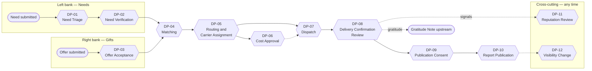

# Decision Points Overview

*Where along the river does a human make a choice, who makes it, and what does the log remember?*

A **decision point (DP)** is a place in the delivery chain where a named role chooses between explicit options, and that choice is appended to the log as one or more [[Log Event]]s. Everything else is either a fact being recorded (a receipt uploaded, a van departing) or a projection being recalculated. Back to [[00 Home]].

> [!principle] Why decision points are first-class
> [[Guiding Principles#P7. The river remembers|P7 — The river remembers]] demands that we can answer, for every outcome, *who decided, on what information, and when*. Naming the twelve DPs lets us give each one a decider, a guard-rail, a service level and an audit record, and keeps judgement with people rather than hiding it in code.

## Section contents

| Note | Purpose |
|---|---|
| [[Responsibility Matrix]] | RACI for every DP and key activity across all roles; ownership of data quality, consent, ledger and safeguarding |
| [[Accountability and Audit]] | How the append log makes decisions accountable; auditor access through IAP; four-eyes rules; tamper evidence |
| [[Escalation and Disputes]] | Escalation ladders, dispute types, timelines, independent review, whistleblowing |
| DP-01 … DP-12 | One note per decision point (below) |

## The twelve decision points along the river

DP-06 is invoked repeatedly: at leg planning (budgeted cost), during transit (actual cost with receipt) and at flow closure (reconciliation). DP-11 and DP-12 are cross-cutting: they can be triggered by any participant at any stage.

## Summary table

| DP | Question decided | Decider | Accountable | Key inputs | Outputs / events | Reversible? | SLA target | AI assistance |
|---|---|---|---|---|---|---|---|---|
| [[DP-01 Need Triage]] | How urgent is this need, what form is it in, and which path does it take? | Coordinator (any on intake rota) | Lead Coordinator of the programme | [[Need]], [[Intent Statement]], category, location | `need.Acknowledged`, `need.Triaged`, `need.Opened`, `need.Referred`, `need.PutOnHold` | Yes — re-triage | Acknowledge ≤ 1 h (automatic); triage ≤ 2 working days; urgent same day | Summary, category and urgency *suggestion*; translation draft |
| [[DP-02 Need Verification]] | How deep a check is proportionate, and is the claim sound enough to route? | Coordinator | Lead Coordinator; Safeguarding Lead if flagged | Triage result, [[Reputation Signals]] (internal), risk tier, [[Verification]] evidence | `verification.DepthSet`, `verification.Completed`, `verification.Waived` | Yes — new verification | ≤ 3 working days after triage (light: same day) | PII-redaction assistance only |
| [[DP-03 Offer Acceptance]] | Is this offer useful, clear and clean in intent? | Coordinator | Lead Coordinator; Finance Steward for money above threshold | [[Offer]], [[Intent Statement]], open needs, storage capacity | `offer.Accepted`, `offer.DeclinedWithThanks`, `offer.ClarificationRequested`, `gift.Pledged` | Partly — acceptance can be withdrawn before conversion | ≤ 3 working days | Clarity assistance; match-likelihood hint |
| [[DP-04 Matching]] | Which gifts meet which needs, in which Flow? | Lead Coordinator of the Flow | Lead Coordinator | Open needs, available gifts, restricted-fund rules, AI suggestions | `flow.Formed`, `gift.Allocated`, `need.Matched` / `need.PartiallyMatched`, `flow.Committed` | Yes until dispatch — `gift.Deallocated` | ≤ 5 working days from `open` (urgent ≤ 1 day) | **Advisory only**: ranked suggestions with explanation |
| [[DP-05 Routing and Carrier Assignment]] | By what route, through which hubs and by whom? | Lead Coordinator (or Contributing Coordinator with delegation) | Lead Coordinator | Consignment, [[Hub]]s, [[Carrier]] availability, cost estimates, safety advisories | `leg.Planned`, `leg.CarrierAssigned`, `leg.AssignmentDeclined` | Yes until `leg.Departed` | ≤ 2 working days after `flow.Committed` | Route/cost estimate suggestions |
| [[DP-06 Cost Approval]] | Is this cost legitimate, evidenced and chargeable to this fund? | Finance Steward (Lead Coordinator below threshold) | Finance Steward | [[Cost Record]], receipt, budget, restricted-fund purpose, FX rate | `costRecord.Approved`, `costRecord.Queried`, `costRecord.Declined`, `costRecord.Reallocated` | Yes — reversing entry | Pre-approval ≤ 1 working day; receipt approval ≤ 5 working days | Receipt OCR and PII redaction draft |
| [[DP-07 Dispatch]] | Is the consignment ready and safe to leave now? | Lead Coordinator or hub lead | Lead Coordinator | Packing checklist, leg assignment, safety check, approved budget | `consignment.Ready`, `consignment.Dispatched`, `leg.Departed`, `flow.MotionStarted` | No once departed — recall is a new decision | Same day as readiness | None |
| [[DP-08 Delivery Confirmation Review]] | Did help arrive, and is the confirmation sufficient? | Coordinator (not the carrier on that leg) | Lead Coordinator | [[Delivery Confirmation]], handover evidence, recipient response | `deliveryConfirmation.Accepted`, `deliveryConfirmation.FollowUpRequested`, `need.Confirmed`, `flow.Confirmed` | Yes — `deliveryConfirmation.Reopened` | ≤ 3 working days after `delivered` | Evidence completeness check; face-blur suggestion |
| [[DP-09 Publication Consent]] | May this story, image or name be used for this purpose and audience? | The subject person (or guardian/institution) | Editor (for correctly recording it) | [[Consent]] request, preview at target audience, [[Media Asset]] | `consent.Granted`, `consent.Declined`, `consent.Withdrawn` | Always — withdrawal at any time | Request never pressured; unanswered in 14 days = not granted | Translation of consent text (human-reviewed) |
| [[DP-10 Report Publication]] | Is this publication accurate, consented and ready for its audience? | Editor | Lead Coordinator (content) / Administrator (org-wide) | Draft [[Publication]], projections, consent checks, ledger | `publication.Approved`, `publication.Published`, `publication.Withdrawn`, `flow.Reported` | Yes — withdraw / correct | ≤ 10 working days after `flow.Confirmed` | Drafting and translation drafts; never auto-publish |
| [[DP-11 Reputation Review]] | Is a reputation signal correct and fairly explained? | Reviewer not involved in the flow | Administrator | [[Reputation]] signals, underlying events, contest statement | `reputation.ContestRaised`, `reputation.SignalCorrected`, `reputation.SignalAnnotated`, `reputation.ContestRejected` | Yes — further correction | Acknowledge ≤ 2 working days; conclude ≤ 15 | None |
| [[DP-12 Visibility Change]] | Should the visibility level of this record or field change? | Data subject (to restrict); Coordinator/Editor with consent (to widen); Safeguarding Lead (to seal) | Administrator | [[Visibility Policy]], [[Consent]], safeguarding flags | `visibility.Changed`, `visibility.ChangeDeclined`, `visibility.Sealed` | Restriction immediate; widening needs fresh consent | Restrict: immediate; widen ≤ 5 working days | PII detection before widening |

## Rules that apply to every DP

1. **One decision, one event trail.** Every DP outcome is an append-only event carrying `actor.role`, `correlationId` (the Flow or Need) and a `reason` code from a controlled list plus optional free text. See [[Event Catalogue]].
2. **Humans decide.** Events with `actor.via: vertex` may *suggest* (`*.Suggested` payloads in views) but never carry a decision. See [[Vertex AI Integration]].
3. **No DP may close the left bank.** No outcome at any DP prevents a person from submitting another need. See [[ADR-005 Open Access for Recipients]].
4. **Corrections are compensating events.** Nothing is edited in place ([[ADR-001 Event-Sourced Append Log]]).
5. **Conflicts of interest are declared.** A person may not decide a DP about a flow in which they are the giver, carrier or recipient. The command API enforces this where roles are known (see [[Accountability and Audit#Four-eyes rules]]).
6. **Kind language on every outcome that disappoints.** Referrals, holds and declines carry a human explanation written in plain words ([[Brand and Tone of Voice]]).

## Tier switchboard

| DP | T1 | T2 | T3 | T4 | Note |
|---|:-:|:-:|:-:|:-:|---|
| DP-01, DP-02 | ○ | ● | ● | ● | T1 usually has no public need intake |
| DP-03, DP-04, DP-06, DP-07, DP-08, DP-10 | ● | ● | ● | ● | DP-04 is trivial at T1 (one campaign → one flow) |
| DP-05 | ● (single leg) | ● | ● | ● | Multi-leg from T3 |
| DP-09, DP-11, DP-12 | ● | ● | ● | ● | Always on — they protect people |

See [[Scaling Tiers]].
