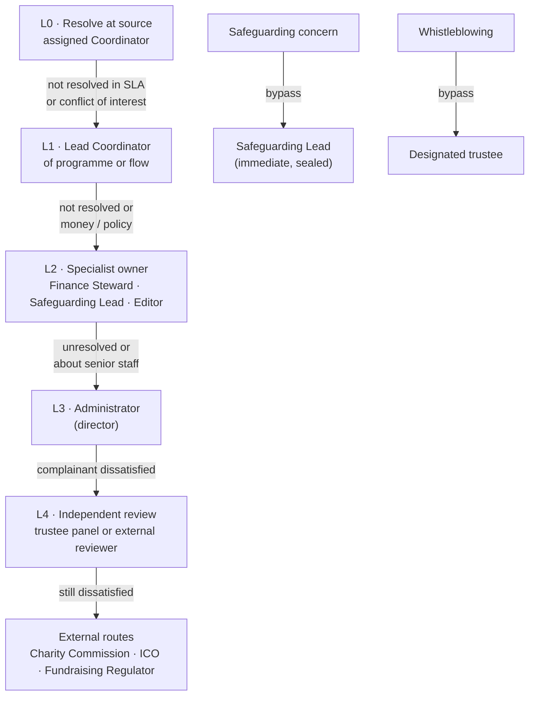
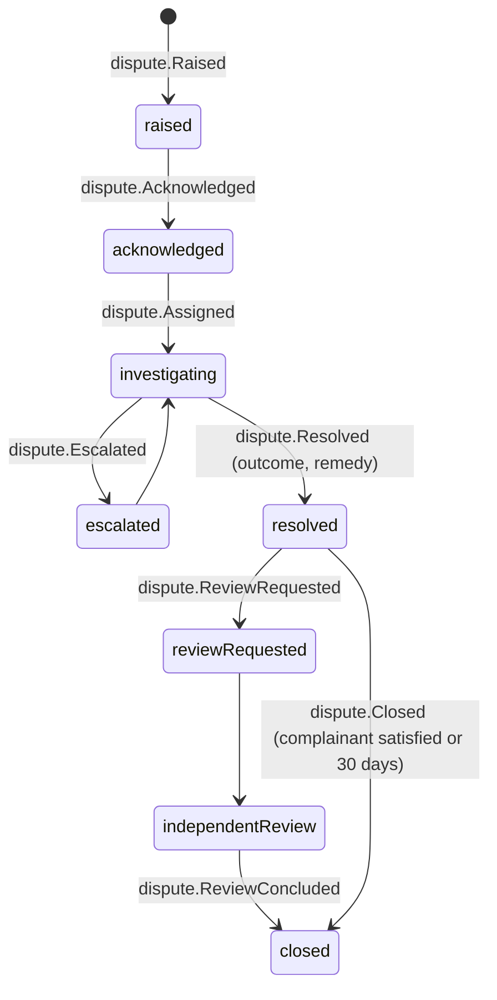

# Escalation and Disputes

How problems travel **up** the river when a decision is wrong, slow or unfair, and how anyone (recipient, giver, carrier, volunteer or staff) can be heard, including against the organisation itself. Back to [[Decision Points Overview]] · [[00 Home]].

> [!principle] Complaints are gifts of information
> Raising a concern never affects anyone's access to help or their [[Reputation Signals]] ([[Guiding Principles#P3. The left bank is always open|P3]]). A complaint is recorded as a first-class aggregate (`dispute.*`), with the same append-only guarantees as any other decision ([[Accountability and Audit]]).

## Channels

Every public page footer and every notification offers **"Something wrong? Tell us"**, in uk and en-GB, reachable:
- without an account (tracking link, form, SMS keyword `ДОПОМОГА`/`HELP`, phone);
- in the [[Help Seeker Section]], [[Giver Section]] and carrier leg view;
- by proxy (a neighbour, institution or partner on someone's behalf).

Submissions append `dispute.Raised` { kind, subjectRef, channel, visibility: `private` }. Safeguarding-related submissions are routed to `sealed` immediately.

## Escalation ladder

Rules of the ladder:
1. Anyone may **skip levels** when the complaint concerns the person at that level.
2. Each step appends `dispute.Escalated` { from, to, reason }. The complainant is told who now holds it.
3. Nobody reviews a decision they took ([[Responsibility Matrix]]).
4. Urgent harm stops the clock: protect first (seal, withdraw, pause), then investigate.

## Dispute types

| Kind | Typical trigger | First owner | Interim protection | Resolution options | Related DP |
|---|---|---|---|---|---|
| **Non-delivery** | Recipient says nothing arrived, or partial delivery; giver asks where their gift is | Lead Coordinator | Hold further payments to the leg's carrier. Replacement matching starts in parallel. | `deliveryConfirmation.Reopened`, replacement flow, `consignment.Lost` with evidence, referral to police for diversion | [[DP-07 Dispatch]], [[DP-08 Delivery Confirmation Review]] |
| **Cost disputes** | Carrier's reimbursement declined; sponsor questions a cost against a restricted fund; public query on the ledger | Finance Steward | Ledger line marked "under review" | `costRecord.Approved` / `Reversed` / `Reallocated`; explanation to the sponsor | [[DP-06 Cost Approval]] |
| **Reputation contestation** | A subject disagrees with a signal or its explanation | Independent reviewer | Signal marked "under review" and excluded from routing | See [[DP-11 Reputation Review]]; second review at L3/L4 | [[DP-11 Reputation Review]] |
| **Consent disputes** | "I never agreed to this photo"; consent obtained under pressure; proxy consent contested | Editor → Administrator | **Withdraw first**: the item is removed from public surfaces immediately | `consent.Withdrawn`, `publication.Withdrawn`, apology, process fix | [[DP-09 Publication Consent]], [[DP-12 Visibility Change]] |
| **Complaints from recipients** | Treated disrespectfully, a referral they disagree with, a long hold, a request for documents they found intrusive | Lead Coordinator (never the coordinator complained about) | The need stays open. The complainant may request a different coordinator. | Re-triage, change of coordinator, apology, policy change | [[DP-01 Need Triage]], [[DP-02 Need Verification]] |
| **Giver or sponsor complaints** | Gift used differently than expected; report delayed; unwanted contact | Lead Coordinator / Finance Steward | none | Explanation from the ledger, refund of unallocated restricted funds where lawful, contact preferences fixed | [[DP-03 Offer Acceptance]], [[DP-10 Report Publication]] |
| **Carrier or volunteer complaints** | Unsafe assignment, unpaid costs, disrespect | Lead Coordinator | Assignment paused | Route suspension, reimbursement, signal correction | [[DP-05 Routing and Carrier Assignment]] |
| **Data-protection requests** | Access, rectification, erasure, objection | Administrator (data protection lead) | Narrowing applied immediately | [[DP-12 Visibility Change]], crypto-shredding | [[DP-12 Visibility Change]] |

## Handling notes by kind

### Non-delivery
Start from the manifest hash at [[DP-07 Dispatch]] and the handover record. Replacement help for the recipient is **never** paused while the investigation runs. Givers are told honestly on their journey timeline ("this part of the journey is being checked").

### Cost disputes
The Finance Steward answers from the ledger, with the receipt (redacted) and the approval chain. A reversed cost appears as a visible correction in the [[Transparency Ledger]], not as a silent change.

### Reputation contestation
Handled at [[DP-11 Reputation Review]] by a reviewer from outside the flows concerned. A second review goes to the Administrator, then to independent review.

### Consent disputes
The rule is **withdraw first, discuss later**. The disputed item is removed from every public surface before anyone assesses whether consent was valid. If consent was invalid, the process that produced it is reviewed ([[Consent Management]]).

### Complaints from recipients
Recipients can complain in their own language, by any channel, without an account, and by proxy. They are offered a different coordinator. A complaint is never visible to the coordinator complained about until the Lead Coordinator decides it is safe to share. It never appears in any reputation signal.

## Timelines

| Stage | Target |
|---|---|
| Acknowledge (automatic, in the complainant's language) | ≤ 1 hour |
| Human contact | ≤ 2 working days (safeguarding: same day) |
| Resolution at L0–L1 | ≤ 10 working days |
| Resolution at L2–L3 | ≤ 20 working days |
| Independent review (L4) | Convened ≤ 15 working days after request; decision ≤ 30 working days |
| Consent or visibility disputes: interim removal | ≤ 1 hour after the report |

Each dispute carries a visible clock in the [[Coordinator Workspace]]. Breaches appear in the SLA audit view ([[Accountability and Audit#Audit views]]).

## Dispute lifecycle

Outcomes use a controlled list: `upheld`, `partly_upheld`, `not_upheld`, `resolved_informally`, `withdrawn`. Every outcome includes a plain-language explanation to the complainant and, where upheld, a **remedy** and a **learning** (a process or policy change, linked to the ADR or DP it changes).

## Independent review

- A panel of at least one trustee who is not involved in operations, or an external reviewer from a [[Partner Organisation]] under a reciprocal arrangement (Tier 3–4).
- The panel receives a pseudonymised case file generated from the decision trail. It can request unmasking through the audit route ([[Accountability and Audit#Auditor access via IAP]]).
- The panel's findings are appended as `dispute.ReviewConcluded` and are binding on the organisation for remedy. Anonymised learnings are summarised yearly in the [[Impact Report]].

## Whistleblowing channel

For staff, volunteers, carriers and partners who see wrongdoing: diversion of aid, fraud, misuse of data, safeguarding failures, or coercion of recipients.

- A separate form in the studio **and** a public, account-free form. Anonymous submission is allowed, and the submitter gets a one-time reply token.
- Reports go to a **designated trustee** and the Safeguarding Lead (for safeguarding matters), **not** to the Administrator by default, since they may be the subject.
- Stored in a dedicated `sealed` aggregate (`whistleblow.*`) with its own access list. Only the trustee and SL can read it. Auditors see counts only.
- No retaliation: any change to the reporter's roles, assignments or signals during an open report is flagged for trustee review.
- External routes are always listed: Charity Commission (England and Wales), ICO, and relevant Ukrainian authorities for partner organisations.

> [!question] Open question
> Should the whistleblowing channel be hosted outside the organisation's own GCP project (e.g. a third-party service) so that platform administrators cannot see even the metadata? #open-question

## Related notes

[[Safeguarding]] · [[Ethics Charter]] · [[Accountability and Audit]] · [[Responsibility Matrix]] · [[Notifications]] · [[Privacy Model]] · [[Coordinator Workspace]]
