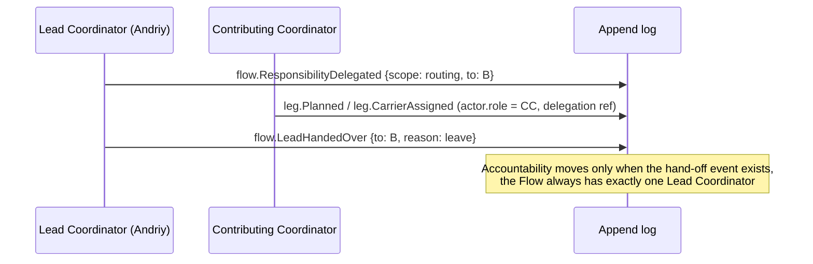

# Responsibility Matrix

Who is Responsible, Accountable, Consulted and Informed at every [[Decision Points Overview|decision point]] and key activity, and who owns each **responsibility point**: the standing duties that keep the river clean. Back to [[Decision Points Overview]] · [[00 Home]].

Roles are defined in [[Role]]. A [[Person]] may hold several roles, scoped to [[Organisation]], [[Programme]], [[Campaign]] or [[Flow]]. **A person never takes two of R, A and the approving step on the same item where they are also a participant** (giver, carrier or recipient in that flow). See [[Accountability and Audit#Four-eyes rules]].

## Legend

**R** does the work or decides · **A** answers for the outcome (one per row per situation; conditional accountability is footnoted, and for DP-12 it depends on the direction of the change, see the DP note) · **C** consulted before · **I** informed after · **S** subject decides (the person the data is about) · — no role

| Abbr. | Role | Abbr. | Role |
|---|---|---|---|
| Rec | [[Recipient]] | Vol | [[Volunteer]] |
| Giv | [[Giver]] | PO | [[Partner Organisation]] |
| Spo | [[Sponsor]] | FS | Finance Steward ([[Role]]) |
| LC | Lead Coordinator ([[Coordinator]]) | SL | Safeguarding Lead ([[Role]]) |
| CC | Contributing Coordinator | Ed | Editor ([[Role]]) |
| Car | [[Carrier]] | Adm | [[Administrator]] |
| | | Aud | Auditor ([[Role]]), read-only |

## RACI: decision points

| DP | Rec | Giv | Spo | LC | CC | Car | Vol | PO | FS | SL | Ed | Adm | Aud |
|---|---|---|---|---|---|---|---|---|---|---|---|---|---|
| [[DP-01 Need Triage]] | I | — | — | A | R | — | — | C | — | C | — | I | I |
| [[DP-02 Need Verification]] | C/I | — | — | A | R | — | — | C | C | C | — | — | I |
| [[DP-03 Offer Acceptance]] | — | I | I | A | R | — | — | C | C | C | — | — | I |
| [[DP-04 Matching]] | I | I | I | A/R | C | — | — | C | C | — | — | — | I |
| [[DP-05 Routing and Carrier Assignment]] | I | I | — | A/R | R | C | — | C | C | — | — | I | I |
| [[DP-06 Cost Approval]] | — | I | I/C | R | — | C | — | — | A/R | — | — | I | I |
| [[DP-07 Dispatch]] | I | I | I | A/R | R | C | C | C | C | — | — | — | I |
| [[DP-08 Delivery Confirmation Review]] | S/C | I | I | A | R | C | — | C | — | C | — | — | I |
| [[DP-09 Publication Consent]] | S | S | S | C | C | S | S | S | — | A* | A | — | I |
| [[DP-10 Report Publication]] | I | I | I | A | C | I | I | C | C | C | R | A** | I |
| [[DP-11 Reputation Review]] | S/C | S/C | S/C | R*** | C | S/C | S/C | S/C | — | C | — | A | I |
| [[DP-12 Visibility Change]] | S | S | S | R | R | S | S | C | — | R/A (seal) | R (widen public) | A | I |

\* SL is accountable when the subject is a minor or the content is `sealed`. · \*\* Adm is accountable for org-wide publications (impact reports, ledger statements). · \*\*\* A Lead Coordinator from another flow or programme, never one involved in the contested flows.

## RACI: key activities

| Activity | Rec | Giv | Spo | LC | CC | Car | Vol | PO | FS | SL | Ed | Adm | Aud |
|---|---|---|---|---|---|---|---|---|---|---|---|---|---|
| Submit a need | R | — | — | I | I | — | — | R (referral) | — | — | — | — | — |
| Make an offer / pledge | — | R | R | I | I | R (transport) | R (time) | R | I | — | — | — | — |
| Record money received (webhook or manual) | — | I | I | C | — | — | — | — | A/R | — | — | — | I |
| Coordinator hand-off within a Flow | — | — | — | A/R | R | I | — | C | — | — | — | I | I |
| Pack and sort at a hub | — | — | — | A | C | — | R | R | — | — | — | — | — |
| Carry a leg, record handover and costs | I | — | — | A | C | R | — | R | C | — | — | — | — |
| Write and route a Gratitude Note | R | I | I | A | R | I | I | I | — | C | C | — | — |
| Translate content (uk ↔ en-GB) | — | — | — | C | — | — | R | — | — | — | A | — | — |
| Configure thresholds, policies, rubrics | — | — | — | C | — | — | — | — | C | C | — | A/R | I |
| Grant and revoke staff roles (IAP groups) | — | — | — | C | — | — | — | — | — | — | — | A/R | I |
| Respond to a data-subject request | S | S | S | C | — | — | — | C | — | C | — | A/R | I |
| Periodic reconciliation | — | — | I | C | — | — | — | — | A/R | — | — | I | C |
| Safeguarding concern handling | C | — | — | C | R (raise) | R (raise) | R (raise) | R (raise) | — | A/R | — | I | — |
| Enable an AI (Vertex) feature | — | — | — | C | — | — | — | — | — | C | C | A/R | I |
| Independent audit of the log | — | — | — | C | — | — | — | — | C | — | — | A | R |

## Responsibility points: standing duties

| Responsibility point | Owner (A) | Day-to-day (R) | What "good" looks like | Evidence |
|---|---|---|---|---|
| **Data quality of needs and flows** | Lead Coordinator per flow | Coordinators | Statuses current. No need older than its SLA without a note. Categories and locations complete. | Queue-age view; stale-item report |
| **Consent registry** | Editor (content); Administrator (overall) | Editor, Coordinators | Every identifiable public item links to an in-force consent. Withdrawals are applied to live pages within 15 minutes ([[Canonical Parameters]]). | Consent coverage audit ([[Consent Management]]) |
| **Ledger correctness** | Finance Steward | Lead Coordinators, Carriers | All costs evidenced and approved. Restricted funds used for purpose. Monthly reconciliation signed off. | Reconciliation report ([[Transparency Ledger]]) |
| **Safeguarding** | Safeguarding Lead | Everyone raises concerns | Concerns triaged within 24 h. Sealed data accessed only by named people. | Sealed-access log ([[Safeguarding]]) |
| **Visibility and privacy configuration** | Administrator | Coordinators, Editor | Defaults `private`. Field-level policies reviewed each quarter. | Policy change log ([[Visibility Policy]]) |
| **Reputation fairness** | Administrator | Reviewers | Contests concluded on time. Signal definitions reviewed twice a year. | [[DP-11 Reputation Review]] metrics |
| **AI oversight** | Administrator | Editor, Coordinators | Suggestion acceptance and override rates monitored. No AI-originated decisions. | `via: vertex` audit ([[Vertex AI Integration]]) |
| **Access control** | Administrator | Platform engineer | IAP groups match role assignments. Leavers removed ≤ 1 working day. | Quarterly access review ([[IAP Staff Access]]) |
| **Log integrity** | Administrator | Platform engineer | No write paths outside the command API. Hash chain verified where enabled. | [[Accountability and Audit#Tamper evidence]] |

## Handling of hand-offs

See [[Coordination Model]] for how Lead and Contributing Coordinators work together at Tier 3.

## Tier notes

At Tier 1 one person often holds LC, FS and Ed. This is allowed, but the four-eyes rules in [[Accountability and Audit]] then require a second named person (for example a trustee) for costs above the threshold and for org-wide publications ([[Scaling Tiers]]).
