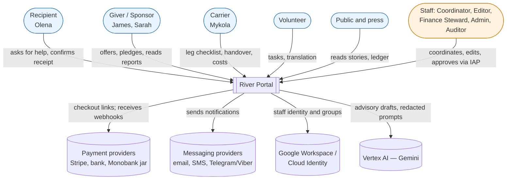
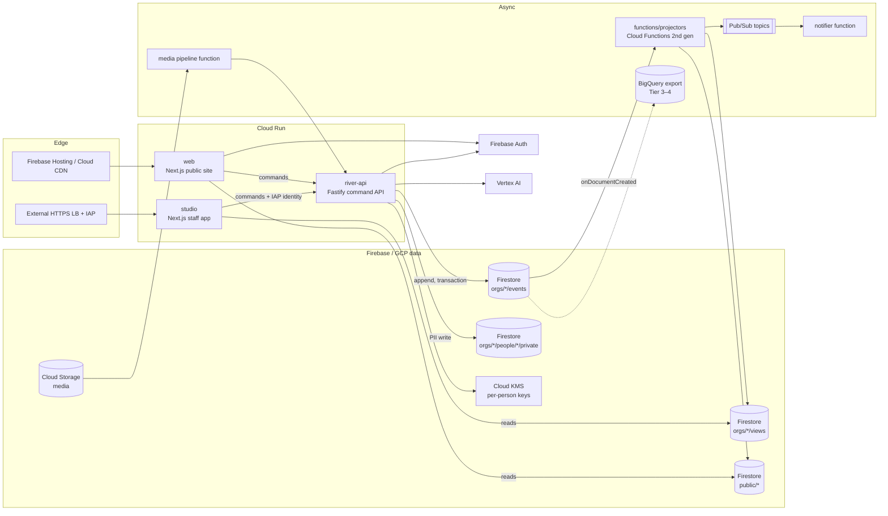
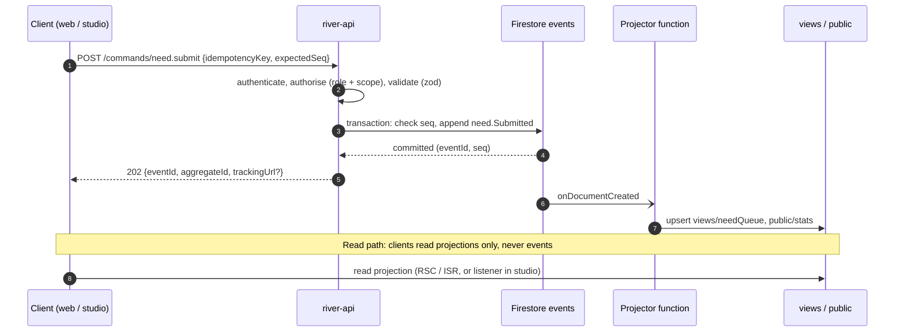

# Architecture Overview

*How River Portal is built: Node.js and TypeScript on Google Cloud, Firebase as the content and data platform, Identity-Aware Proxy for staff and Vertex AI as an advisory assistant.* Back to [[00 Home]].

The architecture is a direct translation of [[The River Concept]]: **every action is sediment** (an append-only [[Log Event]]), and **everything anyone sees is the surface** (a rebuildable [[Projection]]). Nothing in the portal is a hand-edited number.

> [!principle] Architectural non-negotiables
> 1. **All writes are commands.** Clients never write domain data to Firestore; the command API appends events. ([[ADR-001 Event-Sourced Append Log]], [[Guiding Principles#P7. The river remembers]])
> 2. **Private by default, per field.** Projections redact per audience using [[Visibility Levels]]. ([[ADR-006 Private by Default Visibility]])
> 3. **The left bank is always open.** Need intake works without an account and is never gated by [[Reputation]]. ([[ADR-005 Open Access for Recipients]])
> 4. **Staff surfaces sit behind IAP.** No staff screen is reachable from the public internet without a Google identity. ([[ADR-003 IAP for Staff Sections]])
> 5. **AI advises, humans decide.** Every Vertex action is logged `via: vertex` and never auto-publishes. ([[Vertex AI Integration]])

## Section contents

| Note | Question it answers |
|---|---|
| [[Technology Stack]] | What we use, why, and what we considered instead |
| [[Frontend Application]] | How `web` and `studio` are structured (Next.js App Router, RSC, PWA) |
| [[Firebase Data Model]] | The Firestore collection tree, document shapes and indexes |
| [[Event Log and Projections]] | Command handling, the append-only log, projectors, replay, crypto-shredding |
| [[Event Catalogue]] | Every event type, its payload, visibility and affected projections |
| [[Identity and Access]] | Who signs in how; roles, scopes and authorisation |
| [[IAP Staff Access]] | Load balancer + IAP set-up, JWT verification, break-glass |
| [[Security Rules]] | Firestore and Storage rules |
| [[Content Management]] | Block JSON, live data blocks, media pipeline |
| [[Internationalisation]] | next-intl, ICU messages, translation workflow |
| [[Vertex AI Integration]] | Gemini use cases and guard-rails |
| [[Notifications]] | Email, SMS, Web Push, messengers via Pub/Sub |
| [[Deployment and Environments]] | Projects, Terraform, CI/CD, backups |
| [[Scaling Architecture]] | Tier 1 → Tier 4 technical evolution |
| [[Observability]] | Logs without PII, tracing, SLOs, projection lag |

**Architecture decision records:** [[ADR-001 Event-Sourced Append Log]] · [[ADR-002 Firebase as Content and Data Platform]] · [[ADR-003 IAP for Staff Sections]] · [[ADR-004 Next.js on Cloud Run]] · [[ADR-005 Open Access for Recipients]] · [[ADR-006 Private by Default Visibility]]

## System context (C4 level 1)

## Containers (C4 level 2)

## Request paths

| Path | Entry | Identity | Reads from | Writes via |
|---|---|---|---|---|
| **Public** (web) | Firebase Hosting → Cloud Run `web` | Anonymous, or Firebase Auth ID token; tracking token for no-account recipients | `public/{orgId}/…` (ISR-cached), own-subject views via `river-api` | `river-api` `/commands/*` |
| **Staff** (studio) | External HTTPS LB → IAP → Cloud Run `studio` | Google Workspace identity, IAP JWT verified | `orgs/{orgId}/views/…` via server components (Admin SDK, scoped) | `river-api` with forwarded IAP assertion |
| **Command API** | `api.<domain>` via LB (public routes) and internal ingress (studio routes) | Firebase ID token, tracking token, leg magic link, IAP JWT, or provider webhook signature | Aggregate state rebuilt from events / snapshot | Firestore transaction on `events` |
| **Carrier** | web PWA `/leg/{token}` | Leg-scoped magic link | Leg projection | `river-api` leg commands |

See [[Identity and Access]] for the full matrix.

## Write path and read path

- **Write path**: command → authorise → validate → load aggregate → decide → append event(s) in one transaction. Details in [[Event Log and Projections]].
- **Read path**: projections are eventually consistent (target p95 lag < 5 s, see [[Observability]]). The command response returns enough for optimistic UI.

## Key cross-cutting concerns

- **PII** lives only in `people/{personId}/private`, encrypted with per-person KMS keys; events carry ids. See [[Firebase Data Model]], [[Privacy Model]], [[Data Minimisation]].
- **Decisions** ([[Decision Points Overview]]) are recorded as events carrying `dp: "DP-04"` metadata, giving the [[Accountability and Audit]] trail.
- **Tiers**: the same containers serve all four [[Scaling Tiers]]; features are toggled by organisation configuration. See [[Scaling Architecture]].
