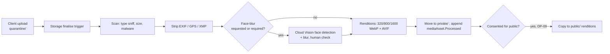

# Content Management

How [[Article]]s, [[Report]]s, [[Campaign Page]]s and [[Journey Story|Journey Stories]] are authored, versioned and published, and how media is processed. Back to [[Architecture Overview]]. UI: [[Content Editor]]. Workflow: [[Publication Pipeline]].

> [!principle] Numbers come from the river, not the keyboard
> Figures in content are **live data blocks** bound to projections. An editor cannot type "we delivered 412 generators"; they insert a counter block that reads the projection ([[Guiding Principles#P8. Honest numbers, beautifully shown]]).

## Block JSON schema

The TipTap editor in studio produces ProseMirror JSON, normalised on save into a portable block list defined in `packages/blocks` (so `web` renders without ProseMirror).

```ts
// packages/blocks/src/schema.ts
export type Block =
  | { type: 'heading'; level: 2 | 3; text: InlineText }
  | { type: 'paragraph'; text: InlineText }
  | { type: 'quote'; text: InlineText; attribution?: { personRef?: string; consentId?: string; label: string } }
  | { type: 'image'; mediaId: string; alt: LocalisedText; caption?: InlineText }
  | { type: 'gallery'; mediaIds: string[] }
  | { type: 'callout'; tone: 'info' | 'thanks' | 'cost'; text: InlineText }
  | { type: 'cta'; action: 'give' | 'ask' | 'volunteer'; campaignId?: string }
  | LiveDataBlock;

export type LiveDataBlock =
  | { type: 'live.counter'; metric: MetricKey; scope: ScopeRef; format?: 'number' | 'currency' }
  | { type: 'live.ledgerExcerpt'; scope: ScopeRef; limit: number; groupBy?: 'costKind' | 'month' }
  | { type: 'live.journeyTimeline'; flowId: string }                       // Journey Story spine
  | { type: 'live.map'; scope: ScopeRef; granularity: 'oblast' | 'country' }
  | { type: 'live.gratitude'; scope: ScopeRef; limit: number }            // consented notes only
  | { type: 'live.progress'; campaignId: string };                         // goal vs raised vs costs

export interface ContentDoc {
  id: string; kind: 'article' | 'report' | 'campaignPage' | 'journeyStory' | 'page';
  sourceLocale: 'en-GB' | 'uk';
  locales: Record<string, { title: string; blocks: Block[]; translationStatus: 'source' | 'draft' | 'reviewed' | 'stale' }>;
  visibility: Visibility;               // target audience once published
  consentIds: string[];                 // every consent this content relies on
  mediaIds: string[];
  revisionId: string;
}
```

`InlineText` is an array of text runs with marks (bold, italic, link). Links to people are forbidden in inline text; people appear only via consented `quote.attribution`.

## Live data blocks

- Rendered on `web` as RSC reading `public/{orgId}/…` (counters, ledger, map, gratitude) with ISR tags, so a new `gift.Received` revalidates every page that shows the affected counter.
- In studio preview they read the same **public** projection, so editors see exactly what the public will see, never a `team` number.
- `MetricKey` values are defined in [[Impact Metrics]]; small numbers are suppressed below k-anonymity thresholds ("fewer than 5").
- A `live.journeyTimeline` only renders steps whose events are `participants` or `public` **and** covered by consent for public display ([[DP-09 Publication Consent]]).

## Versioning

- Each save is a command `article.revise` → event `article.Revised {revisionId}`; the full block document is stored in `orgs/{orgId}/content/{id}/revisions/{revId}` (content-addressed hash) because block bodies are large and non-PII.
- Published versions are immutable snapshots copied to `public/{orgId}/pages/{slug}` by the publication projector. Rolling back = publishing an older revision (new event).
- Diff view in studio compares any two revisions per locale.

## Publication workflow tie-in

```mermaid
stateDiagram-v2
    [*] --> Draft: article.Drafted
    Draft --> InReview: publication.SubmittedForReview
    InReview --> ConsentChecked: publication.ConsentChecked (DP-09)
    ConsentChecked --> Approved: publication.Approved (DP-10)
    Approved --> Published: publication.Published
    Published --> Withdrawn: publication.Withdrawn / consent.Withdrawn
    InReview --> Draft: changes requested
```

The consent check is automatic first (every `consentIds` entry active, scope covers purpose and locale, every `mediaId` public-cleared), then confirmed by a person. A `consent.Withdrawn` event triggers immediate unpublishing of dependent content ([[Consent Management]], [[Publication Pipeline]]).

## Media pipeline



- Every [[Media Asset]] carries its own `visibility` and `consentId`; default `private`.
- Receipts (for [[Cost Record]]s) skip face-blur but go through OCR for amount/date suggestion (Vertex, advisory).
- Face-blur is **required** for any image containing people that is to be published without a specific consent to show faces ([[Safeguarding]], [[Guiding Principles#P10. Dignity in every pixel]]).
- Originals are kept in `private/` with retention per [[Data Retention]]; deleted on `person.KeyShredded`.

## Translations of content

Each locale is a first-class version with its own review status. Vertex drafts are flagged `translationStatus: 'draft'` and cannot be published until `translation.Approved`. See [[Internationalisation]] and [[Translation]].
