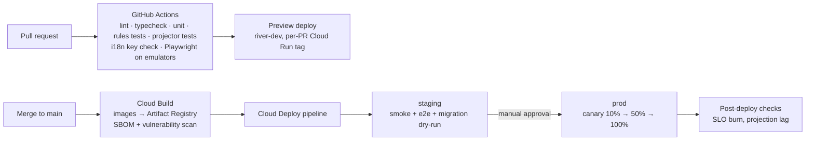

# Deployment and Environments

GCP projects, infrastructure as code, delivery pipeline, secrets, backups and recovery. Back to [[Architecture Overview]]. Components: [[Technology Stack]].

## GCP projects

One Google Cloud project per environment (per organisation in single-tenant mode, see [[Scaling Architecture]]):

| Project | Purpose | Data | Access |
|---|---|---|---|
| `river-dev` | Developers' shared cloud sandbox; preview deployments per PR | Synthetic only (seeded from [[Demo Content Overview]]) | engineers |
| `river-staging` | Release candidates, UAT with coordinators, load tests | Demo organisation [[Demo Organisation|Open River Aid]] data (fictional) | engineers, product, testers |
| `river-prod` | Production | Real people | deploy SA only; humans via break-glass ([[IAP Staff Access#Break-glass access]]) |
| `river-ops` | Terraform state bucket, Artifact Registry, Cloud Deploy pipelines, central log sink, billing export | none personal | platform team |

> [!privacy] Real data never leaves production
> No copy of production Firestore is restored into dev or staging. Bugs are reproduced with synthetic data or with the log replayed through a PII-free projection. See [[Data Minimisation]].

Local development runs entirely on the **Firebase Emulator Suite** (Firestore, Auth, Storage, Functions, Pub/Sub) with `pnpm dev`; IAP is simulated by a signed test JWT.

## Terraform

```text
infra/terraform/
├─ modules/
│  ├─ run-service/          # Cloud Run service + SA + min/max instances
│  ├─ iap-frontend/         # LB, serverless NEG, IAP, Cloud Armor, certs
│  ├─ firestore/            # database, indexes, TTL policies, PITR, backup schedules
│  ├─ kms/                  # key rings, KEK, rotation
│  ├─ pubsub/               # topics, subscriptions, DLQs
│  ├─ observability/        # dashboards, SLOs, alert policies, log sinks
│  └─ vertex/               # service account, budgets, allowed models
└─ envs/{dev,staging,prod}/ # module composition + tfvars; state in gs://river-ops-tfstate/{env}
```

- `firestore.indexes.json` and security rules are deployed by the Firebase CLI in the pipeline (single source in repo), not by Terraform, to keep rules testing in one place.
- Organisation policies: `constraints/gcp.resourceLocations` = `in:eu-locations`, disable service-account key creation, uniform bucket-level access, domain-restricted sharing.

## CI/CD



- GitHub → GCP via **Workload Identity Federation** (no JSON keys).
- Deploy order per release: `packages/domain` event schema changes must be **backward-compatible** (additive fields, new event types, upcasters); projectors deploy before `river-api` emits new types. A projection rebuild, if needed, runs as a Cloud Run job before the read alias flips ([[Event Log and Projections#Replay and rebuild]]).
- Cloud Run revisions are tagged; rollback = traffic shift to the previous revision (seconds). Events already appended are never rolled back; forward-fix with compensating events.
- Binary Authorization in prod: only images built by Cloud Build from `main` may run.

## Secret Manager

| Secret | Used by | Rotation |
|---|---|---|
| Payment webhook signing secrets | river-api | on provider rotation |
| SendGrid / Twilio / messenger bot tokens | notifier | 90 days |
| IAP OAuth client secret | LB backend | yearly |
| Tracking-token pepper (HMAC) | river-api | yearly, dual-read during rotation |
| Revalidation secret (projector → web) | projectors, web | 90 days |

Secrets are mounted as volumes into Cloud Run with per-service IAM; no secret is in env files or CI variables. Per-person encryption keys are **not** secrets here; they are KMS-wrapped DEKs ([[Event Log and Projections#Crypto-shredding]]).

## Backups and recovery

| Mechanism | Setting | Purpose |
|---|---|---|
| Firestore **PITR** | enabled, 7-day window | recover from bad writes to views / people |
| Firestore scheduled backups | daily, 14-day retention; weekly, 13-week retention | disaster recovery |
| Export of `events` to GCS (and BigQuery at Tier 3–4) | daily, bucket with retention lock (Tier 3–4) | independent copy of the log |
| Cloud Storage media | object versioning (30 days) + dual-region bucket | accidental deletion |
| `keystore` database (wrapped DEKs) | PITR 7 days only, **no** long-term backups; organisation KEKs in KMS rotated yearly | a restore can never resurrect an erased person's key beyond 7 days |

- **RPO** ≤ 5 minutes (PITR), **RTO** ≤ 4 hours for full restore; projections are rebuilt from the restored log.
- Quarterly restore drill in staging using synthetic data; results recorded in [[Accountability and Audit]].

> [!privacy] Backups and erasure
> Restoring a backup can bring back `people/*/private` of an erased person, but the wrapped DEK is gone from `keystore` (whose history is at most 7 days), so the data stays unreadable. After any restore, a job re-applies all `person.KeyShredded` events since the backup time.

## Costs at a glance

Tier 1 on this set-up is dominated by fixed items (LB for studio ~£18/month, Cloud Run min-instance for `web` optional). See [[Scaling Architecture#Cost profile]].
