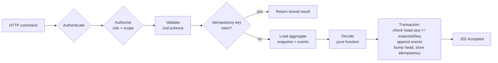

# Event Log and Projections

How commands become immutable [[Log Event]]s ("sediment") and how events become [[Projection]]s ("the surface"). Back to [[Architecture Overview]]. Decision: [[ADR-001 Event-Sourced Append Log]]. Event list: [[Event Catalogue]].

> [!principle] The river remembers
> Nothing is edited or deleted in the log. A correction is a new event that references the one it corrects ([[Guiding Principles#P7. The river remembers]]). Every public number is derived from events ([[Guiding Principles#P8. Honest numbers, beautifully shown]]).

## Append-only design

- One log per organisation: `orgs/{orgId}/events/{eventId}`; `eventId` is a ULID (time-sortable, globally unique).
- Each event belongs to exactly one **aggregate** (`need`, `offer`, `gift`, `flow`, `consignment`, `leg`, `person`, …) and carries a gap-free per-aggregate `seq`.
- Events are created **only** by `river-api` (and trusted functions using the same library) with the Admin SDK. [[Security Rules]] deny all client writes and all updates/deletes.
- Payloads contain ids and business facts, **never plaintext PII**; personal free text is encrypted under the author's key (see [[Firebase Data Model#Where PII lives]]).
- `schemaVersion` allows upcasting old events when read; stored events are never rewritten.

## Command handling



Aggregates are **pure**: `decide(state, command) → events[]` and `evolve(state, event) → state`, both in `packages/domain`, unit-tested without Firestore.

```ts
// services/river-api/src/commands/handle.ts
export async function handle<C extends Command>(cmd: C, ctx: CommandContext): Promise<CommandResult> {
  const agg = aggregateFor(cmd);                                 // e.g. { kind: 'need', id: cmd.needId }
  const headRef = db.doc(`orgs/${ctx.orgId}/aggregates/${agg.kind}_${agg.id}`);
  const idemRef = db.doc(`orgs/${ctx.orgId}/idempotency/${cmd.idempotencyKey}`);

  return db.runTransaction(async (tx) => {
    const idem = await tx.get(idemRef);
    if (idem.exists) return idem.data()!.result as CommandResult;       // safe retry (offline outbox)

    const head = await tx.get(headRef);
    const seq = head.exists ? head.get('seq') as number : 0;
    if (cmd.expectedSeq !== undefined && cmd.expectedSeq !== seq)
      throw new ConcurrencyConflict(agg, cmd.expectedSeq, seq);        // 409 → client refreshes

    const state = await loadState(tx, ctx.orgId, agg, head);             // snapshot + tail events
    const newEvents = decide(state, cmd, ctx);                           // throws DomainError on invalid transition

    newEvents.forEach((e, i) => {
      const ev: LogEvent = {
        ...e, id: ulid(), orgId: ctx.orgId, aggregate: agg, seq: seq + i + 1,
        actor: ctx.actor, recordedAt: FieldValue.serverTimestamp(),
        correlationId: ctx.correlationId, causationId: ctx.causationId ?? null,
      };
      tx.create(db.doc(`orgs/${ctx.orgId}/events/${ev.id}`), ev);        // create() fails if exists
    });
    tx.set(headRef, { seq: seq + newEvents.length, updatedAt: FieldValue.serverTimestamp() }, { merge: true });
    const result = { eventIds: newEvents.map(e => e.id), seq: seq + newEvents.length };
    tx.set(idemRef, { result, expiresAt: addDays(new Date(), 7) });
    return result;
  });
}
```

### Idempotency

- Every command carries a client-generated `idempotencyKey` (UUIDv7). The PWA outbox reuses it on retry ([[Frontend Application#PWA and offline]]).
- Payment webhooks use the provider event id as key (`stripe:evt_…`), so duplicate webhooks never create two `gift.Received` events.
- Projectors are idempotent too: each view stores `lastEventId`/`lastSeq` per aggregate and skips events already applied (Cloud Functions deliver *at least once*).

### Optimistic concurrency

Per-aggregate `seq` in `aggregates/{kind}_{id}` is the concurrency token. Two coordinators matching the same [[Need]] at once: the second receives `409 Conflict` with the current state and re-decides. Cross-aggregate rules (e.g. "a gift may be allocated once") are enforced by the aggregate that owns the invariant (the Gift), and multi-aggregate operations run as **process managers** reacting to events (e.g. `flow.Committed` → commands to allocate each gift).

## Projector functions

```ts
// functions/projectors/src/index.ts
export const onEvent = onDocumentCreated(
  { document: 'orgs/{orgId}/events/{eventId}', region: 'europe-west1', retry: true },
  async (e) => {
    const ev = e.data!.data() as LogEvent;
    const projectors = registry.for(ev.type);            // from Event Catalogue: type → projections
    await Promise.all(projectors.map(p => p.apply(ev))); // each idempotent via lastSeq guard
    await pubsub.topic('river-events').publishMessage({ json: slim(ev) }); // notifications, BQ, revalidation
  });

// example: need queue row
export const needQueue: Projector = {
  handles: ['need.Submitted', 'need.Triaged', 'need.DeliveryStarted', 'need.Delivered', 'need.Confirmed', 'need.Closed', 'need.Withdrawn'],
  async apply(ev) {
    const ref = db.doc(`orgs/${ev.orgId}/views/needQueue/items/${ev.aggregate.id}`);
    await db.runTransaction(async (tx) => {
      const cur = await tx.get(ref);
      if (cur.exists && cur.get('lastSeq') >= ev.seq) return;          // already applied
      tx.set(ref, { ...reduceNeedQueue(cur.data(), ev), lastSeq: ev.seq, lastEventId: ev.id }, { merge: true });
    });
  },
};
```

- Projectors that need strict ordering per aggregate check `lastSeq + 1 === ev.seq`; on a gap they re-read the aggregate's events and catch up.
- Public projectors apply `redactFor('public')`, k-anonymity thresholds and consent checks ([[Consent Management]]) before writing to `public/{orgId}`, then call `web`'s on-demand revalidation.
- [[Reputation]] signals are a projection (`views/reputation`) storing the contributing `eventIds`, so the subject can see why ([[Reputation Signals]], [[DP-11 Reputation Review]]).

## Replay and rebuild

Projections are disposable. To rebuild (schema change, bug fix, new view):

1. Deploy the new projector writing to a versioned target (`views/needQueue_v2`).
2. Run the `rebuild` Cloud Run job: streams `events` ordered by `recordedAt, id`, applying only the chosen projector.
3. Live events are applied concurrently (idempotent by `lastSeq`).
4. When lag = 0, flip the read alias in `orgs/{orgId}.viewVersions` and delete the old view.

Rebuild time is monitored ([[Observability]]); at Tier 4 rebuilds read from BigQuery for speed.

## Compensating events

There is no delete. Mistakes are corrected with explicit events:

| Situation | Compensating event |
|---|---|
| Cost recorded twice | `costRecord.Reversed {costId, reason}` |
| Wrong amount received | `gift.ReceiptCorrected {giftId, previousEventId, amount}` |
| Delivery confirmed against wrong need | `deliveryConfirmation.Retracted` then new `deliveryConfirmation.Recorded` |
| Story published without valid consent | `publication.Withdrawn` (projection removes it immediately) |
| Consent revoked | `consent.Withdrawn` → projectors unpublish dependent content ([[Guiding Principles#P5. Consent is specific and revocable]]) |

## Crypto-shredding

Right to erasure ([[Data Retention]], [[Privacy Model]]) is reconciled with an append-only log:

1. PII is stored only in `people/{id}/private`, encrypted with a per-person **data encryption key** (DEK, AES-256-GCM). The DEK is wrapped by a per-organisation Cloud KMS key-encryption key and stored in the separate `keystore` database.
2. Free text written by a person (a need description, a gratitude note) may contain personal detail even after the PII scan, so it is stored in the event as `Encrypted<string>` under the author's DEK.
3. On an approved erasure, `river-api` appends `person.ErasureRequested` → `person.KeyShredded`, deletes the wrapped DEK from `keystore` and deletes `private/*`. The events remain, but their personal fragments are now unreadable noise.
4. Projectors handle `person.KeyShredded` by replacing the person in all views with "a former participant" and dropping media linked to that person.

Financial facts (amounts, costs, dates) survive, so the [[Transparency Ledger]] stays balanced.

## Optional hash chain

For tamper-evidence at Tier 3–4 ([[Accountability and Audit]]): each event stores `prevHash = sha256(prev.prevHash ‖ canonicalJson(prev without prevHash))` per organisation, computed in a serialised **chainer** function (not in the command path, to avoid a global write bottleneck). A daily anchor (the head hash) is written to a WORM Cloud Storage bucket with a retention lock, and optionally shown on the public ledger.

## BigQuery export

Tier 3–4: a Pub/Sub → BigQuery subscription streams `slim(ev)` (no encrypted fragments) into `river_log.events` partitioned by `DATE(recordedAt)`, clustered by `orgId, type`. Used for grant reporting, [[Impact Metrics]] and fast rebuilds. The Firestore log remains the source of truth.

> [!question] #open-question
> Do we export to BigQuery from day one (cheap, simplifies audits) or only from Tier 3? Also: is the per-organisation hash chain worth the operational cost below Tier 3?
