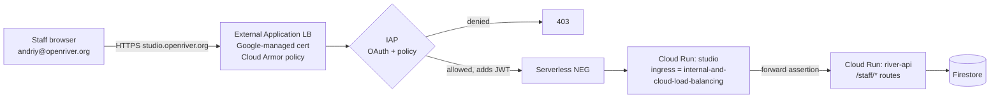

# IAP Staff Access

How the staff app `studio` ([[Coordinator Workspace]], [[Admin Studio]], [[Content Editor]]) is protected by Google Cloud **Identity-Aware Proxy**. Back to [[Architecture Overview]]. Decision: [[ADR-003 IAP for Staff Sections]]. General model: [[Identity and Access]].

## Topology



- `studio` Cloud Run ingress is **internal and Cloud Load Balancing only**; its `run.app` URL is unreachable from the internet.
- `river-api` exposes `/public/*` via the public web path and `/staff/*` only to callers presenting a valid IAP assertion **and** arriving through the internal path (studio's service identity, verified by Cloud Run IAM `roles/run.invoker`).
- Cloud Armor: geo-agnostic (staff travel), rate limiting and OWASP preconfigured rules.

## Terraform sketch

```hcl
resource "google_compute_region_network_endpoint_group" "studio" {
  name                  = "studio-neg"
  region                = var.region
  network_endpoint_type = "SERVERLESS"
  cloud_run { service = google_cloud_run_v2_service.studio.name }
}

resource "google_compute_backend_service" "studio" {
  name                  = "studio-backend"
  load_balancing_scheme = "EXTERNAL_MANAGED"
  backend { group = google_compute_region_network_endpoint_group.studio.id }
  iap {
    enabled              = true
    oauth2_client_id     = var.iap_client_id
    oauth2_client_secret = data.google_secret_manager_secret_version.iap_secret.secret_data
  }
  security_policy = google_compute_security_policy.studio.id
}

resource "google_iap_web_backend_service_iam_member" "coordinators" {
  project             = var.project_id
  web_backend_service = google_compute_backend_service.studio.name
  role                = "roles/iap.httpsResourceAccessor"
  member              = "group:river-staff@openriver.org"
}
```

## Group mapping

IAP decides **who may reach studio at all**; the portal decides **what they may do**. Google groups are the bridge:

| Google group | IAP access | Portal role granted on first sign-in (if absent) |
|---|---|---|
| `river-staff@` | yes | none (must be granted a role in [[Admin Studio]]) |
| `river-coordinators@` | via `river-staff@` | `coordinator` @ organisation |
| `river-finance@` | via `river-staff@` | `financeSteward` @ organisation |
| `river-safeguarding@` | via `river-staff@` | `safeguardingLead` @ organisation (named individuals only) |
| `river-editors@` | via `river-staff@` | `editor` @ organisation |
| `river-auditors@` | yes (time-boxed membership) | `auditor` @ organisation |
| `river-admins@` | yes | `administrator` @ organisation |

Group membership is synced every 15 minutes by a scheduled job using the Cloud Identity Groups API, and diffs are appended as `role.Granted` / `role.Revoked` events (actor `system`), so the log shows **why** someone has access. Flow-level roles (lead coordinator) are granted in-app only.

## JWT verification

Studio and `river-api` both verify the assertion; never trust `x-goog-authenticated-user-email` alone.

```ts
// packages/domain/src/iap.ts
import { OAuth2Client } from 'google-auth-library';
const client = new OAuth2Client();
const AUDIENCE = `/projects/${process.env.PROJECT_NUMBER}/global/backendServices/${process.env.STUDIO_BACKEND_ID}`;

export async function verifyIap(headers: Headers): Promise<StaffIdentity> {
  const jwt = headers.get('x-goog-iap-jwt-assertion');
  if (!jwt) throw new Unauthorised('missing IAP assertion');
  const keys = await client.getIapPublicKeys();                  // cached, rotated by Google
  const ticket = await client.verifySignedJwtWithCertsAsync(
    jwt, keys.pubkeys, AUDIENCE, ['https://cloud.google.com/iap']);
  const p = ticket.getPayload()!;                                 // ES256, exp, iat checked
  if (p.hd !== process.env.STAFF_DOMAIN) throw new Forbidden('wrong domain');
  return { googleSub: p.sub!, email: p.email!, via: 'studio' };
}
```

`river-api` maps `googleSub` → `personId` via `people` (`staffIdentity.googleSub`) and loads role grants. The event actor becomes `{ personId, role, via: 'studio' }`.

## Break-glass access

For outages of Workspace/IAP or urgent safeguarding needs:

1. Two sealed break-glass accounts (`breakglass-1@`, `-2@`) with hardware security keys, stored with the Director and a trustee.
2. Members of `river-breakglass@` only; group normally **empty**. Adding a member requires two administrators (Cloud Identity approval workflow) and triggers a Cloud Monitoring alert to all administrators and trustees.
3. Every request in break-glass mode is tagged `breakGlass: true` in logs; a `system.BreakGlassUsed` event is appended and reviewed within 72 hours ([[Accountability and Audit]]).

## Auditor access

- External auditors receive Cloud Identity guest accounts added to `river-auditors@` with an **expiry** (IAP condition `request.time < timestamp(...)`).
- Auditors see studio's read-only audit area: the log explorer, decision trail, ledger, receipts. `private` and `sealed` values show as `[restricted · sha256:…]` so completeness can be checked without exposure.
- All auditor queries are logged to a dedicated log bucket with 7-year retention.

## Context-aware access (optional, Tier 3–4)

With BeyondCorp Enterprise / Access Context Manager, add access levels:
- managed or verified device (endpoint verification) for `sealed`-capable roles;
- block known-bad IP ranges; require re-authentication every 8 h for Finance Stewards.

> [!privacy] IAP is a perimeter, not authorisation
> Passing IAP only proves the person is staff. Field-level [[Visibility Levels]] and scopes are always enforced by `river-api` and [[Security Rules]].
