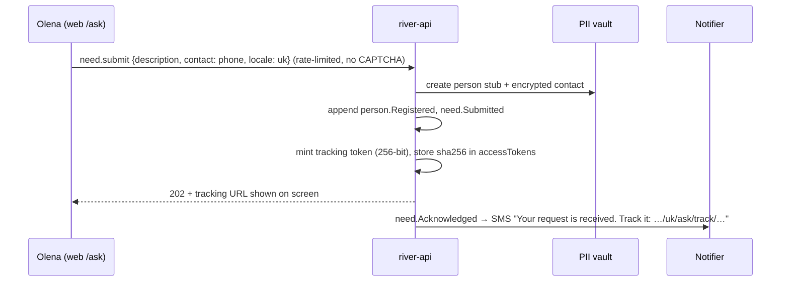

# Identity and Access

Who signs in how, and how `river-api` decides what they may do. Back to [[Architecture Overview]]. Staff perimeter: [[IAP Staff Access]]. Data-level enforcement: [[Security Rules]].

> [!principle] The left bank is always open
> Asking for help never requires an account, a verified identity or a good [[Reputation]]. Identity mechanisms exist to protect people and to route work, never to gate access. See [[ADR-005 Open Access for Recipients]] and [[Guiding Principles#P3. The left bank is always open]].

## Identity types

| Who | Mechanism | Credential reaching `river-api` | Typical lifetime |
|---|---|---|---|
| Recipient without account | Contact channel (SMS / email / messenger) + one-time **tracking link** | `X-River-Access: trk_…` (opaque token, hashed at rest) | 90 days, renewable; revocable |
| Recipient, Giver, Sponsor, Volunteer with account | **Firebase Authentication**: email link, phone OTP, Google, Apple | Firebase ID token (`Authorization: Bearer`) | 1 h token, refresh via SDK |
| Carrier (occasional) | **Leg-scoped magic link** sent by SMS / messenger | `X-River-Access: leg_…` | from assignment to `leg.Closed` + 72 h ([[Canonical Parameters]]) |
| Carrier (regular) | Firebase Auth account with `carrier` role | Firebase ID token | as above |
| Staff (Coordinator, Editor, Finance Steward, Safeguarding Lead, Administrator, Auditor) | Google Workspace / Cloud Identity via **IAP** | `x-goog-iap-jwt-assertion`, forwarded by studio | IAP session (configurable, default 8 h) |
| Partner Organisation systems | Service account / Workload Identity Federation, API key per org | Google-signed OIDC token | short-lived |
| Payment providers | Webhook signature (Stripe-Signature, HMAC) | signature header | per request |

No passwords are stored by the portal. See [[Recipient]], [[Carrier]], [[Giver]].

## No-account recipient submissions



- Abuse control uses **rate limits per device/IP/phone** and content heuristics, never CAPTCHA puzzles that exclude older or disabled users ([[Accessibility]]). Suspected spam goes to `on_hold` for a human, never auto-deleted.
- The tracking token grants: read own need status and messages, answer clarifications, withdraw, confirm delivery, write a [[Gratitude Note]], manage [[Consent]]s. Nothing else.
- A recipient can later "claim" the need into a Firebase account (phone OTP matching the stored contact).

## Leg-scoped magic links for carriers

Issued on `leg.CarrierAssigned` ([[DP-05 Routing and Carrier Assignment]]). Scope: one leg. Grants: read the leg view (pickup, hand-over point, contact of next hand only when the leg is `departed`), append `leg.Departed`, `leg.HandedOver`, `costRecord.Submitted`, upload evidence. The delivery address is revealed only inside the final leg and only while it is active. See [[Transport and Logistics Flow]].

## Role and scope model

Roles are defined in [[Role]]; grants are events (`role.Granted`, `role.Revoked`) projected to `people/{id}.roles`.

```ts
export type RoleName =
  | 'recipient' | 'giver' | 'sponsor' | 'carrier' | 'volunteer'
  | 'coordinator' | 'leadCoordinator' | 'partnerOrg'
  | 'safeguardingLead' | 'financeSteward' | 'editor' | 'auditor' | 'administrator';

export interface RoleGrant {
  role: RoleName;
  scope: { kind: 'organisation' | 'programme' | 'campaign' | 'flow' | 'leg'; id: string };
  grantedBy: string; grantedAt: string; expiresAt?: string;
}
```

Scopes nest: `organisation ⊃ programme ⊃ campaign ⊃ flow ⊃ leg`. A grant at a level applies to everything beneath it. `leadCoordinator` is always flow-scoped; exactly one per [[Flow]] ([[Coordination Model]]).

### Visibility ceiling per role

| Role | Highest level readable | Notes |
|---|---|---|
| Recipient / subject | `private` (own records only) | Also sees own [[Reputation Signals]] and the events behind them |
| Giver, Sponsor, Carrier | `participants` in flows they took part in | Pseudonymised recipients |
| Volunteer | `team` for assigned tasks only | |
| Coordinator | `private` for assigned needs/flows; `team` elsewhere in scope | |
| Safeguarding Lead | `sealed` in scope | Access to `sealed` logged as `system.SealedAccessed` |
| Finance Steward | `team` + receipts | Approves costs ([[DP-06 Cost Approval]]) |
| Editor | `team` + consented media | Cannot see `private` fields |
| Auditor | `team` read-only across org, log explorer | No `private`/`sealed` values; sees their existence and hashes |
| Administrator | `team` + role management | Not automatically `sealed` or `private` |

See [[Visibility Levels]] and [[Responsibility Matrix]].

## Custom claims

Firebase custom claims are kept **small** (1000-byte limit) and only used by [[Security Rules]] for coarse checks; fine-grained authorisation happens in `river-api`.

```json
{ "orgs": { "open-river-aid": ["giver", "carrier"] }, "staff": false, "v": 7 }
```

Studio users get a short-lived Firebase custom token (minted after IAP verification) with `{ "staff": true, "orgs": { "open-river-aid": ["coordinator"] }, "scopes": "h:9f2c…" }` to use realtime listeners on views. `v` increments on role change; the client refreshes its token on `role.*` events.

## Authorisation in river-api

```ts
// services/river-api/src/authz.ts
export const policies: Record<CommandType, Policy> = {
  'need.submit':        () => allow(),                                       // always open
  'need.triage':        ({ actor, need }) => hasRole(actor, 'coordinator', scopeOf(need)),
  'flow.commit':        ({ actor, flow }) => isLead(actor, flow) || hasRole(actor, 'coordinator', flow.campaignScope),
  'cost.approve':       ({ actor, cost }) => (hasRole(actor, 'financeSteward', cost.scope) || isLead(actor, cost.flow))
                                              && actor.personId !== cost.recordedBy,  // four-eyes
  'leg.handOver':       ({ access, leg }) => access.kind === 'leg' && access.legId === leg.id && leg.status === 'departed',
  'visibility.change':  ({ actor, target }) => canChangeVisibility(actor, target),   // DP-12
  'confirmation.record':({ access, actor, need }) => isSubject(access, need) || isProxy(actor, need) || isFinalLegCarrier(access, need),
};
```

Every decision (allow or deny) for a `team`-or-higher resource is logged with `correlationId` ([[Observability]]). Denials return a kind, explanatory message key, never a stack trace.

> [!privacy] Separation of duties
> A person cannot approve their own [[Cost Record]], review their own [[Delivery Confirmation]] as carrier, or resolve a [[DP-11 Reputation Review]] about themselves. Enforced in policy code and visible in [[Accountability and Audit]].
