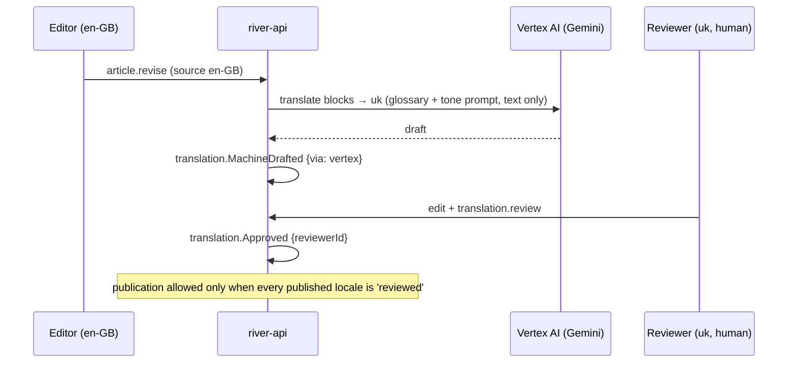

# Internationalisation

How River Portal speaks en-GB and Ukrainian (uk) as equals, and how more locales are added. Back to [[Architecture Overview]]. User experience: [[Multilingual Experience]]. Canonical terms: [[Glossary]].

> [!principle] Bilingual parity
> Ukrainian copy is written natively and reviewed by a person; machine drafts are never published unchecked ([[Brand and Tone of Voice]]). A recipient must be able to complete every step in Ukrainian.

## Two kinds of text

| Kind | Examples | Stored in | Workflow |
|---|---|---|---|
| **UI strings** | buttons, form labels, status names, notification templates | `packages/i18n/messages/{locale}.json` (ICU) in Git | PR review; translators via Git-based TMS (e.g. Crowdin/Tolgee) |
| **Content** | [[Article]]s, [[Campaign Page]]s, [[Journey Story|Journey Stories]], [[Report]]s | `ContentDoc.locales[locale]` in Firestore | [[Content Editor]], `translation.*` events |
| **User-generated text** | need descriptions, gratitude notes, coordinator messages | event payloads (encrypted) | shown in original; optional on-demand translation for staff (advisory, not stored as truth) |

Status names, categories and message keys (e.g. `need.onHold.kind.awaitingStock`) are **keys**, never free text, so every explanation to a recipient exists in both languages.

## next-intl set-up

```ts
// apps/web/src/i18n/routing.ts
import { defineRouting } from 'next-intl/routing';
export const routing = defineRouting({
  locales: ['en-GB', 'uk'],
  defaultLocale: 'en-GB',
  localePrefix: 'always',                       // /en-GB/give, /uk/ask
  pathnames: {
    '/ask':  { 'en-GB': '/ask',  uk: '/poprosyty-dopomohu' },
    '/give': { 'en-GB': '/give', uk: '/dopomohty' },
  },
});
```

- Locale negotiation: explicit choice (cookie `NEXT_LOCALE`) > `Accept-Language` > organisation default. Links in SMS carry the locale the person used.
- The organisation config lists enabled locales; adding one (e.g. `pl`) = new catalogue + content translations + formats, no code change.
- Server components use `getTranslations`; client islands receive only the namespaces they need to keep bundles small.
- `hreflang` alternates and localised sitemaps are generated per page.

## ICU messages and Ukrainian plurals

Ukrainian needs the CLDR categories `one`, `few`, `many`, `other`; English uses `one`, `other`.

```json
// packages/i18n/messages/en-GB.json
{ "campaign": { "givers": "{count, plural, one {# person has given} other {# people have given}}" } }
```

```json
// packages/i18n/messages/uk.json
{ "campaign": { "givers": "{count, plural, one {# людина долучилася} few {# людини долучилися} many {# людей долучилися} other {# людини долучилися}}" } }
```

(`1 людина`, `3 людини`, `5 людей`, `21 людина`, `1,5 людини`.) CI runs a linter that fails if a `uk` plural message lacks `few` or `many`, or if any key is missing in any enabled locale.

Gendered forms use ICU `select` where the person has chosen how to be addressed; otherwise neutral phrasing is preferred.

### Grammatical case in pseudonymisation phrases

Ukrainian place names change form by grammatical case, so the approved pseudonymisation phrases in [[Visibility Levels#Pseudonymisation phrases]] take **case-inflected parameters** instead of the bare name. The forms are stored per place in the [[Location]] dictionary and are never inflected at runtime:

| Parameter | Case | Example (Kharkiv oblast / Leeds) | Used in |
|---|---|---|---|
| `{oblast}` | nominative (en-GB uses this form only) | Харківська / Kharkiv | `pseudo.family.oblast` (en-GB) |
| `{oblastGen}` | genitive (*родовий*) | родина з **Харківської** області | `pseudo.family.oblast`, `pseudo.older.person` |
| `{oblastLoc}` | locative (*місцевий*) | сільська школа в **Харківській** області | `pseudo.school` |
| `{cityGen}` | genitive (*родовий*) | благодійник із **Лідса** | `pseudo.giver` |

```json
{ "pseudo": { "family": { "oblast": "родина з {oblastGen} області" } } }
```

## Formatting

| What | en-GB | uk-UA |
|---|---|---|
| Date | 24 September 2026 / 24/09/2026 | 24 вересня 2026 р. / 24.09.2026 |
| Time | 14:30 | 14:30 |
| Number | 1,234.5 | 1 234,5 |
| Currency (GBP) | £1,234.50 | 1 234,50 GBP |
| Currency (UAH) | UAH 1,234.50 | 1 234,50 ₴ (UI may prefer «грн» via custom display) |
| Relative | 3 days ago | 3 дні тому |

All via `Intl` (`useFormatter` in next-intl) with the locale tag `uk-UA` for formatting while routing uses `uk`. Money always shows its ISO currency; conversions display the recorded FX rate and date ([[Money Flow and Cost Transparency]]). Time zones: store UTC, display in `Europe/London` or `Europe/Kyiv` per viewer.

## Translation workflow for content



- The [[Glossary]] Ukrainian column is supplied to the model as a terminology table; reviewers see glossary hits highlighted.
- Only text runs are sent, never media or personal attribution; quotes from recipients are translated only with their consent scope covering translation.
- When the source changes, dependent locales drop to `stale` and show a diff to the reviewer.
- UI strings are **not** machine-translated at runtime; Vertex may propose drafts in the TMS, reviewed like any other.

See [[Vertex AI Integration]], [[Translation]], [[Content Management]].

## Accessibility and language

- `lang` attribute on `<html>` and on inline passages in another language (e.g. a Ukrainian quote in an English story) for screen readers ([[Accessibility]]).
- Help-seeker copy targets reading age ~9 in both languages; Ukrainian copy reviewed by a native speaker from the region served.
