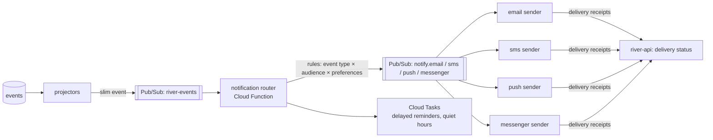

# Notifications

How people hear that something happened: a request acknowledged, a gift arrived, a leg assigned, thanks received. Back to [[Architecture Overview]]. Related: [[Gratitude Loop]], [[Newsletter Digest]].

> [!principle] Calm, useful, never pushy
> Notifications inform and thank; they never pressure. No urgency marketing, no "only 2 hours left", no guilt ([[Brand and Tone of Voice]]). A recipient's notifications never reveal the nature of their need on a lock screen.

## Channels

| Channel | Provider (behind adapter) | Used for | Notes |
|---|---|---|---|
| Email | SendGrid (or Postmark) | givers, sponsors, staff digests, [[Donor Report]]s | DKIM/SPF/DMARC on the org domain |
| SMS | Twilio (or Vonage), UA sender where available | recipients without smartphone data, carriers' magic links | short, no need details, link to tracking page |
| Web Push | FCM / VAPID | PWA users (recipients, carriers, givers) | opt-in only after a meaningful moment |
| Telegram / Viber | Bot APIs (optional per org) | recipients and carriers who prefer messengers | explicit opt-in with the bot; can be unlinked |
| In-app | `views/subjects/{id}/inbox` | everyone signed in / with tracking token | always written, the reference copy |

## Architecture

- The **router** resolves who should be told (from projections, never raw PII), their preferred channel and locale, then resolves contact details from the PII vault through `river-api` at send time. Contact details never travel through Pub/Sub; messages carry `personId` + template key.
- **Templates** are ICU messages in `packages/i18n` (`notify.need.acknowledged.sms`), rendered in the person's locale ([[Internationalisation]]).
- **Idempotency**: dedupe key `eventId + personId + channel`; stored in `orgs/{orgId}/notifications/{key}` with delivery status.
- **Quiet hours** (22:00–08:00 local) for everything except safety-critical staff alerts; queued via Cloud Tasks.
- **Fallback**: push fails → SMS for recipients whose need is time-sensitive (e.g. delivery arrival window).
- **Digesting**: givers receive at most one email per flow stage; coordinators get a morning digest plus real-time for assignments.

## Notification matrix (excerpt)

| Event | Recipient | Giver / Sponsor | Carrier | Coordinator |
|---|---|---|---|---|
| `need.Acknowledged` | SMS/in-app: "We have your request" | — | — | — |
| `need.ClarificationRequested` | SMS/in-app question | — | — | — |
| `need.PutOnHold` / `need.Referred` | kind explanation + next step | — | — | — |
| `gift.Received` | — | email receipt + thanks | — | digest |
| `leg.CarrierAssigned` | — | — | SMS magic link | — |
| `consignment.Dispatched` | "Help is on its way" (no route details) | "Your gift is travelling" | — | real-time |
| `deliveryConfirmation.Recorded` | "Thank you for confirming" | "Your gift arrived" | "Delivered, thank you" | real-time |
| `gratitudeNote.Routed` | — | the note (pseudonymised sender) | the note | the note |
| `costRecord.Queried` | — | — | question about receipt | — |
| `publication.Published` | if their consented story: link | "A story you are part of" | same | — |

Messages to participants use pseudonyms ("a family in Kharkiv oblast") per [[Visibility Levels]].

## Preferences and consent

- Stored as events (`person.ProfileUpdated` with `notificationPrefs`) and projected to `people/{id}.contactChannels`.
- Marketing-type messages ([[Newsletter Digest]]) require separate opt-in ([[Consent Management]]); transactional messages about a person's own request or gift do not.
- Every email/SMS has a one-step stop/unsubscribe path; SMS `STOP` handled by provider webhook.

## Safety considerations

> [!privacy] Lock-screen safety
> SMS and push for recipients contain no category, no item, no organisation name if the recipient opted for discreet mode (e.g. risk of an abusive household member reading messages): "You have an update. Open: …". See [[Safeguarding]].

- Carrier SMS never includes the delivery address; it arrives inside the leg view when active.
- Delivery failures (bounced email, undelivered SMS) surface in the coordinator's queue as "cannot reach" rather than silently failing.
