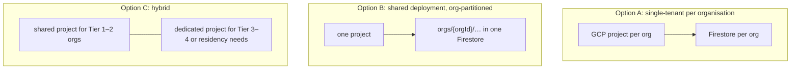

# Scaling Architecture

The technical counterpart of [[Scaling Tiers]]: how the same codebase serves a one-van fundraiser and a multi-country programme. Back to [[Architecture Overview]].

> [!principle] Switch on, never migrate
> Tiers are configuration (`orgs/{orgId}.features`, `tier`), not forks. Moving up a tier enables features and adds infrastructure; the event log and its schema remain the same ([[Guiding Principles#P11. Scale without changing character]]).

## Tier by tier

| Aspect | Tier 1 — Spring | Tier 2 — Stream | Tier 3 — River | Tier 4 — Basin |
|---|---|---|---|---|
| Typical volume | < 5k events/month, 1–2 staff | 5–50k events/month, 3–10 staff | 50–500k events/month, 10–50 staff, partners | > 500k events/month, 50+ staff, many orgs |
| web | Cloud Run min 0, ISR, CDN | min 1 (no cold start on `/ask`) | min 2, multi-region serving via LB | multi-region, per-country domains |
| studio | Cloud Run behind IAP | same | + context-aware access | + per-programme IAP groups |
| river-api | 1 service | 1 service | split: `river-api` + `river-api-webhooks` | + partner API gateway (API Gateway / Apigee) |
| Projectors | single `onEvent` function | same | per-domain functions; Pub/Sub fan-out | + Dataflow for heavy aggregations |
| Log | Firestore | Firestore | Firestore + BigQuery export + hash chain | + retention-locked archive, anchored hashes |
| Analytics | projections only | projections | BigQuery + Looker Studio | BigQuery, grant reporting, [[Impact Report]] automation |
| AI | off | optional (translation, PII) | optional | standard ([[Vertex AI Integration]]) |
| Notifications | email only | + SMS | + push, messengers | + per-country SMS senders |
| Media | basic pipeline | + renditions | + face-blur | + regional buckets |

## Firestore limits and how we stay within them

| Limit | Risk | Mitigation |
|---|---|---|
| ~1 sustained write/s per document | aggregate head for a busy campaign | aggregates are fine-grained (each gift its own aggregate); campaign totals are projections, updated with **distributed counters** (N shards) |
| 500 writes/s ramp on new collections; hotspotting on monotonically increasing ids | ULIDs are time-ordered | event collections are naturally partitioned by `orgId`; at Tier 4 the document id is `{randomPrefix2}{ulid}` while `id` stays the ULID field; traffic ramps follow the "500/50/5" rule |
| Transaction contention | two coordinators on one flow | per-aggregate optimistic concurrency, small transactions |
| Query fan-out for rebuilds | slow replay at Tier 4 | rebuild from BigQuery export |
| Document size 1 MiB | large content bodies | revisions in own docs; media in Storage |

## Multi-tenancy options

| | A: project per org | B: shared, partitioned | C: hybrid |
|---|---|---|---|
| Isolation | strongest (IAM, billing, residency) | logical (`orgId` in paths, rules, claims) | per need |
| Cost for a tiny charity | ~£25–40/month fixed | near zero marginal | near zero for small orgs |
| Operations | Terraform per org, many deploys | one deploy | two deploy targets |
| Partner sharing ([[Partner Organisation]]) | via partner API | direct (cross-org projections with consent) | both |
| Data residency | per project region | one region for all | dedicated where required |

The data model already partitions everything by `orgId`, so the choice can be made per customer. **Proposed:** Option C — shared hosting for Tier 1–2, dedicated projects for Tier 3–4 or on request.

> [!question] #open-question
> Multi-tenant (many organisations per deployment) or single-tenant per organisation as the default offer? Proposal above (hybrid) needs validation against partner-sharing needs and trustees' expectations of isolation.

## Quotas and protection

- Per-organisation quotas enforced in `river-api` (commands/minute, uploads/day, AI budget), stored in org config; exceeding them degrades gracefully and never blocks `need.submit`, which has its own abuse controls ([[Identity and Access#No-account recipient submissions]]).
- Cloud Armor rate limiting at the LB; Firebase App Check on `web` for command calls (with a fallback path for browsers where attestation fails, so no recipient is locked out).
- GCP quota monitoring alerts for Firestore, Vertex, Cloud Run instances ([[Observability]]).

## Cost profile

Indicative monthly costs (GBP, EU regions, excluding SMS). Order-of-magnitude estimates to be validated with the Google Cloud pricing calculator before quoting to an organisation:

| Tier | Main cost drivers | Indicative |
|---|---|---|
| 1 | LB for studio IAP (~£18), Firestore reads for public pages (mostly CDN-absorbed), email | £20–40 |
| 2 | + web min instance, SMS, Storage | £60–150 |
| 3 | + BigQuery, more Cloud Run, push/messenger, Cloud Armor | £250–800 |
| 4 | + Vertex AI usage, multi-region, Apigee (optional), retention archive | £1,500+ (driven by AI and traffic) |

Cost levers: ISR and CDN for public reads, projections sized for their screens (no over-reads), SMS only where needed, AI batch jobs, BigQuery partition pruning. Costs of the platform itself are reported honestly on the [[Transparency Ledger]] as overheads if the organisation chooses ([[Money Flow and Cost Transparency]]).
