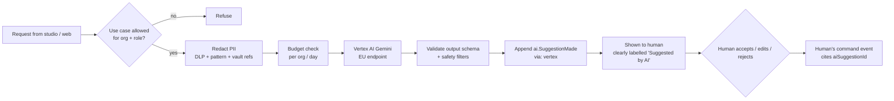

# Vertex AI Integration

Where Gemini models on Vertex AI help people do their work, and the guard-rails that keep AI **advisory only**. Back to [[Architecture Overview]]. Ethics: [[Ethics Charter]]. Tier: optional at Tier 2–3, standard at [[Scaling Tiers#Tier 4 — Basin|Tier 4]].

> [!principle] AI advises, people decide
> No AI output changes a status, makes a [[Decision Points Overview|decision]], contacts a person or publishes anything. Every suggestion is shown to a named human who accepts, edits or discards it; that human's command is the event of record. AI never assesses whether someone "deserves" help ([[Guiding Principles#P2. A need is respected]]).

## Use cases

| # | Use case | Who sees it | Input (after redaction) | Output | Decision point |
|---|---|---|---|---|---|
| 1 | **Translation drafts** (content, gratitude notes on request) | Editor, reviewer | text blocks + glossary | draft locale | [[DP-10 Report Publication]] (human review) |
| 2 | **Need summarisation & clarity** | Coordinator; recipient (optional "help me explain") | need text, category, oblast | 2-line summary; suggested clarifying questions | [[DP-01 Need Triage]] |
| 3 | **Matching suggestions** | Coordinator | open needs (category, form, oblast, urgency), available gifts/stock | ranked candidate pairs with rationale | [[DP-04 Matching]] |
| 4 | **Report and story drafting** | Editor, coordinator | projection data (aggregates), consented quotes | draft [[Donor Report]], [[Impact Report]], [[Journey Story]] | [[DP-09 Publication Consent]], [[DP-10 Report Publication]] |
| 5 | **PII detection / redaction assistance** | river-api pipeline, editor | free text before append or publish | spans flagged as PII | automatic masking + human confirm on publish |
| 6 | **Receipt reading** | Carrier, Finance Steward | receipt image | amount, currency, date, vendor suggestion | [[DP-06 Cost Approval]] |
| 7 | **Offer intent clarity** | Coordinator | [[Intent Statement]] text | clarity hints (never a verdict) | [[DP-03 Offer Acceptance]] |

Matching suggestions never use [[Reputation]] to lower a recipient's priority; features available to the model are an explicit allow-list reviewed by the Safeguarding Lead.

## Models and platform

- **Gemini Flash** class for summaries, translation drafts, PII detection, receipt OCR (low latency, low cost).
- **Gemini Pro** class for report drafting and matching rationale.
- Model ids are pinned per use case in `packages/domain/ai/models.ts` and upgraded only after evaluation.
- Called from `river-api` (server-side only) with the `@google-cloud/vertexai` SDK through a service account holding `roles/aiplatform.user` only.
- Structured output (JSON schema) for use cases 3, 5, 6 so responses are validated with zod before display.

## Guard-rails pipeline

1. **PII redaction before prompts.** Names, phones, emails, addresses and exact locations are replaced with placeholders (`[PERSON_1]`, `[PLACE_1]`) using Sensitive Data Protection (Cloud DLP) plus our own vault references. Mapping stays in memory and is re-applied to the output server-side. `sealed` data is never sent.
2. **Logging `via: vertex`.** `ai.SuggestionMade` stores use case, model id, target ref, prompt **hash** and output hash, never prompt text. The accepted content enters the log through the human's command with `actor.via = 'studio'` and `aiSuggestionId`, so provenance is always traceable ([[Accountability and Audit]]).
3. **Human in the loop.** UI labels every AI draft; "accept" requires an explicit click; bulk accept is not offered for matching or publication.
4. **Never auto-publish.** Publication commands reject content with `translationStatus: 'draft'` or unreviewed AI provenance.
5. **Recipient-facing help is optional.** "Help me explain" on `/ask` is opt-in, runs after the recipient's text is locally stored, and the recipient chooses which version to send.

## Evaluation

- Golden sets per use case in both languages (fictional data from [[Demo Needs]] and [[Demo Stories and Gratitude]]).
- Metrics: translation (reviewer edit distance, glossary adherence), summarisation (faithfulness score by reviewer, no added facts), matching (acceptance rate, time-to-match, **no disparity** across oblasts or recipient types), PII detection (recall ≥ 0.98 on test set).
- Model or prompt changes run the suite in CI (Vertex Gen AI evaluation service) and require sign-off from the product owner and the Safeguarding Lead for use cases 2, 3.
- Live monitoring: rejection rate per use case; a sudden rise pauses the feature flag.

## Cost controls

- Per-organisation monthly budget and per-day cap in `orgs/{orgId}.ai.budget`; exhausting it disables suggestions gracefully (workflow continues manually).
- Context caching for glossary and style prompts; batch prediction for nightly report drafts.
- Token counts recorded in metrics (not logs) per use case ([[Observability]]).

## Data residency

- Vertex endpoints in the EU (e.g. `europe-west1` / `europe-west4`); requests do not leave the region.
- Google does not use customer data from Vertex AI to train its models (per Google Cloud terms); prompts are not retained beyond abuse-monitoring defaults, and the zero data retention option is requested for production.
- A Data Protection Impact Assessment covers each use case before enabling ([[Privacy Model]]).

> [!question] #open-question
> Which use cases are in scope for v1? Proposal: 1 (translation drafts) and 5 (PII detection) at launch; 2 and 6 at Tier 2; 3 and 4 at Tier 3–4 after evaluation.
