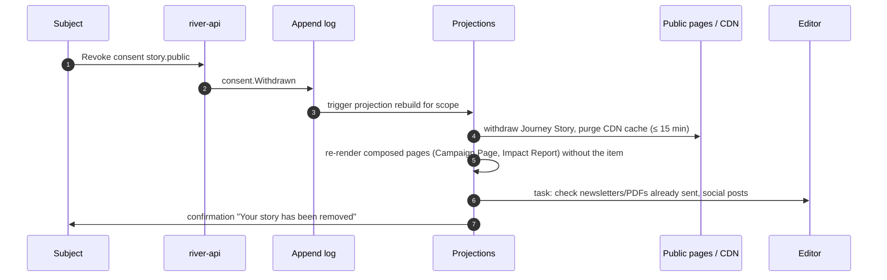

# Consent Management

How the portal asks for, records, honours and withdraws consent. The entity itself is [[Consent]]; the decision to publish consented content is [[DP-09 Publication Consent]]. Back to [[Privacy Model]].

> [!principle] Consent is specific and revocable
> One consent covers one purpose. It can be withdrawn at any time, as easily as it was given, and withdrawal removes the item from publications. — [[Guiding Principles#P5. Consent is specific and revocable]]

## Consent purposes

Each purpose is a separate, unticked choice. There is no "I agree to everything".

| Purpose code | What it allows | Asked of | Scope | Default |
|---|---|---|---|---|
| `contact.service` | Messages about your own request or gift | Everyone | Person | Implied by the request (legitimate interest), can be narrowed to one channel |
| `contact.updates` | Newsletter and campaign news ([[Newsletter Digest]]) | Givers, volunteers | Person | Off |
| `share.carrier` | Give your first name and a phone relay to the driver for this delivery | Recipient | [[Leg]] | Asked at intake; required only for home delivery (pick-up point is offered instead) |
| `share.partner` | Pass your request to a [[Partner Organisation]] that can help better | Recipient | [[Need]] | Asked when referral is proposed ([[DP-01 Need Triage]]) |
| `gratitude.participants` | Send your thank-you to the people who helped | Recipient | [[Gratitude Note]] | Asked after delivery |
| `gratitude.wall` | Show your thank-you on the public [[Gratitude Wall]] | Recipient | Gratitude Note | Off |
| `story.participants` | Tell the journey of this help to those who took part, with details you choose | Recipient | [[Flow]] | Off |
| `story.public` | Publish a [[Journey Story]] publicly | Recipient (+ carrier if named) | Flow | Off |
| `media.photo` | Use this photo, per level chosen (participants / public), with or without faces | Subject(s) in photo | [[Media Asset]] | Off |
| `name.public` | Show your name (form chosen: full / first name / initials / city only) | Giver, sponsor, carrier | Person or Gift | Off |
| `ai.assist` | Let an AI tool help draft or translate your text (a person always checks it) | Anyone writing free text | Text field | Off for health text; see [[Vertex AI Integration]] |
| `health.process` | Record health details needed for this request | Recipient | Need | Asked only when the need is medical |

## Capture UX

Consent questions appear **at the moment they matter**, not in a wall at sign-up: sharing with a driver when choosing delivery; story consent after delivery, when the person knows what happened. Every question shows *who will see it*, *what exactly*, *for how long*, and *how to change your mind*. Reading age about 9 ([[Accessibility]]).

| Moment | en-GB | uk |
|---|---|---|
| Delivery to door | **Can we give the driver your first name and a way to call you?** Only for this delivery. The number is hidden behind our relay and stops working 72 hours after the delivery leg closes ([[Canonical Parameters]]). [Yes, share] [No, I'll collect from a pick-up point] | **Чи можемо ми передати водієві ваше ім'я та спосіб зв'язатися з вами?** Лише для цієї доставки. Номер буде приховано через наш сервіс переадресації, і він перестане працювати через 72 години після завершення етапу доставки. [Так, передати] [Ні, я заберу з пункту видачі] |
| After delivery — thanks | **Would you like to say thank you to the people who helped?** They will see your words, but not your name or address. [Write a thank-you] [Not now] | **Бажаєте подякувати людям, які допомогли?** Вони побачать ваші слова, але не ваше ім'я чи адресу. [Написати подяку] [Не зараз] |
| After delivery — story | **May we tell the story of how this help reached you?** You choose what we say. We will show you the text before anyone else sees it. [Let me choose] [No, thank you] | **Чи можемо ми розповісти, як ця допомога до вас дійшла?** Ви самі обираєте, що ми скажемо. Ми покажемо вам текст, перш ніж його хтось побачить. [Обрати самостійно] [Ні, дякую] |
| Photo | **Can we use this photo?** ○ Only for the people who helped ○ On our website ○ Not at all. ☐ Blur faces | **Чи можемо ми використати це фото?** ○ Лише для тих, хто допоміг ○ На нашому сайті ○ Ні. ☐ Розмити обличчя |
| Giver name | **How should we show your name?** ○ Don't show it ○ First name ○ First name and city ○ Full name | **Як показувати ваше ім'я?** ○ Не показувати ○ Лише ім'я ○ Ім'я та місто ○ Повне ім'я |
| Withdrawal footer | You can change this at any time from your tracking link or by replying STOP. | Ви можете змінити це будь-коли за посиланням для відстеження або відповівши «СТОП». |

Refusing a consent **never** changes the help a person receives. The UI says so on every consent screen: *"Your answer does not change the help you get." / «Ваша відповідь не впливає на допомогу, яку ви отримаєте.»*

## Consent registry

Consents are Log Events (`consent.Granted`, `consent.Narrowed`, `consent.Withdrawn`, `consent.Expired`) projected into a registry view `orgs/{orgId}/views/consents` at `team` level.

| Field | Example | Notes |
|---|---|---|
| `consentId` | ULID | |
| `subjectPersonId` | `per_01J…` | The person the data is about |
| `grantedByPersonId` | same, or guardian / proxy | See proxy rules below |
| `purpose` | `story.public` | From the table above |
| `scope` | `{kind: "flow", id: "flw_…"}` | Narrowest aggregate that makes sense |
| `detail` | `{nameForm: "first", faces: "blurred", fields: ["oblast","category"]}` | What exactly is allowed |
| `wordingVersion` + `locale` | `story.public@3`, `uk` | The exact text the person saw is stored and versioned |
| `channel` | web / phone call / paper form / in person | Phone and paper consents are recorded by a coordinator with a witness note |
| `expiresAt` | `2027-09-24` | Publication consents last 24 months unless renewed |
| `status` | active / narrowed / revoked / expired | |

## Revocation cascade

Revocation is as easy as granting: one tap from the tracking link, a reply keyword, or a call to the coordinator.

- **Live pages**: item removed and replaced by a neutral aggregate within 15 minutes; CDN purge is part of the projection.
- **Composed publications** ([[Campaign Page]], [[Impact Report]]): recomposed automatically, because composition never raises visibility.
- **Already-distributed copies** (emailed digests, printed reports, partner social posts): cannot be recalled; the Editor records what was sent, asks partners to remove, and the subject is told honestly.
- **Media**: renditions deleted from public buckets; the original stays at `private` unless erasure is also requested ([[Data Retention]]).
- **Narrowing** (e.g. from full name to first name) is re-rendered the same way.

## Consent by proxy and guardian

| Situation | Who consents | Rules |
|---|---|---|
| Child under 18 | Parent or legal guardian | Children's faces and names are **never** public, whatever the consent. See [[Safeguarding]]. |
| Adult who cannot consent (e.g. dementia) | Legal representative, or the coordinator records "vital interests" for delivery only | No publication consents by proxy. |
| Neighbour asking on behalf of others | Each household for its own data | The asker may consent for themselves only; others are contacted or remain pseudonymised. |
| Institution (school, hospital) | Authorised officer of the institution | Covers the institution's name and premises, not pupils or patients. |
| Carrier / partner staff | The individual, not their employer | An organisation can consent to its logo, not to its staff's names. |

> [!question] Age of digital consent (rule set; legal review pending)
> The UK age of digital consent is 13, Ukraine has no single equivalent. Current rule ([[Canonical Parameters]]): everyone under 18 is treated as a child for all publication purposes. #open-question

## Related
[[Consent]] · [[Visibility Levels]] · [[DP-09 Publication Consent]] · [[DP-12 Visibility Change]] · [[Publication Pipeline]] · [[Multilingual Experience]] · [[Help Seeker Section]]
