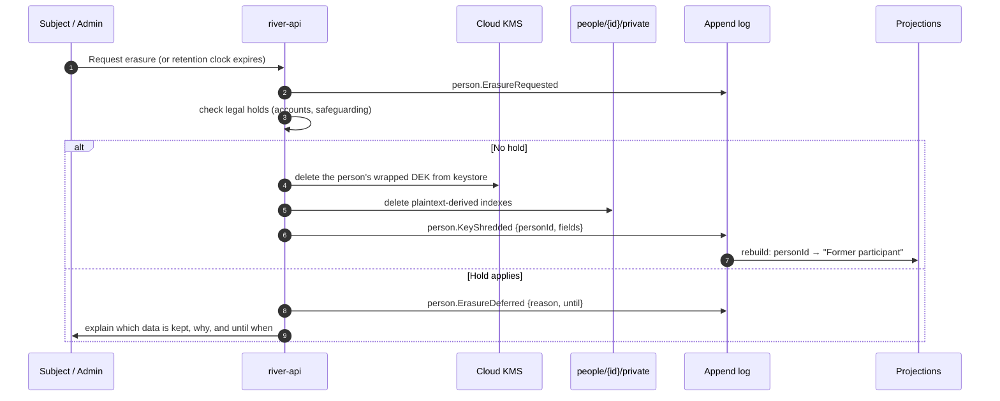

# Data Retention

How long each kind of data is kept, and how an **append-only log** ([[ADR-001 Event-Sourced Append Log]]) is reconciled with the **right to erasure**. Back to [[Privacy Model]].

> [!principle] The river remembers — but not everything, and not forever
> Facts about what happened (a gift received, a cost approved, a delivery confirmed) are kept for accountability. Personal details are kept only as long as they help someone. — [[Guiding Principles#P7. The river remembers]], [[Guiding Principles#P4. Private by default]]

## Retention schedule

Clocks start at the event named in "Starts at". Periods are defaults for the demo organisation (UK charity); an [[Administrator]] can shorten them per tenant, never lengthen beyond the legal maximum without a recorded DPIA update.

| Data type | Where | Starts at | Retention | At end of period |
|---|---|---|---|---|
| Recipient contact details | `people/{id}/private` | `need.Closed` (last need) | 12 months | Crypto-shred |
| Delivery address | Need private sidecar | `deliveryConfirmation.Recorded` | 30 days | Crypto-shred; oblast kept |
| Health details | Need private sidecar | `need.Closed` | 90 days | Crypto-shred |
| Children's details | sealed sidecar | `need.Closed` | 90 days | Crypto-shred |
| Safeguarding case records | sealed store | case closed | 6 years (adults), until the child is 25 (children) | Reviewed by Safeguarding Lead, then shredded |
| Carrier leg sheet (name, phone relay, plate) | leg-scoped view | `leg.Closed` | 72 hours (relay and contact details; [[Canonical Parameters]]), 30 days (plate) | Deleted |
| Giver identity + gift records | `people/{id}/private`, [[Gift]] | end of financial year | 6 years + current (UK charity accounts, HMRC Gift Aid) | Crypto-shred identity; amounts remain anonymised in the ledger |
| Cost records and receipts | [[Cost Record]], Storage | end of financial year | 6 years + current | Archive, then delete receipt images |
| Consent records | registry | consent revoked or expired | 6 years (proof of what was agreed) | Delete |
| Published stories and media | public projections | publication | While consent is active (max 24 months, renewable) | Withdrawn; see [[Consent Management#Revocation cascade]] |
| Private media (delivery photos) | Storage | `flow.Closed` | 12 months | Delete originals |
| Log Events (non-personal facts) | `orgs/{orgId}/events` | — | Life of the organisation | Archive to cold storage after 3 years |
| Staff access logs (IAP, studio) | Cloud Logging | event | 400 days | Automatic expiry |
| Reputation signals | projection | — | Rolling 24 months window | Older events no longer contribute ([[Reputation Dynamics]]) |
| Unsubmitted drafts (need forms) | browser only / draft doc | last edit | 7 days | Delete |
| AI prompts and outputs | Vertex logs | request | 30 days (no training) | Automatic expiry |

## Crypto-shredding

The log is immutable: Firestore security rules forbid update and delete on `events` ([[Security Rules]]). Erasure is therefore achieved by making personal data **unreadable**, not by editing history.

- **One key per person**: a data encryption key (DEK) wrapped by the organisation's Cloud KMS key and held in the separate `keystore` database ([[Firebase Data Model#Where PII lives]]). Sensitive fields in the sidecar, and personal free text in events, are encrypted with it.
- **Field-scoped keys** for short-lived data (address, health) allow shredding one category without erasing the whole person.
- Events still say "`per_01J…` gave a gift of GBP 50.00 on 2026-03-02"; with the key destroyed, `per_01J…` no longer resolves to anyone. Aggregates and the [[Transparency Ledger]] stay correct.
- **Backups**: wrapped DEKs live in the separate `keystore` database, which has only 7-day point-in-time recovery and **no** long-term backups. A restore of other data can therefore never resurrect a shredded key beyond 7 days, and after any restore a job re-applies every `person.KeyShredded` since the backup time ([[Deployment and Environments#Backups and recovery]]).
- **BigQuery export** (Tier 3–4): contains only log payloads (no PII); pseudonymous ids are re-hashed with a rotating salt per export.

## Archive

After 3 years, events are exported to a Cloud Storage **archive bucket** (Archive class, bucket lock with retention policy) and removed from hot Firestore **by a documented, audited archival process** — the only exception to "no delete", run by a service account with its own IAM role and producing an `system.ArchiveSegmentSealed` event with a hash of the segment. Projections remain rebuildable from archive + hot log. [[Accountability and Audit]] describes how auditors verify the hash chain.

> [!question] Archive delete versus immutability
> Is moving events to an archive bucket compatible with the "no delete" rule for [[Log Event]]? Proposal above treats it as relocation with a hash seal. Needs an ADR. #open-question

> [!question] Data residency for Ukrainian partners
> Some Ukrainian partner organisations may require that data about their beneficiaries be stored in Ukraine. Tier 4 may need a Ukrainian region or on-premise partner store. #open-question

## Related
[[Data Minimisation]] · [[Event Log and Projections]] · [[Firebase Data Model]] · [[Scaling Architecture]] · [[Deployment and Environments]] · [[Person]]
