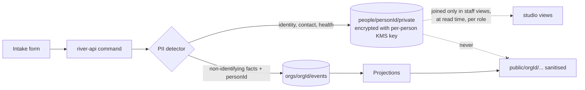

# Privacy Model

*How people are protected.* This is the section MOC for privacy and ethics: what personal data the portal holds, on what lawful basis, where it lives, and who may see it. Back to [[00 Home]].

> [!principle] Private by default
> Personal data is visible only to those who need it to deliver help, for as long as they need it. Everything public is aggregated, anonymised or explicitly consented. — [[Guiding Principles#P4. Private by default]], [[ADR-006 Private by Default Visibility]]

## Section notes

| Note | Question it answers |
|---|---|
| [[Visibility Levels]] | What are the five levels, and what does each audience see of each field? |
| [[Consent Management]] | How is consent asked for, recorded, revoked and cascaded? |
| [[Data Minimisation]] | What do we never ask, and why is each field we do ask justified? |
| [[Data Retention]] | How long is each kind of data kept, and how is it erased from an append-only log? |
| [[Ethics Charter]] | What are the non-negotiable ethics of the organisation and the platform? |
| [[Safeguarding]] | How are children and adults at risk protected, including from exploitation via aid? |

## Data categories

| Category | Examples | Where it lives | Default level | Notes |
|---|---|---|---|---|
| **Identity and contact** | name, phone, email, messenger handle, preferred language | `people/{personId}/private` (encrypted fields) | `private` | Only on [[Person]]; every other entity holds a `personId`. |
| **Location** | delivery address, settlement, oblast | [[Location]] with precision tiers | `private` (address), `participants` (oblast) | Exact addresses in conflict zones are security-sensitive; see [[Ethics Charter#8. Do no harm]]. |
| **Need content** | what, form, when, household size | [[Need]] payload (no names) | `private` | Free text is scanned for PII before storage (see below). |
| **Special category — health** | medicines, disability, chronic illness, pregnancy | encrypted field on the Need's private sidecar | `private` or `sealed` | UK/EU GDPR Art. 9. Never in a public projection, never in event payloads. |
| **Special category — displacement and circumstances** | IDP status, loss of home, bereavement, military family | encrypted sidecar | `private` | Not Art. 9 in law, but treated as if it were: it can expose people to risk. |
| **Beliefs, ethnicity, politics** | religion, nationality, political views | **not collected** | — | See [[Data Minimisation#What we never ask]]. |
| **Children and adults at risk** | age band, guardian link, safeguarding concerns | sealed sidecar | `sealed` | See [[Safeguarding]]. |
| **Financial** | gift amount, payment reference, receipt image | [[Gift]], [[Cost Record]]; card data never touches the portal | `private` (giver), `public` (aggregated) | Gift amounts are private unless the giver chooses otherwise ([[Guiding Principles#P1. A gift is a gift]]). Aggregated cost amounts are public by default ([[Guiding Principles#P8. Honest numbers, beautifully shown|P8]]). |
| **Media** | photos, voice notes, documents | Cloud Storage with EXIF/GPS stripped | `private` | Each [[Media Asset]] has its own visibility and consent. |
| **Staff and carrier operational data** | shifts, vehicle plate, route | [[Leg]], [[Carrier]] | `team` | Vehicle plates and live positions are never public. |
| **Reputation signals** | reliability, timeliness | [[Reputation]] projection | `private` to subject + `team` | Recipients' signals are internal only; see [[Reputation Dynamics]]. |

## Lawful bases

The demo organisation is UK-registered and processes data of people in Ukraine and the EU (Poland transit). It therefore designs for **UK GDPR + Data Protection Act 2018**, **EU GDPR** (EU-based givers, carriers and partners) and the **Law of Ukraine "On Personal Data Protection" (No. 2297-VI)**, together with the Ukrainian draft law aligning with GDPR.

| Processing | UK / EU GDPR Art. 6 basis | Art. 9 condition (if special) | Ukrainian law basis |
|---|---|---|---|
| Receiving and handling a Need | Legitimate interests (charitable purpose); vital interests where life is at risk | Explicit consent for health data; vital interests where the person cannot consent; not-for-profit body condition (Art. 9(2)(d)) for members/regular contacts | Consent of the data subject (Art. 11), or protection of vital interests |
| Delivering goods (address, phone to carrier) | Legitimate interests; contract-like arrangement with the recipient | — | Consent; necessity to perform the request |
| Recording gifts and receipts | Legal obligation (charity accounting, Gift Aid records); legitimate interests | — | — |
| Donor communications | Consent (PECR for email/SMS marketing); legitimate interests for service messages | — | Consent |
| Publishing stories, photos, names | **Consent only** | Explicit consent if health or circumstances are visible | Consent |
| Safeguarding records | Legal obligation / substantial public interest (DPA 2018 Sch. 1 para 18) | Substantial public interest | Protection of vital interests |
| AI-assisted drafting via Vertex AI | Legitimate interests, with a DPIA and no training on our data | Only on redacted text for special-category fields | Consent (disclosed in the privacy notice) |

> [!privacy] Data residency
> Primary data is stored in `europe-west2` (London) or `europe-central2` (Warsaw) per tenant. Ukrainian personal data transferred to the UK/EU relies on the recipient's consent and the adequacy of the destination; this is stated plainly on the intake form. See [[Data Retention]] and [[Scaling Architecture]].

A **DPIA** (Data Protection Impact Assessment) is required before go-live of each tier, because the portal processes special-category data of vulnerable people at scale. The template sits with the [[Administrator]] in [[Admin Studio]].

## Separation of PII from events

The append-only log ([[Log Event]], [[ADR-001 Event-Sourced Append Log]]) never contains names, phone numbers, addresses or health details. Events carry `personId` references and non-identifying facts.

- **Free-text scrubbing.** Free text in a Need or Gratitude Note is scanned (rule-based, optionally [[Vertex AI Integration|Vertex]] PII detection) before the event is appended. Detected names, phones and addresses are moved to the private sidecar and replaced with tokens (`[name-1]`).
- **No plaintext PII in events.** Whatever free text remains after scrubbing is stored in the event encrypted with the author's per-person key.
- **Crypto-shredding.** Each Person has a data encryption key (DEK), wrapped by Cloud KMS and kept in the separate `keystore` database. Erasure destroys it (`person.KeyShredded`); encrypted sidecar fields and encrypted free text in events become unreadable while the log remains intact. See [[Data Retention#Crypto-shredding]].
- **Projections join at read time.** Staff views in [[Coordinator Workspace]] resolve names only for roles that hold the required level. Because Firestore rules cannot hide fields, a view that mixes levels is stored as one document per visibility level ([[Security Rules#Level-split views]]). Public projections are built from the log alone.

## Who sees what (summary)

The full matrix is in [[Visibility Levels#Default levels per entity]]. In short:

| Audience | Sees |
|---|---|
| Subject (the person) | Everything about themselves, including reputation signals and the events behind them |
| Assigned Coordinator(s) | What they need for their flow: contact, address, need detail |
| Safeguarding Lead | `sealed` fields for cases assigned to them |
| Carrier | For their [[Leg]] only: handover point, first name or code word, a phone number (masked relay where possible), for the duration of the leg |
| Organisation team | Pseudonymised needs, flows, costs; names only where their role requires it |
| Participants of a Flow | Pseudonymised journey ("a family in Kharkiv oblast"), costs, confirmation, gratitude |
| Public | Aggregates, consented stories, the [[Transparency Ledger]] |
| Auditor | Read-only log and reports; personal data on request with a logged reason |

## Rights of data subjects

Access, rectification, erasure, restriction, objection and portability are exercised from the person's own account or via a tracking link, and handled by the Administrator within one month. Every request and response is a Log Event (`person.DataRequestReceived`, `person.DataRequestFulfilled`). Changing a visibility level is a decision: [[DP-12 Visibility Change]].

## Open questions

> [!question] Anonymous givers and AML
> Can a [[Giver]] be anonymous to the [[Coordinator]], not just to the public? UK charity guidance expects "know your donor" checks above certain thresholds. Decided ([[Canonical Parameters]]): a giver may stay anonymous to staff below GBP 5,000 cumulative in 12 months (or equivalent) and without Gift Aid; at or above that, identity is always held.

> [!question] Ukrainian law in transition
> The Ukrainian GDPR-aligned bill may change the lawful bases available (e.g. legitimate interest). The lawful-basis table must be reviewed when it is adopted. #open-question

## Related
[[Consent]] · [[Visibility Policy]] · [[Person]] · [[Security Rules]] · [[Identity and Access]] · [[Accountability and Audit]] · [[Guiding Principles]]
