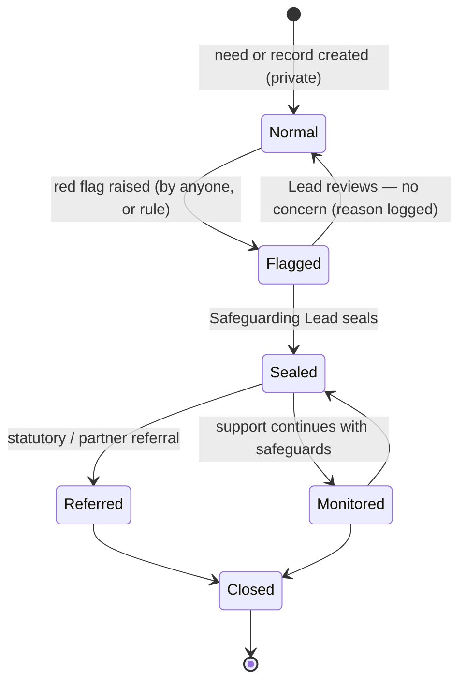

# Safeguarding

How the portal and the people using it protect **children** and **adults at risk** — including from the specific risk that aid itself becomes a lever for exploitation. Back to [[Privacy Model]].

> [!principle] Safety over story, always
> No publication, report, metric or fundraising need justifies exposing a child or an adult at risk. When in doubt, the Safeguarding Lead seals first and asks questions afterwards.

## Scope

| Group | Definition in the portal | Examples |
|---|---|---|
| Children | Anyone under 18 | A grandson in Olena's household; pupils of a school receiving a generator |
| Adults at risk | Adults who, because of age, illness, disability, displacement, dependency or circumstance, cannot fully protect themselves | An older person living alone near the front; a person with dementia; a woman in a controlling relationship |
| Staff, volunteers and carriers | Everyone acting for the organisation | Conduct expectations, protection from harassment |

## Safeguarding Lead

A variant of [[Role]], named per [[Organisation]] (and per [[Programme]] at Tier 4). There is always a deputy; a Tier 1 group names one of its two coordinators.

- Sole holder, with the assigned coordinator, of `sealed` access ([[Visibility Levels]]).
- Receives all red-flag alerts; decides on sealing, referral and reporting.
- Can **freeze** public content for a Flow, Campaign or region (withdraws items from [[Journey Story]], [[Flow Map]], [[Gratitude Wall]] within 15 minutes).
- Can suspend a carrier, volunteer or giver's participation pending review (`role.Suspended`), without disclosing the reason beyond `sealed`.
- Keeps the safeguarding log and makes statutory and regulatory reports.
- Trained (Level 3 safeguarding or equivalent); contact details published on the site in both languages.

## Sealed visibility

- Sealed fields and records show as "Restricted — safeguarding" to everyone else, including Administrators and the Director.
- A sealed record **cannot be raised** above `sealed` by any consent. Unsealing is a [[DP-12 Visibility Change]] taken by the Safeguarding Lead with a second approver.
- Break-glass access by an Auditor or regulator is logged (`safeguarding.AccessGranted`) with reason and expiry.
- Help continues: sealing changes who can see, not whether the person is helped ([[ADR-005 Open Access for Recipients]]).

## Rules for children

- A child is never a [[Recipient]] account holder; needs are expressed by a parent, guardian, carer or institution ([[Consent Management#Consent by proxy and guardian]]).
- Children's names, faces, schools (when combined with a settlement) and exact ages are never published. Institutions are published as "a village school in Kharkiv oblast" unless the institution consents and the Safeguarding Lead agrees.
- No carrier or volunteer is alone with a child at delivery; deliveries to children's institutions are handed to a named adult.
- Children are never asked to write or record thanks. Drawings sent by a school may be shared only without names and with the teacher's consent.

## Red flags

Anyone in the portal can raise a flag from any record ("I'm worried about this" / «Мене це турбує»). Some are also detected by rules and, where enabled, by AI-assisted text screening (advisory only; see [[Vertex AI Integration]]).

| Red flag | Examples | Automatic check |
|---|---|---|
| **Exploitation via aid** | A giver, carrier or volunteer asks for a recipient's personal contact, asks to deliver "personally", offers extra help in exchange for meeting, photos, favours, money, or loyalty | Messages containing contact exchange or meeting requests outside the relay; repeated requests by the same carrier to be assigned to the same recipient |
| **Sexual exploitation and abuse** | Any sexualised remark, request or behaviour towards a recipient | Keyword screening on messages and notes |
| **Trafficking and "opportunities"** | Offers of jobs, travel, accommodation abroad, marriage or "sponsorship" to recipients, especially women and young people | Offers mentioning jobs, travel or housing to named recipients |
| **Control by a third party** | Someone else answers for an adult each time, confiscates aid, or the adult seems afraid | Coordinator observation; proxy always the same unknown person |
| **Child at risk** | Child alone, child caring for adults, signs of neglect | Coordinator / carrier observation |
| **Diversion** | Aid collected by someone other than the recipient repeatedly; goods resold | Delivery confirmations by carrier without recipient over several flows |
| **Grooming patterns** | A giver funds one recipient repeatedly and asks for updates about a child | Restricted: givers cannot target individuals ([[Ethics Charter#1. A gift is a gift, not a commodity]]) |
| **Staff misconduct** | Favouritism, requests for payment, conditional aid | Complaints channel; cost anomalies |

> [!privacy] Relay by design
> Recipients and givers never exchange direct contact details through the portal. Carriers get a masked phone relay that expires 72 hours after the leg closes. This removes the most common path to exploitation via aid.

> [!privacy] Quick exit
> Every help-seeker page (`/ask`, `/track` and the help band on the [[Public Portal]]) carries a **Quick exit** button on every screen. One tap clears the page and replaces it with a neutral site, for people asking for help in an unsafe situation. See [[Help Seeker Section]] and [[Accessibility]].

## Reporting duties

| Situation | Action | Who | Timescale |
|---|---|---|---|
| Immediate danger to life | Emergency services (Ukraine 102/103/112; UK 999) | Whoever is present | Immediately |
| Concern about a child in Ukraine | Referral to the local Служба у справах дітей (children's service) via partner, or National Police | Safeguarding Lead | Within 24 hours |
| Gender-based violence | Referral to specialised services (e.g. national hotline 1547) with the person's consent unless life at risk | Safeguarding Lead | Within 24 hours |
| Serious incident involving the charity | Report to the Charity Commission (England and Wales) as a serious incident | Trustees via Director | Promptly |
| Misconduct by a UK-based carrier/volunteer with children | Referral to the DBS where legally required | Director | As required |
| Partner staff involved | Inform the partner's safeguarding focal point | Safeguarding Lead | Within 48 hours |

Every step is a sealed Log Event (`safeguarding.ConcernRaised`, `visibility.Sealed`, `safeguarding.Referred`, `safeguarding.Closed`).

## Carrier conduct code

Accepted at the first [[Leg]] and annually (`role.CharterAccepted`), in the carrier's language.

| en-GB | uk |
|---|---|
| I deliver aid without conditions. I never ask for anything in return. | Я доставляю допомогу без жодних умов і ніколи нічого не прошу натомість. |
| I use only the contact details the organisation gives me, and only for this delivery. | Я користуюся лише тими контактами, які надала організація, і лише для цієї доставки. |
| I do not photograph people or homes without their clear permission. | Я не фотографую людей чи їхні оселі без їхнього чіткого дозволу. |
| I am never alone with a child. I hand deliveries to an adult. | Я ніколи не залишаюся наодинці з дитиною. Я передаю допомогу дорослому. |
| I do not share routes, locations or times on social media. | Я не публікую маршрути, місця чи час доставки в соцмережах. |
| I record costs honestly and keep receipts. | Я чесно фіксую витрати та зберігаю чеки. |
| I report any concern to the coordinator or the Safeguarding Lead. | Я повідомляю координатора або відповідальну особу з питань захисту про будь-яке занепокоєння. |
| I may refuse any leg I consider unsafe, without explanation. | Я можу відмовитися від будь-якого етапу, який вважаю небезпечним, без пояснень. |

Background checks for carriers (DBS in the UK, certificate of no criminal record in Ukraine) are carried out **outside** the portal; the portal records only that a check was seen, when and by whom.

## Related
[[Ethics Charter]] · [[Visibility Levels]] · [[Carrier]] · [[Verification]] · [[Escalation and Disputes]] · [[Responsibility Matrix]] · [[Accountability and Audit]]

> [!question] Minimum age of a self-registered recipient
> Decided: 18 ([[Canonical Parameters]]). People aged 16–17, including those living independently, ask through a trusted adult or institution.
