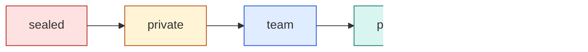
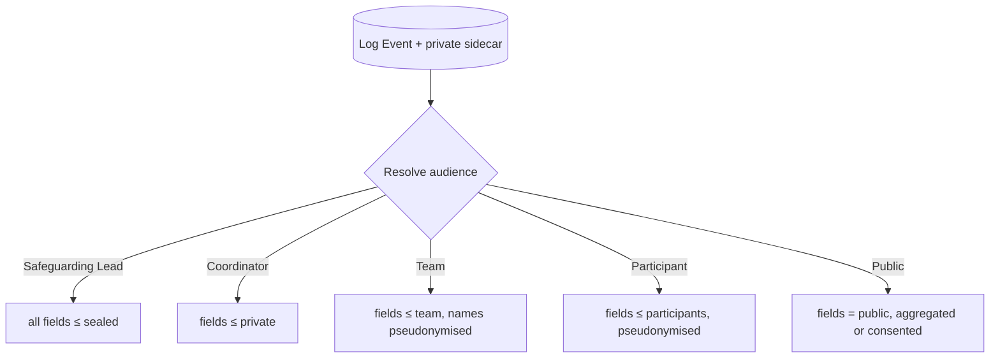

# Visibility Levels

The **canonical definition** of the five visibility levels used everywhere in the vault and the code. The per-record rules that apply them are held in [[Visibility Policy]]; changing a level is [[DP-12 Visibility Change]]. Back to [[Privacy Model]].

> [!principle] Private by default
> Anything touching a person starts at `private`. A level can only be raised by a specific, current [[Consent]] and a recorded decision. — [[Guiding Principles#P4. Private by default]]

## The five levels

Levels are **ordered** from narrowest to widest. A viewer who is entitled to a wider level is not automatically entitled to a narrower one (a giver in `participants` does not see `private`); entitlement is computed per audience.

| Level | Code | Who may see | Typical content | Identifiability |
|---|---|---|---|---|
| 1 | `sealed` | The named **Safeguarding Lead** and the **assigned coordinator** of that case only. Not Administrators, not Directors, not Auditors without a logged break-glass request. | Safeguarding concerns, children's details, domestic-abuse context, exact location of a person at risk | Full |
| 2 | `private` | The **subject person** + the **assigned coordinator(s)** of the Flow (Lead and Contributing). Carriers receive a leg-scoped subset for the duration of their [[Leg]]. | Name, phone, address, health, free-text need detail, gift amount (for the giver) | Full |
| 3 | `team` | **Organisation staff** working on the flow, campaign or programme (role-scoped via [[Role]]). | Pseudonymised needs, cost records, receipts, route plans, internal notes | Pseudonymous; names resolved only if the role requires it |
| 4 | `participants` | **Everyone who took part** in that Flow: givers, sponsors, carriers, volunteers, the recipient. | Journey timeline, costs, delivery confirmation, gratitude — **pseudonymised by default** | Pseudonymous ("a family in Kharkiv oblast") |
| 5 | `public` | **Anyone**, including search engines. | Aggregates, anonymised facts, and content a specific Consent allows | Anonymous unless consented |

*Raising* a field to the right requires consent (for anything touching a person) and a DP-12 record. *Lowering* is always allowed and takes effect immediately, including in already-published items (see [[Consent Management#Revocation cascade]]).

## Field-level rule

Every field of a record carries its own level. A [[Need]] is not "private" as a whole: its category may be `participants`, its oblast `public` (as an aggregate), its phone number `private`, and a safeguarding note `sealed`. [[Projection]]s redact per audience at build time; staff views redact at read time. Because Firestore security rules cannot hide individual fields of a document, a projection that mixes levels is stored as **one document per visibility level** (for example `…/{needId}`, `…/{needId}/lvl/private`, `…/{needId}/lvl/sealed`); see [[Security Rules#Level-split views]] and [[Firebase Data Model]].

## Default levels per entity

| Entity | Default record level | Widest level without consent | Notes |
|---|---|---|---|
| [[Person]] | `private` | `team` (pseudonym only) | Identity fields never above `private` without Consent |
| [[Need]] | `private` | `participants` (category, oblast, form) | Health and circumstances stay `private` / `sealed` |
| [[Offer]] | `private` | `team` | Declined offers never leave `team` |
| [[Gift]] | `private` (amount), `participants` (existence) | `public` as part of totals | Giver may choose to be named |
| [[Flow]] | `team` | `participants` | Public only as a consented [[Journey Story]] or aggregate |
| [[Consignment]] / [[Item]] | `team` | `participants` | Contents may be public in aggregate ("312 blankets") |
| [[Leg]] | `team` | `participants` (after arrival, with delay) | Live position never public; see [[Flow Map]] |
| [[Hub]] | `team` | `public` (city only) | Street address of hubs in Ukraine is `team` |
| [[Cost Record]] | `team` | `public` (category + amount, receipt redacted) | Aggregated cost amounts are **public by default** ([[Guiding Principles#P8. Honest numbers, beautifully shown|P8]]); supplier names of individuals redacted |
| [[Delivery Confirmation]] | `private` | `participants` (fact + date + oblast) | Photos need separate consent |
| [[Gratitude Note]] | `private` | `participants` if the recipient says "share with those who helped" | `public` only via [[Gratitude Wall]] consent |
| [[Reputation]] | `private` (subject) + `team` | never public | No leaderboards; see [[Recognition Anti-Patterns]] |
| [[Media Asset]] | `private` | `participants` if no faces/places | Faces, house numbers, plates require consent |
| [[Consent]] | `private` | `team` | The consent registry itself is not published |
| Safeguarding case | `sealed` | `sealed` | Cannot be raised; see [[Safeguarding]] |

## Field-level examples

**Need #N-0142 (Olena's generator request)**

| Field | Level | Safeguarding Lead | Coordinator | Team | Participants | Public |
|---|---|---|---|---|---|---|
| `category` = generator | `participants` | ✓ | ✓ | ✓ | ✓ | in totals |
| `settlement` | `private` | ✓ | ✓ | — | — | — |
| `oblast` = Kharkiv | `participants` | ✓ | ✓ | ✓ | ✓ | aggregated |
| `contactPhone` | `private` | ✓ | ✓ | — | — | — |
| `health.detail` (insulin, cold storage) | `private` | ✓ | ✓ | "medical" flag | — | — |
| `household` (carer + grandson, 9) | `sealed` for the child's details | ✓ | ✓ | "household of 2" | "a family" | — |
| `intentStatement` | `team` | ✓ | ✓ | ✓ | paraphrase with consent | — |

**Gift from James (Leeds)**

| Field | Level | Coordinator | Team | Participants | Public |
|---|---|---|---|---|---|
| `amount` = GBP 50.00 | `private` | ✓ | Finance Steward only | — | in totals |
| `giverName` | `private` | ✓ | ✓ | "a giver from Leeds" (if city consented) or "a giver" | "James from Leeds" only with wall consent |
| `message` | `participants` if the giver chose | ✓ | ✓ | ✓ | with consent |

## Redaction rules per projection

| Projection / publication | Max level | Redaction applied |
|---|---|---|
| Staff views (`orgs/{orgId}/views/...`) | per role | Names resolved at read time; `sealed` fields replaced by "Restricted — safeguarding" |
| Carrier leg sheet | `private` subset | First name or code word, handover point, masked phone relay; expires at `leg.Closed` + 72 h |
| [[Donor Report]] | `private` (the giver's own data) + `participants` | Recipient pseudonymised; exact dates of delivery rounded to the day; settlement → oblast |
| [[Journey Story]] (participants version) | `participants` | Pseudonym phrases; photos only with no faces/places or with consent |
| [[Journey Story]] (public version) | `public` | As above + delay of at least 14 days after delivery in conflict zones; consented detail only |
| [[Transparency Ledger]] | `public` | Givers "anonymous" unless opted in; individual supplier names removed from receipts |
| [[Flow Map]] | `public` | Oblast centroid; minimum 7-day delay; hidden entirely in regions frozen by the Safeguarding Lead |
| [[Gratitude Wall]] | `public` / `participants` | Name form chosen by recipient; free text PII-scrubbed and moderated |
| [[Impact Report]] | `public` | Aggregates with **k ≥ 5** (no cell describing fewer than five people/households) |

> [!privacy] Small-number suppression
> Any aggregate that describes fewer than five people or households in one oblast and month is suppressed or merged ("fewer than 5"). This prevents re-identification in small villages. Thresholds and delays: [[Canonical Parameters]].

## Pseudonymisation phrases

Projections use approved phrases, maintained as translation keys in [[Internationalisation]]. Coordinators may choose a phrase; free-form substitutes require Editor review.

| Key | en-GB | uk |
|---|---|---|
| `pseudo.family.oblast` | a family in {oblast} oblast | родина з {oblastGen} області |
| `pseudo.older.person` | an older woman / man in {oblast} oblast | літня жінка / літній чоловік з {oblastGen} області |
| `pseudo.carer` | a grandmother caring for her grandson | бабуся, яка доглядає онука |
| `pseudo.household.displaced` | a household that recently moved | родина, яка нещодавно переїхала |
| `pseudo.school` | a village school in {oblast} oblast | сільська школа в {oblastLoc} області |
| `pseudo.hospital` | a district hospital | районна лікарня |
| `pseudo.giver` | a giver from {city} | благодійник із {cityGen} |
| `pseudo.giver.anon` | a kind person | небайдужа людина |
| `pseudo.carrier` | a volunteer driver | волонтер-водій |
| `pseudo.neighbours` | neighbours on one street | сусіди з однієї вулиці |

Ukrainian keys take case-inflected parameters (`oblastGen` = «Харківської», `oblastLoc` = «Харківській», `cityGen` = «Лідса»), supplied by the [[Location]] dictionary rather than inflected at runtime.

Rules: never combine more than two identifying attributes (e.g. "older woman" + "oblast" is fine; + "with a disabled son" + "village near the river" is not). "Recently moved" is used instead of "displaced" or "refugee" in public copy.

## Related
[[Visibility Policy]] · [[Consent Management]] · [[Security Rules]] · [[Event Log and Projections]] · [[Publication Pipeline]] · [[ADR-006 Private by Default Visibility]]
